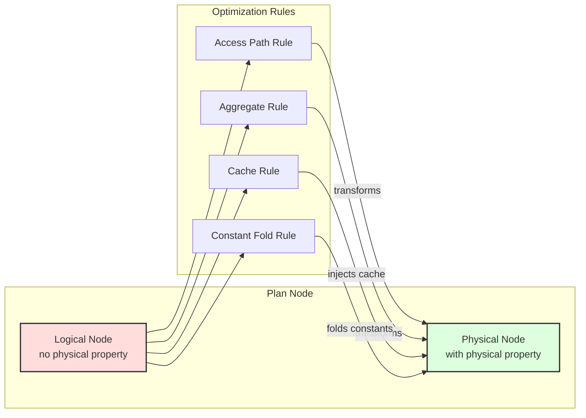

# Quereus Query Optimizer

The Quereus optimizer transforms logical query plans into efficient physical execution plans through a rule-based transformation system. This document provides a comprehensive reference for understanding and extending the optimizer.  This document reflects the current or future design of the system.  See TODO.md for descriptions of enhancements.

## Philosophy

The Quereus optimizer embodies several core principles that guide its design and implementation:

### Virtual Table Centric
The optimizer is built around the premise that all data access happens through virtual tables. This means optimization decisions must respect the capabilities and constraints exposed by each virtual table module through the `BestAccessPlan` API.

### Streaming First
Quereus prioritizes streaming execution over materialization. The optimizer favors transformations that preserve pipeline-able operations and only introduces blocking operations (sorts, materializations) when absolutely necessary for correctness or significant performance gains.

### Attribute-Based Identity
Column identity is tracked through stable attribute IDs rather than names or positions. This enables robust column reference resolution across arbitrary plan transformations without the fragility of name-based or position-based systems.

### Single Hierarchy, Dual Phase
Rather than maintaining separate logical and physical plan hierarchies, Quereus uses a single `PlanNode` tree that transitions from logical to physical through property annotation. This eliminates duplication while maintaining clear phase separation.

### Cost-Based with Heuristic Fallbacks
While the optimizer uses cost estimates to guide decisions, it provides sensible heuristic defaults when statistics are unavailable. This ensures reasonable plan quality even without detailed table statistics.

### Property based rules
Rather than tying rules to specific node types, as much as possible, the optimizer and its rules are tied to properties of the nodes, such as the physical properties, or the node's data type.  This reduces direct dependencies, making the system more robust and flexible.

## Architecture Overview

The Quereus optimizer operates as a transformation engine between the plan builder and runtime emitter:

```
┌─────────────┐     ┌──────────────┐     ┌─────────────┐     ┌──────────────┐
│   Parser    │ --> │   Builder    │ --> │  Optimizer  │ --> │   Emitter    │
│             │     │              │     │             │     │              │
│ SQL → AST   │     │ AST → Logic  │     │Logic → Phys │     │ Phys → Code  │
└─────────────┘     └──────────────┘     └─────────────┘     └──────────────┘
```

The optimizer uses a **multi-pass architecture** where different categories of transformations occur in separate tree traversals. Each pass can use either top-down or bottom-up traversal order depending on its requirements:



### Multi-Pass Optimization System

The optimizer executes transformations through a series of **optimization passes**, each with a specific purpose and traversal order:

#### Pass 0: Constant Folding (Bottom-up)
- **Purpose**: Pre-evaluate constant expressions before other optimizations
- **Traversal**: Bottom-up to evaluate from leaves to root
- **Implementation**: Custom execution using runtime expression evaluator
- **Result**: Simplified plan with literals replacing constant expressions

#### Pass 1: Structural Transformations (Top-down)
- **Purpose**: Restructure the plan tree for optimal execution boundaries
- **Key Rules**: `ruleGrowRetrieve`, `rulePredicatePushdown`, `ruleScalarCSE`
- **Traversal**: Top-down to see parent context for sliding operations
- **Result**: Operations pushed into virtual table boundaries where beneficial; duplicate scalar expressions eliminated

#### Pass 2: Physical Selection (Bottom-up)
- **Purpose**: Convert logical operators to physical implementations
- **Key Rules**: `ruleSelectAccessPath`, `ruleAggregatePhysical`
- **Traversal**: Bottom-up to select implementations based on child properties
- **Result**: Executable physical plan with concrete operators

#### Pass 3: Post-Optimization (Bottom-up)
- **Purpose**: Final cleanup, materialization decisions, and caching
- **Key Rules**: `ruleMaterializationAdvisory`, `ruleCteOptimization`, `ruleMutatingSubqueryCache`, `ruleInSubqueryCache`
- **Traversal**: Bottom-up for global analysis and cache injection
- **Result**: Optimized plan with caching and materialization points

#### Pass 4: Validation (Bottom-up)
- **Purpose**: Validate the correctness of the optimized plan
- **Implementation**: Structural and property validation checks
- **Result**: Verified executable plan or error if invalid

### Pass Framework (`src/planner/framework/pass.ts`)

The pass system provides a clean abstraction for multi-pass optimization:

```typescript
interface OptimizationPass {
  id: string;                          // Unique identifier
  name: string;                        // Human-readable name
  traversalOrder: TraversalOrder;      // 'top-down' or 'bottom-up'
  rules: RuleHandle[];                 // Rules belonging to this pass
  execute?: (plan, context) => plan;   // Optional custom execution
  order: number;                       // Execution order (lower first)
}
```

**Key Benefits**:
- **Separation of Concerns**: Each pass focuses on a specific optimization category
- **Proper Sequencing**: Structural transformations happen before physical selection
- **Flexible Traversal**: Each pass can choose its optimal traversal order
- **Clean Debugging**: Clear pass boundaries make optimization easier to understand
- **Depth safety**: Each pass enforces a per-pass depth budget of `max(tuning.maxOptimizationDepth, planInputDepth + tuning.optimizationDepthHeadroom)` so wide input shapes (deep AND chains, deep CASE) plan without tripping the guard, while a separate `tuning.maxRulesFired` budget catches runaway rule rewrites independent of input shape.

### Core Components

**Pass Manager** (`src/planner/framework/pass.ts`)
- Coordinates execution of all optimization passes
- Manages rule registration per pass
- Implements both top-down and bottom-up traversal strategies
- Provides hooks for custom pass execution logic

**Rule Engine** (`src/planner/optimizer.ts`)
- Registers rules to appropriate passes based on their purpose
- Creates optimization context for rule execution
- Integrates with pass manager for multi-pass optimization
- Provides debugging and tracing infrastructure

**Physical Properties** (`src/planner/framework/physical-utils.ts`)
- Captures execution characteristics: ordering, uniqueness, cardinality, monotonic-on-attribute
- `monotonicOn` (per `MonotonicOnInfo` in `nodes/plan-node.ts`) is stronger than `ordering`: it identifies an attribute the relation is totally ordered on (with optional `strict` to assert no duplicates), and is meaningful only for total-order-preserving sources (vtab access plans that advertise it; sort nodes; merge join). Propagation rules live alongside each operator's `computePhysical`.
- `rangeBoundedOn` is a non-relational annotation set by `monotonic-range-access` on physical leaves whose access plan walks a `MonotonicOn(x)` path bounded by a recognized range predicate on `x`. See [Monotonic range-scan recognition](#monotonic-range-scan-recognition) below.
- Propagates properties through plan transformations
- Enables property-based optimization decisions

**Rule Framework** (`src/planner/framework/`)
- Standard rule signature: `(node, context) → node | null`
- Context provides access to database, statistics, and tuning parameters
- Rules are pure functions that return transformed nodes or null

**Generic Tree Rewriting** (`PlanNode.withChildren()`)
- Every plan node implements generic tree reconstruction
- Preserves attribute IDs during transformations
- Eliminates manual node-specific handling in optimizer core

## Design Decisions

### Immutable Plan Nodes
Plan nodes are never mutated after construction. All transformations create new nodes, ensuring:
- Clear debugging with before/after comparisons
- Safe concurrent access during optimization
- Predictable transformation behavior

### Attribute ID Preservation
The optimizer guarantees that attribute IDs remain stable across transformations:
```typescript
// ProjectNode preserves original attribute IDs
const newProjections = this.projections.map((proj, i) => ({
  node: newProjectionNodes[i] as ScalarPlanNode,
  alias: proj.alias,
  attributeId: proj.attributeId // ✅ Preserved from original
}));
```

### Two-Phase Transformation
1. **Logical Phase**: Builder creates plan nodes without physical properties
2. **Physical Phase**: Optimizer transforms and annotates with physical properties

This separation allows the builder to focus on semantic correctness while the optimizer handles execution strategy.

### Rule-Based Transformation
Optimization logic is organized into focused, composable rules:
- Each rule has a single responsibility
- Rules can be enabled/disabled independently  
- New optimizations can be added without modifying core code
- Rules are registered per node type for efficient dispatch

## Engineering Considerations

### Generic Tree Walking
The optimizer uses a generic tree walking mechanism via `withChildren()`:

```typescript
private optimizeChildren(node: PlanNode): PlanNode {
  const originalChildren = node.getChildren();
  const optimizedChildren = originalChildren.map(child => this.optimizeNode(child));
  
  const childrenChanged = optimizedChildren.some((child, i) => child !== originalChildren[i]);
  if (!childrenChanged) {
    return node;
  }
  
  return node.withChildren(optimizedChildren); // Attribute IDs preserved
}
```

This eliminates error-prone manual reconstruction and ensures consistent handling across all node types.

### Cost Model Integration
Cost estimation is centralized in `src/planner/cost/index.ts`:
- Consistent formulas across optimization rules
- Tunable parameters via `OptimizerTuning`
- Clear units (rows, cost units, bytes)

### Statistics Abstraction
The `StatsProvider` interface allows pluggable statistics sources:
```typescript
interface StatsProvider {
  tableRows(table: TableSchema): number | undefined;
  selectivity(table: TableSchema, pred: ScalarPlanNode): number | undefined;
  joinSelectivity?(left: TableSchema, right: TableSchema, cond: ScalarPlanNode): number | undefined;
  distinctValues?(table: TableSchema, columnName: string): number | undefined;
  indexSelectivity?(table: TableSchema, indexName: string, pred: ScalarPlanNode): number | undefined;
}
```

The default provider is `CatalogStatsProvider`, which reads real statistics from `TableSchema.statistics` (populated by `ANALYZE` or `VirtualTable.getStatistics()`) and falls back to `NaiveStatsProvider` heuristics when unavailable. When catalog statistics include equi-height histograms, range and equality selectivity estimates use histogram interpolation rather than uniform assumptions.

### Physical Properties System

Physical properties are automatically computed and cached for each plan node using a bottom-up inheritance model:

**Default Properties**
```typescript
const DEFAULT_PHYSICAL: PhysicalProperties = {
  deterministic: true,    // Pure - same inputs produce same outputs
  readonly: true,         // No side effects
  idempotent: true,       // Safe to call multiple times
  constant: false,        // Not a constant value
};
```

**Inheritance Model**
```typescript
// Physical properties are lazily computed and cached
get physical(): PhysicalProperties {
  if (!this._physical) {
    const childrenPhysical = this.getChildren().map(child => child.physical);

    // Get node-specific overrides
    const propsOverride = this.computePhysical?.(childrenPhysical);

    // Derive defaults from children if any, else use DEFAULT_PHYSICAL
    const defaults = childrenPhysical.length
      ? {
        deterministic: childrenPhysical.every(child => child.deterministic),
        idempotent: childrenPhysical.every(child => child.idempotent),
        readonly: childrenPhysical.every(child => child.readonly),
        // constant is not inherited; only leaf nodes explicitly set it
      }
      : DEFAULT_PHYSICAL;

    this._physical = { ...defaults, ...propsOverride };
  }
  return this._physical;
}
```

**Key Principles:**
- Leaf nodes get `DEFAULT_PHYSICAL` properties
- Parent nodes inherit the most restrictive properties from children
- Nodes can override specific properties via `computePhysical()`; `constant` is only set explicitly by nodes that can provide `getValue()`
- Properties are computed once and cached

**Property Computation Example**
```typescript
// SortNode only overrides specific properties
computePhysical(): Partial<PhysicalProperties> {
  return {
    ordering: extractOrderingFromSortKeys(this.sortKeys),
    estimatedRows: this.source.physical.estimatedRows,
    // deterministic and readonly are inherited from source
  };
}
```

### Scalar Expression Properties (per-attribute)

Distinct from `physical` (relational, cached on the node), `ScalarPlanNode` exposes three **per-attribute** property methods on `PlanNode`:

```typescript
isInjectiveIn(inputAttrId: number): InjectivityResult;
monotonicityIn(inputAttrId: number): MonotonicityResult;  // Monotonicity = 'increasing' | 'decreasing' | 'constant' | 'non_monotone' | 'unknown'
rangeRewriteIn(inputAttrId: number, constant: SqlValue): RangeRewrite | undefined;
```

The base class returns conservative defaults (`{ injective: false }` / `{ monotonicity: 'unknown' }` / `undefined`); concrete scalar nodes override only what they can prove. Composite nodes (`UnaryOpNode`, `BinaryOpNode`, `ScalarFunctionCallNode`) recurse into children — they don't switch on `nodeType`. Helper lattices `addMonotonicity` and `negateMonotonicity` (in `nodes/plan-node.ts`) compose the operator rules.

`ScalarFunctionCallNode` consults per-function traits on `FunctionSchema`:
- `injectiveOnArgs?: readonly number[]` — arg indices on which the function is injective when other args are constants.
- `monotoneOnArgs?: { [argIndex]: 'increasing' | 'decreasing' }` — direction-of-monotonicity per arg.
- `rangeRewriteOnArg?: { [argIndex]: { kind: string } }` — names a bucketing kind; the actual boundary computation lives on the operand's `LogicalType.bucketBounds(kind, value)`.

The function-call traits compose with the operand's own `monotonicityIn` / `isInjectiveIn`, so `f(g(x))` is treated correctly when both layers are annotated. `rangeRewriteIn` is intentionally tighter: it only rewrites the `f(x) op c` case, requiring the operand to be a bare `ColumnReferenceNode` for the queried attribute (anything else would conflate value spaces).

Consumers (key propagation through non-trivial projections, sargable predicate rewrites for `date(ts) = D`, etc.) build on this surface — see [Sargable range rewrites](#sargable-range-rewrites) below.

### Sargable range rewrites

Rule `rule-sargable-range-rewrite` (Structural pass, priority 18 — runs before `aggregate-predicate-pushdown` / `predicate-pushdown`) turns predicates of the form `f(col) = c` into the equivalent half-open range on `col`:

```
f(col) = c    →    col >= lower(c)  AND  col < upper(c)
```

This converts a function-of-column equality (which the constraint extractor cannot push down) into a bare `col op literal` shape that `rule-predicate-pushdown` carries through the Retrieve pipeline and `rule-select-access-path` can convert to an `IndexSeek` or range scan.

**Wiring.** The rule consults the per-function trait `FunctionSchema.rangeRewriteOnArg` (see [Scalar Expression Properties](#scalar-expression-properties-per-attribute)) which names a bucketing **kind**; the actual boundary computation lives on the column's `LogicalType.bucketBounds(kind, value)`. Bounds are wrapped in `LiteralNode`s typed with the column's logical type, so the result rides the same coercion-free path the constraint extractor already knows.

**Initial coverage.** Only `=` is rewritten; `<`/`<=`/`>`/`>=` require direction analysis on `monotonicityIn` and are deferred. Built-in trait wiring covers the unary `date(x)` form (`func/builtins/conversion.ts`) and `DATE_TYPE` / `DATETIME_TYPE` `bucketBounds`. The variadic `dateFunc` (`func/builtins/datetime.ts`, `numArgs: -1`) is intentionally **not** annotated — its trailing modifiers can shift or re-bucket the result. Build-time dispatch picks the unary `numArgs: 1` form when an SQL `date(col)` call has exactly one argument.

**Identity / null constraints.** The rule never rewrites `f(g(col)) = c` — `bucketBounds` answers in `col`'s value space, not `g(col)`'s, so only a bare column reference is safe. A `null` constant is left alone (`f(col) = null` is already null-rejecting). A null column row continues to be rejected because `col >= L` and `col < U` both evaluate to null.

**Parameter-bound RHS** (`where date(ts) = :p`) is out of scope here — the rule needs a literal RHS at plan time. A follow-up will introduce scalar bound functions (`bucket_lower(:p)` / `bucket_upper(:p)`) backed by the same `bucketBounds`.

### TVF Property Declarations

Table-valued functions can advertise relational and physical characteristics through an optional `relationalAdvertisement` field on `TableValuedFunctionSchema`. Without it, a TVF's logical `returnType.keys` / `returnType.isSet` are exposed but `physical` defaults are conservative (no key FDs, no `ordering`, no `monotonicOn`, default `estimatedRows`). With an advertisement, `TableFunctionCallNode.computePhysical` consumes it on the standard physical-property path so downstream rules (FD propagation, DISTINCT elimination, sort/monotonic-window rules, cardinality estimation) see the same information they get from a real vtab.

**Advertisement surface** — each field is either a static value or a `TVFAdvertiseFn<T>` that receives the call's operands and the schema and may return `undefined` to decline:

| Field | Type | Notes |
|---|---|---|
| `isSet` | `boolean` | Overrides `returnType.isSet` when present. |
| `keys` | `ReadonlyArray<ReadonlyArray<ColRef>>` | Output-column unique keys; lifted into `physical.fds` as `key → other-cols` FDs and into `getType().keys`. |
| `fds` | `ReadonlyArray<FunctionalDependency>` | Additional (non-key) FDs over output columns. |
| `equivClasses` | `ReadonlyArray<ReadonlyArray<number>>` | Equivalence classes; each class must have ≥ 2 members. |
| `ordering` | `ReadonlyArray<{column, desc}>` | Output ordering. |
| `monotonicOnColumns` | `ReadonlyArray<{column, direction, strict?}>` | Column-keyed monotonicity; preferred over `monotonicOn` because the node mints attribute IDs per call — the node translates `column → attrId` when assembling physical props. |
| `monotonicOn` | `ReadonlyArray<MonotonicOnInfo>` | Direct form for advanced uses where the author already has the attrId. |
| `constantBindings` | `ReadonlyArray<ConstantBinding>` | Columns pinned to a single value over the call. |
| `estimatedRows` | `number` | Row-count estimate; the `TableFunctionCallNode.estimatedRows` getter consults this before falling back to the default. |
| `accessCapabilities` | `PhysicalProperties['accessCapabilities']` | `ordinalSeek` / `asofRight`. |
| `deterministic`, `readonly`, `idempotent` | `boolean` | Overrides the FunctionFlags-derived defaults. |

**Literal operand inspection** — `evaluateLiteralOperand(operand)` (from `schema/function.js`) returns `operand.expression.value` when the operand is a literal and `undefined` otherwise. Use it in a `TVFAdvertiseFn` closure to declare parameter-dependent values:

```typescript
estimatedRows: (operands) => {
  const start = evaluateLiteralOperand(operands[0]);
  const end = evaluateLiteralOperand(operands[1]);
  if (typeof start === 'number' && typeof end === 'number' && end >= start) {
    return end - start + 1;
  }
  return undefined;  // Decline when bounds are non-literal.
},
```

**Validation** — every advertised field is shape-checked against the call's column count and attribute set before it lands in `physical`. Bad advertisements (out-of-range column indices, empty FD dependents, equivalence classes of size < 1, duplicate ordering columns, etc.) are dropped silently with a single warning on the `planner:tvf` log channel — they never break planning. A `TVFAdvertiseFn` closure that throws is treated the same way. This guarantees a buggy third-party advertisement degrades to "no advertisement" instead of poisoning the optimizer.

**Built-in annotations** — the following TVFs ship with relational advertisements:

| TVF | Advertisement |
|---|---|
| `generate_series(start, end)` | `isSet`, `keys=[[value]]`, `ordering=[{value, asc}]`, `monotonicOnColumns=[{value, asc, strict}]`, `estimatedRows` (when bounds are literal). |
| `json_each(json[, path])` | `isSet`, `keys=[[id]]`. |
| `json_tree(json[, path])` | `isSet`, `keys=[[id]]`. |
| `query_plan(sql)` | `isSet`, `keys=[[id]]`. |
| `table_info(table)` | `isSet`, `keys=[[cid]]`. |
| `index_info(table)` | `isSet`, `keys=[[index_name, seq]]`. |
| `foreign_key_info(table)` | `isSet`, `keys=[[id, seq]]`. |
| `unique_constraint_info(table)` | `isSet`, `keys=[[id, seq]]`. |
| `check_constraint_info(table)` | `isSet`, `keys=[[id]]`. |
| `assertion_info()` | `isSet`, `keys=[[name]]`. |
| `function_info()` | `isSet`, `keys=[[name, num_args]]`. |

Non-deterministic or trace-only TVFs (`execution_trace`, `row_trace`, `stack_trace`, `scheduler_program`, `schema_size`, `explain_assertion`, `schema`) skip advertisement.

**Relevant to materialized-view maintenance (deferred shape).** The TVF `relationalAdvertisement` (`keys` / `isSet`) is the surface a lateral-TVF row-time materialized-view body would consume to bound a fan-out (`base t cross join lateral json_each(t.arr) je`): a base-row change maps to many backing rows that a prefix-delete + recomputed-fan-out maintenance would need to prove set on the backing PK. This shape is **not** in the current row-time eligibility gate — it is deferred to `materialized-view-rowtime-general-bodies`. `combineJoinKeys` (`planner/util/key-utils.ts`) now forms the **product key** `(leftKey ∪ shiftedRightKey)` for a keyed cross/lateral join (when both sides are keyed and neither is equi-covered), so `keysOf` surfaces the keyed cross-product key — see [Keyed cross/inner (and lateral) product keys](#keyed-crossinner-and-lateral-product-keys). The remaining lateral-TVF consumption work (proving a recomputed fan-out set on the backing PK) is tracked by `materialized-view-rowtime-general-bodies`. See [Materialized Views](materialized-views.md).

### Constant Folding Subsystem

Constant folding is an elaborate optimization that evaluates constant expressions at plan time rather than runtime. The system uses a three-phase algorithm with sophisticated dependency tracking.

See [Constant Folding System](optimizer-const.md) for details.

**Core Concepts**

The `constant` physical property has strict requirements:
- A node is `constant: true` **only if** it implements the `ConstantNode` interface with `getValue()`
- This means the node can statically provide its value at plan time
- Examples: `LiteralNode`, materialized relation nodes

```typescript
interface ConstantNode extends PlanNode {
  getValue(): OutputValue;  // Must return the constant value
}
```

**Three-Phase Algorithm**

Rather than stopping propagation when a column reference is found, the optimizer notes the reference and continues to see if the expressions remains otherwise constant at the point where said column is resolved.  This allows even complex queries to be fully folded, if they truly are constant.

1. **Bottom-up Classification**: Assigns `ConstInfo` to every node
   - `const`: Nodes with `physical.constant === true` that implement `getValue()`
   - `dep`: Nodes depending on specific attribute IDs (e.g., column references)
   - `non-const`: Non-functional nodes or those with non-const children

2. **Top-down Border Detection**: Identifies foldable nodes
   - Const nodes are always border nodes
   - Dep nodes become border nodes when their dependencies are resolved
   - Tracks which attributes are known constants in each scope

3. **Replacement Phase**: Replaces border nodes with literals
   - Scalar expressions → `LiteralNode`
   - Relational expressions → Materialized relation nodes (future)

**Dependency Resolution**

The system tracks constant attribute propagation through the plan:
```typescript
// ProjectNode produces constant attribute 42 if its expression is const
if (exprInfo?.kind === 'const') {
  updatedKnownAttrs.add(42);  // Attribute 42 is now a known constant
}

// Later, ColumnReference to attribute 42 can be folded
if (nodeInfo?.kind === 'dep' && isSubsetOf(nodeInfo.deps, knownConstAttrs)) {
  // This dep node can be folded because its dependencies are resolved
}
```

**Important Constraints**

- **Never set `constant: true` without implementing `getValue()`** - This will cause runtime errors
- **Constant folding respects functional properties** - Only nodes with `deterministic && readonly` are considered
- **The optimizer uses runtime evaluation** - Complex expressions are evaluated using the actual runtime, ensuring correctness

**Example: Constant Propagation**
```sql
-- Original query
SELECT x + 1 AS y FROM t WHERE y > 5;

-- After constant folding with known x = 10
SELECT 11 AS y FROM t WHERE 11 > 5;  -- Expression folded
SELECT 11 AS y FROM t WHERE true;    -- Predicate folded
```

## Component Reference

### Plan Node Hierarchy

All plan nodes extend the base `PlanNode` class and implement category-specific interfaces:

**Base Classes**
- `PlanNode`: Abstract base with cost, scope, and transformation methods
- `RelationalNode`: Nodes producing row streams (implement `getAttributes()`)
- `ScalarNode`: Nodes producing scalar values
- `VoidNode`: Nodes with side effects (DDL, DML)

**Key Methods**
- `getChildren()`: Returns all child nodes in consistent order
- `withChildren(newChildren)`: Creates new instance with updated children
- `computePhysical()`: Optionally overrides specific physical properties
- `getLogicalProperties()`: Returns logical plan information

### Optimization Rules

Rules are organized by optimization family in `src/planner/rules/`:

**Access Path Selection** (`access/`)
- `ruleSelectAccessPath`: Chooses between sequential scan, index scan, and index seek for both primary and secondary indexes. **Collation cover**: an index seek is only a complete substitute for a predicate when the index column's collation equals the predicate's effective comparison collation (resolved at plan time exactly as `emitComparisonOp` / `emitIn` do at runtime). On a mismatch the rule classifies the cover relation per consumed seek constraint: a *coarser* equality index (a BINARY predicate over a NOCASE/RTRIM index) over-fetches a provable superset, so the seek is kept and the original predicate is re-applied as a residual `Filter` above the leaf; a *finer* index (a NOCASE/RTRIM predicate over a BINARY index, which under-fetches) declines the seek entirely and falls back to a `SeqScan` with the full predicate retained as a residual. **Range / prefix-range / OR_RANGE seeks are held to a stricter rule** because a coarser index over-fetch is not recoverable for a range (a collation mismatch reorders the walked window rather than producing a superset). A BINARY range over a BINARY index always reproduces the predicate. A collation-**matched** non-BINARY range (predicate collation = index collation ≠ BINARY) reproduces it only when the module's runtime filters the range bounds — and early-terminates the walk — under that same index collation rather than a fixed BINARY comparator; such a module advertises `BestAccessPlanResult.honorsCollatedRangeBounds`. The in-memory vtab does this (it threads each index column's collation through `scan-plan.ts` → `plan-filter.ts` / `scan-layer.ts`) and sets the flag; the store module does too (its post-fetch row filter `StoreTable.compareValues` compares every pushed bound under the column's declared collation, and its PK range scan visits the full key space so there is no early-termination to thread it into) — so a `NOCASE`/`RTRIM` range or `BETWEEN` over a matching-collation index uses the seek on both backends. A module that bound-filters BINARY leaves the flag off and keeps the conservative decline (`SeqScan` + residual) for any non-BINARY range — identical to the pre-flag behaviour. Any collation **mismatch** (BINARY predicate over a non-BINARY index, or vice versa) is always declined to a `SeqScan` + residual. Effective comparison collation is resolved at plan time exactly as `emitComparisonOp` / `emitIn` / `emitBetween` do at runtime (the symmetric provenance lattice — explicit `COLLATE` > declared column collation > defaults; for a `BETWEEN` each bound is resolved independently by the constraint's `op`). The cover logic lives in the rule so it covers every index-style module uniformly (a module that matches constraints to index columns by position alone — e.g. the memory module — never sees collation). See `tickets/complete/index-collation-mismatch-residual-filter`, `tickets/complete/memory-range-seek-collation-bounds`, and `tickets/complete/store-range-seek-collation-bounds`.

**Aggregation** (`aggregate/`)
- `ruleAggregatePhysical`: Cost-based selection between `StreamAggregateNode` and `HashAggregateNode`. Scalar aggregates (no GROUP BY) always use stream. Already-sorted input always uses stream (preserves ordering). Unsorted input compares sort+stream cost vs hash cost and picks the cheaper option.
- `ruleGroupByFdSimplification`: Drops GROUP BY columns that are functionally determined by other GROUP BY columns under the aggregate-output FDs and equivalence classes (PK / UNIQUE / EC bridges; FK-derived FDs when that ticket lands). Each dropped column is re-emitted as a `MIN(<original-column>)` picker aggregate, with the original output attribute ID preserved via `AggregateNode.preserveAttributeIds` so downstream `Filter`/`Sort`/`Project` bindings survive untouched. Targets the common FK-join-then-aggregate shape (e.g. `GROUP BY c.id, c.name, c.email` where `id` is the PK) — cuts hash-key width and sort-key width before `ruleAggregatePhysical` makes its stream/hash choice. Runs in the Structural pass at priority 23 (after `aggregate-predicate-pushdown` so filter-derived ECs are on the source, before `ruleAggregatePhysical` in the Physical pass). Skips when fewer than two GROUP BY columns are bare `ColumnReferenceNode`s. See the FD framework section for the propagation rules the rule consumes.

**Caching** (`cache/`)
- `ruleCteOptimization`: Adds caching to frequently-accessed CTEs
- `ruleInSubqueryCache`: Wraps uncorrelated, deterministic IN-subquery sources in CacheNode
- `ruleMaterializationAdvisory`: Global analysis for cache injection
- `ruleMaterializedViewRewrite`: Automatic materialized-view query rewrite (read side). Rewrites an *arbitrary* scan-projection-filter, 1:1-join, or grouped-aggregate query that never names an MV to scan (and, for an aggregate rollup, re-aggregate) the MV's backing table when a covering MV answers it — including eliminating a 1:1 inner/cross join at read time. Registered on both `Project` (projection-filter + join arms) and `Aggregate`. See § [Materialized-view query rewrite (read side)](#materialized-view-query-rewrite-read-side).
- `ruleMutatingSubqueryCache`: Ensures mutating subqueries execute once
- `ruleScalarCSE`: Scalar common subexpression elimination. Detects duplicate deterministic scalar expressions across a ProjectNode and its child chain (Filter, Sort), injects a lower ProjectNode that computes each deduplicated expression once, and replaces duplicates with column references. Skips bare column references, literals, and non-deterministic expressions. Runs in the Structural pass at priority 22.

**Retrieve** (`retrieve/`)
- `ruleProjectionPruning`: Prunes unused inner projections in Project-on-Project patterns (common after view expansion). Collects attribute IDs referenced by the outer project's scalar expressions, then filters the inner project to only those projections whose output attributes are referenced. Skips when all inner projections are used or pruning would yield zero projections. Runs in the Structural pass at priority 19 (between distinct-elimination at 18 and predicate-pushdown at 20).

**Sort** (`sort/`)
- `ruleOrderByFdPruning`: Drops trailing `ORDER BY` keys functionally determined by the leading bare-column keys under the source's FDs and equivalence classes (PK-driven, EC-driven via `WHERE a = b`, etc.). Walks the keys front-to-back maintaining `determined = closure({leading bare-column source-indices}, fds, ECs)`; drops any subsequent bare-column key whose source-attribute index is already in `determined`. Non-bare-column keys (expressions) are opaque — they neither contribute to nor consume the determined set, and are never droppable. The rule reasons in source-attribute-INDEX space (positions in `source.getAttributes()`) since `node.source.physical.fds` / `equivClasses` are indexed that way. Direction and NULL placement of the dropped trailing key are irrelevant — once a preceding key pins every value of that column to a single value per equivalence group, the trailing key cannot reorder anything. Skips when fewer than two keys are present, or when no keys are droppable. Runs in the Structural pass at priority 26, which is automatically before `monotonic-limit-pushdown` (PostOptimization priority 8) so single-key reductions enable the pushdown. See the LIMIT/OFFSET pushdown section below for the load-bearing interaction.

**Join** (`join/`)
- `ruleJoinPhysicalSelection`: Selects hash join or merge join over nested loop for equi-joins when cheaper. Three-way cost comparison (nested-loop vs hash vs merge). Supports INNER, LEFT, SEMI, and ANTI join types. Merge-join recognition here is positional on `physical.ordering`.
- `ruleMonotonicMergeJoin`: Recognises merge-join opportunities whenever both sides advertise `MonotonicOn` on the equi-pair attributes — strictly broader than ordering-based recognition. Picks up cases the ordering-based rule misses (notably parent joins on a child `MergeJoin`'s right-side equi-pair attribute, where the child's `physical.ordering` reflects only the left side but `monotonicOn` covers both). Single driving equi-pair in v1; remaining equi-pairs become residual conjuncts. Defers to `ruleJoinPhysicalSelection` whenever ordering already covers all pairs (so multi-key merge joins keep full unique-key propagation). Runs at priority 4 in PostOptimization, ahead of `ruleJoinPhysicalSelection` (priority 5).
- `ruleJoinElimination`: Drops a `JOIN` whose non-preserved side is never referenced above the join and is at-most-one-matching per a declared FK→PK relationship. Fires on `ProjectNode`, walks down through `Filter` / `Sort` / `LimitOffset` / `Distinct` / `Alias` collecting demanded attribute IDs; when the walk reaches a `JoinNode`, the demanded set is final for that chain. Requires an AND-of-column-equalities ON-clause and an FK→PK alignment verified via `checkFkPkAlignment` (same helper that drives FK-aware key/row-count reduction in `analyzeJoinKeyCoverage`). LEFT/RIGHT outer joins may only drop the non-preserved side; INNER joins may drop either side but additionally require (a) every FK column to be `NOT NULL` (otherwise NULL FK rows that wouldn't have matched would now survive) and (b) the eliminable side to be a row-preserving path to its base table — only `TableReference` / `Retrieve` (bare-source) / `Alias` / `Sort` wrappers are permitted, since a `Filter` / `LimitOffset` / `Distinct` / `Project` between the join and the table would either drop rows the FK→PK guarantee assumes are present or break the table-column-index→attribute-index mapping `checkFkPkAlignment` relies on. Most commonly fires on views that join a parent table for FK-side selects the outer caller never references. Runs in the Structural pass at priority 24 (after `predicate-pushdown` at 20, so right-side residual predicates have already landed below the join and protect themselves from elimination).
- `ruleJoinExistencePruning` / `ruleJoinExistencePruningUnderAggregate`: Demand-gated drop of an unused outer-join `exists … as` existence flag, with two entrypoints that mirror `ruleJoinElimination` / `ruleJoinEliminationUnderAggregate`. `ruleJoinExistencePruning` fires on `ProjectNode` (id `join-existence-pruning`); `ruleJoinExistencePruningUnderAggregate` fires on `AggregateNode` (id `join-existence-pruning-aggregate`) for a flag-bearing join that sits under a `count(*)` / `group by` with no enclosing `Project`. Both reuse `ruleJoinElimination`'s demand analysis verbatim (the exported `collectAttrIds` / `walkChain` / `rebuildChain` / `rebuildProject` helpers): collect the attr ids the anchor demands (the Project's projections, or the Aggregate's group-by + aggregate expressions — its only scalar children), walk the `Filter` / `Sort` / `LimitOffset` / `Distinct` / `Alias` pass-through chain to the first `JoinNode`, then rebuild that join without any `ExistenceColumnSpec` whose output attribute id is absent from the demanded set (the Aggregate variant rebuilds the `AggregateNode` with `preserveAttributeIds` so its output ids stay stable). HAVING is a `FilterNode` *above* the Aggregate that can only reference the Aggregate's outputs, never the raw flag, so it needs no special handling. When the last spec is dropped, `existence` becomes `undefined`, `hasExistenceColumns` flips `false`, and the five flag-guarded join rules (`join-elimination`, `fanout-lookup-join`, `join-physical-selection`, `monotonic-merge-join`, `lateral-top1-asof`) re-enable on the now flag-free join. Both run in the Structural pass at priority 22 — after `projection-pruning` (19) / `predicate-pushdown` (20) / `scalar-cse` (22) so demand is settled, and before `fanout-lookup-join` (23) and `join-elimination` (24) / `join-elimination-aggregate` (26) so the freshly-pruned anchor threads through them in the same `applyRules` loop; the PostOptimization join rules and the top-down-visited `lateral-top1-asof` see the flag-free join automatically. `sideEffectMode: 'safe'`: it drops only a derived, read-only `{true,false}` column and preserves both join sides verbatim. Pure optimization — no correctness defect today; a flag-bearing join was simply pinned to nested-loop purely to compute a column no one read. Dropping even a *middle* flag is runtime-safe because column resolution is by attribute id (the `RowDescriptor` rebuilt from `getAttributes()`), not the build-time `columnIndex`. The write half is unaffected: a writable flag is always SELECTed by its view's projection, so the demand gate retains it. **Note on the aggregate anchor (cascade):** `exists … as` is only valid on an *outer* join (the parser rejects it on inner). Pruning the unused flag under an aggregate yields a flag-free outer join, which `ruleJoinEliminationUnderAggregate` — now that it eliminates FK→PK `left`/`right` joins, not just `inner` — eliminates entirely. So an undemanded `count(*) … left join … exists right as` collapses to **zero join ops** (prune at priority 22 → eliminate at priority 26, same `applyRules` pass), not merely to physical join selection.
- `ruleSemijoinExistenceRecovery` / `ruleSemijoinExistenceRecoveryUnderAggregate` (ids `semijoin-existence-recovery` / `semijoin-existence-recovery-aggregate`): The demand-**SHAPE** complement of `join-existence-pruning`'s demand-**PRESENCE** prune. Where pruning drops a flag *nothing* reads, this recovers a semi/anti join when the sole `exists … as` flag on a `left join` is demanded but **only** as a top-level boolean probe — `where flag` ⇒ `semi`, `where not flag` ⇒ `anti` (also `not not flag`, `flag = true/false`, and the `IS` forms `flag is true` / `flag is not false` ⇒ `semi`, `flag is false` / `flag is not true` ⇒ `anti`, each normalized via `normalizePredicate`). The `is not …` collapses (`is not false` ≡ `= true`, `is not true` ≡ `= false`) are exact only because the flag is provably non-null (`EXISTENCE_FLAG_TYPE.nullable === false`); for the same reason `flag is [not] null` is a *constant* over the non-null flag (not a probe) and the matcher abstains. Fires on `ProjectNode` (the anchor must bound everything any ancestor can reference; a Filter anchor would be unsound because rewriting the join to semi drops the right columns + flag, which only the Project's projection list can prove unreferenced). **Two entrypoints** (mirroring `join-existence-pruning` / `…UnderAggregate`): the second entrypoint `ruleSemijoinExistenceRecoveryUnderAggregate` (id `semijoin-existence-recovery-aggregate`, also priority 23, but `nodeType: Aggregate`) anchors on `AggregateNode` for the bare `count(*) … where flag` / `group by` shape that plans with **no enclosing Project** (the probe Filter + flag-bearing join sit *under* the Aggregate, so the Project entrypoint walks past them). It shares ALL of the probe-detection + chain-rewrite machinery — the exported `analyzeChain` now takes a **pre-seeded** demand set so both anchors reuse it — differing only in the demand seed (the Aggregate's group-by + aggregate expressions vs a Project's projections) and the rebuild epilogue (reconstruct the `AggregateNode` with `preserveAttributeIds` so its output ids stay stable). The aggregate anchor has **no inner-join fallback**: a right-column-demanded or fan-out *positive* probe under an aggregate stays a flag-bearing `left` join (sound, just unoptimized) — the `count(*) … where flag` shape is the target — unlike the Project anchor, which hands those off to `inner-join-existence-recovery`. HAVING is a `FilterNode` *above* the Aggregate that can reference only the aggregate output (group keys / aggregate results), never the raw flag, so it never appears in `walkChain` and does not block. Reuses `ruleJoinElimination`'s `walkChain` / `collectAttrIds` / `rebuildChain` / `rebuildProject`; builds the demand set conjunct-by-conjunct so the single probe conjunct is excluded, then requires (a) exactly one flag-referencing conjunct, in probe normal form; (b) the flag absent from the residual demand set (a *selected* or *sorted-on* flag lands there and abstains); (c) no right-side column demanded (`select *` / `select c.*, p.col … where flag` abstain here and hand off to `inner-join-existence-recovery`, which rewrites that shape to an inner join — it is not a semi-join); (d) `existence.length === 1` (a semi join collapses the right side and cannot also emit other flags — when a sibling flag is merely undemanded, `join-existence-pruning` drops it first, leaving a sole flag this rule then recovers in a later `applyRules` iteration); and (e) `subtreeHasSideEffects(right) === false` (a semi join short-circuits the right scan at the first match, changing R's execution count); and (f, **SEMI only**) the right side matches *at most one* row per left row — `rightMatchesAtMostOne`, i.e. the equi-join columns cover a unique key of R via `isUnique`. The fan-out guard (f) is the soundness crux: a plain `left join … exists right as` is a *normal* left join with an appended flag bit, so `emitLoopJoin` yields one output row per **matching** right row — `where flag` keeps **K rows** for a left row with K matches, whereas `semi(L,R,cond)` keeps **one**. They agree only when every left row matches ≤1 R row (FK→PK, or a ≤1-row R); a non-unique / non-equi condition makes the SEMI shape unsound and the rule abstains — `inner-join-existence-recovery` then recovers a fan-out-safe inner join from that abstention point (a positive no-right-col probe over a fan-out R), so the two rules partition the *entire* positive-probe space and, consulting the same `rightMatchesAtMostOne`, are disjoint independent of registration order. The **anti** path needs no such guard: an unmatched left row yields exactly one null-extension regardless of fan-out, and matched rows are filtered out, so `anti(L,R,cond)` equals `left join … where not flag` for *arbitrary* `cond`. The recovered join carries the full ON `condition` verbatim; a residual conjunct over a covered unique key only narrows the ≤1 match further (still ≤1), so the downstream IND folders gate on AND-of-equalities and abstain on any residual, leaving a plain semi/anti (hash semi-join still beats nested-loop+flag). The probe Filter is rebuilt with its non-probe conjuncts (or omitted when the probe was its only conjunct). Runs in the Structural pass at priority 23 — after `join-existence-pruning` (22) so an undemanded sibling flag is gone first, and (in registration order) before `fanout-lookup-join`, `join-elimination`, and the Join-typed IND folders `anti-join-fk-empty` / `semi-join-fk-trivial` (26) so the recovered semi/anti threads into them in the same top-down descent (exactly why `subquery-decorrelation` precedes those folders). `sideEffectMode: 'aware'` (the impure-R guard). Pure optimization: rows are byte-identical to the nested-loop+flag baseline. Write-half safe by construction — a flag writable through a view is always SELECTed by its routing Project, so it lands in `demanded` and check (b) abstains, and the write path never reaches this rewrite. Only `left join … exists right as` is reachable (the parser rejects `exists … as` on inner/cross, the runtime rejects RIGHT/FULL), so the rule is guarded by `joinType === 'left' && spec.side === 'right'`. Deferred: `case`-wrapped probe forms (truthiness-of-integer, not a boolean probe — file a backlog ticket if a real workload produces them) and an aggregate-anchored *inner* fallback (the right-col-demanded / fan-out positive-probe cases the aggregate anchor leaves as a `left` join — out of scope, file a follow-up if a real workload wants it). The positive-probe cases the SEMI rule abstains on — a right column demanded, OR a fan-out (non-unique) R — are both handled by `inner-join-existence-recovery` (next bullet).
- `ruleInnerJoinExistenceRecovery` (id `inner-join-existence-recovery`): The **fallback** complement of `semijoin-existence-recovery` — same probe machinery, covering **both** positive-probe shapes the semi rule abstains on. When the sole `exists … as` flag on a `left join` is a **positive** top-level probe (`where flag` / `flag = true` / `flag is true` / `flag is not false` / `not not flag` — all the `'semi'`-polarity forms) **and EITHER ≥1 right-side column is demanded above the join OR R fans out** (is non-unique on the join column), it rewrites the flag-bearing `JoinNode` to a plain **inner join** (drop the flag, keep both sides) instead of a semi join (which would either drop the right columns the caller needs, or collapse the fanned-out duplicates K→1). Fires on `ProjectNode`; reuses `walkChain` / `rebuildProject` from `join-elimination` and the sibling's exported `analyzeChain` / `rebuildChainStrippingProbe` / `ProbeMatch` (added `export`; no logic change), so the demand SHAPE proof and probe normalization are shared verbatim. Guards: `joinType === 'left' && spec.side === 'right'`, `existence.length === 1`, `condition` present, `probe.polarity === 'semi'` (a negative/anti probe with a right column must stay a `left` join — an anti row has an all-NULL right side, so an inner join would drop the rows anti keeps), `!demanded.has(flagId)` (a selected/sorted-on flag abstains), the gate `!(!rightColDemanded && rightMatchesAtMostOne(join))` — fire when a right column is demanded OR R fans out, deferring to the semi rule ONLY where it can actually fire (no right column AND unique R, the ≤1-match case where the leaner semi join is sound) — and `subtreeHasSideEffects(right) === false`. **Soundness (and why it is simpler than the semi rule):** `emitLoopJoin` drives a `left join … exists right as` as a normal left join with one appended flag bit — a matched left row with K right matches yields K rows each `flag=true`, an unmatched left row yields one null-extended row `flag=false`. A positive `where flag` keeps exactly the K matched rows per left row; an inner join on the same condition yields exactly those K rows — **identical row-for-row for ANY condition**. So unlike the semi rule there is **no fan-out guard for soundness** (an inner join does not collapse K→1, so the conversion is sound under *any* fan-out — `rightMatchesAtMostOne` is consulted only to locate the abstention boundary, never as a correctness precondition — and this rule therefore *does* convert the fan-out case the semi rule cannot), **no condition-shape restriction** (the ON `condition` is carried verbatim, non-equi / residual conditions included), and **no NOT-NULL FK requirement** (a NULL FK is unmatched under both the flag and the inner join, so no orphan leaks). `buildJoinAttributes` emits the same `[left…, right…]` ids for `left` and `inner` (only the right columns' `nullable` flag differs), so right columns resolve by attribute id at the same ids and dropping the appended flag shifts nothing; the inner join's non-nullable right typing is a sound strengthening (after `where flag` only matched rows survive, on which the right side is fully present) that re-enables downstream FD/key/IND reasoning. The probe conjunct is subsumed by the inner join and stripped via `rebuildChainStrippingProbe` (residual conjuncts retained above the join; Filter omitted when the probe was its sole conjunct). Note `join-elimination` does **not** fire on the recovered inner join within this rule's domain: while a right column is demanded it requires the non-preserved side unreferenced, and in the no-right-col fan-out domain it requires an at-most-one unique FK→PK alignment that the non-unique R contradicts; the in-scope win is physical join selection + non-nullable typing + FD/IND reasoning, not elimination. `sideEffectMode: 'aware'` (the impure-R guard): the logical inner join scans R the same number of times as the flag-bearing left join, but dropping the flag re-enables `join-physical-selection`, which can pick a hash join that scans R once total — changing an impure R's execution count. Pure optimization: rows are byte-identical to the nested-loop+flag baseline. Write-half safe by construction (a flag writable through a view is always SELECTed by its routing Project → lands in `demanded` → abstains). Runs in the Structural pass at priority 23. The two recovery rules consult the **same** `rightMatchesAtMostOne` and so are provably disjoint on the positive-probe space **independent of registration order** (semi fires iff `!rightColDemanded && unique-R`; inner iff `rightColDemanded || !unique-R`; the intersection is empty), making registration order (semi then inner) merely conventional. Registered (in registration order) before `fanout-lookup-join`, `join-elimination` (24), and the Join-typed IND folders (26). Termination: the output inner join has no existence spec, so re-running sees `joinType !== 'left'` and no-ops.
- `ruleLateralTop1Asof`: Recognizes the lateral-top-1 idiom and rewrites it to a streaming `AsofScanNode` (see "Streaming asof scan" below).

**Predicate** (`predicate/`)
- `ruleAggregatePredicatePushdown`: Splits `Filter(predicate, Aggregate|StreamAggregate|HashAggregate)` so that conjuncts referencing only GROUP-BY-determined columns are rewritten onto the aggregate's source attribute IDs and moved below the aggregate; conjuncts referencing aggregate outputs (sum/count/etc.) or non-column GROUP-BY expressions stay above. Subsumes the WHERE-on-group-by-column and HAVING-on-group-by-column cases. Uses `computeClosure` over the aggregate's `physical.fds` so composite GROUP BYs whose members FD-determine each other widen the pushable set (see the FD framework section). Runs in the Structural pass at priority 19, ahead of `rulePredicatePushdown` so anything it places below an aggregate can propagate further.
- `rulePredicatePushdown`: Pushes filter predicates down across safe commuting nodes (Sort, Distinct, Alias, eligible Project) and into RetrieveNode boundaries where the virtual table module supports them, reducing rows processed upstream.
- `ruleFilterMerge`: Merges adjacent Filter nodes into a single Filter with an AND-combined predicate. Iteratively absorbs entire chains of adjacent filters in one visit. Runs in the Structural pass at priority 21 (after predicate pushdown at 20).
- `rulePredicateInferenceEquivalence`: Materializes inferred equality predicates from the cross of predicate-derived constant bindings and the source's equivalence classes. For a `Filter(predicate, source)` where `predicate` pins `t.k = V` (literal or parameter) and `source.physical.equivClasses` includes a class containing `t.k`'s column index, the rule emits `col = V` for every other class member not already pinned by the predicate. The augmented predicate is ANDed into the outer Filter; for `inner`/`cross` join sources, single-side inferred conjuncts are additionally injected as `FilterNode` wrappers on the corresponding branch so subsequent `predicate-pushdown` (priority 20) iterations carry them into branch-level vtab access plans. LEFT/RIGHT/FULL joins fall back to the simple form (outer Filter only) — the safety case relies on `propagateJoinFds` already having stripped NULL-padded sides' bindings/ECs from the join's output. Idempotent: a second invocation finds every EC member already in the predicate's bound set and emits nothing. Runs in the Structural pass at priority 22; no collision with `scalar-cse` (priority 22) since they target different node types. Worked example: `t INNER JOIN u ON t.k = u.k WHERE t.k = 5` produces a `Filter(u.k = 5)` wrapper above the u-side Retrieve, which the next pushdown iteration carries into the leaf and lets the vtab handle as an index seek instead of a sequential scan. Range and `IS NULL` inference are intentionally out of scope.
- `ruleSargableRangeRewrite`: Rewrites `f(col) = c` into `col >= lower(c) AND col < upper(c)` using `LogicalType.bucketBounds`, restoring sargability for bare-column equality on lossy-monotone transforms (notably `date(ts) = D`). Structural pass priority 18 — ahead of `aggregate-predicate-pushdown` / `predicate-pushdown` so the rewritten range flows through the rest of the predicate pipeline. See § [Sargable range rewrites](#sargable-range-rewrites) for the wiring (function-schema `rangeRewriteOnArg` trait + per-type `bucketBounds`) and the identity/null/parameter guards.
- `ruleFilterContradiction`: Recognises when a Filter's predicate, conjoined with the source's `domainConstraints` and literal `constantBindings`, is provably unsatisfiable and emits `EmptyRelationNode` carrying the Filter's own attribute IDs / RelationType. Structural pass priority 27, downstream of `rule-empty-relation-folding` at the same priority so the cascade can collapse the surrounding subtree. Reasoning is per-column range/enum intersection (`planner/analysis/sat-checker.ts`); OR / CASE / cross-column arithmetic stay out of scope. See § [Predicate contradiction detection](#predicate-contradiction-detection).
- `ruleEmptyRelationFolding`: Cascades `EmptyRelationNode` up through immediate `Filter` / `Project` / `Sort` / `LimitOffset` / `Distinct` / inner-or-cross-or-semi-anti joins, lifting the host's attribute IDs / RelationType onto the new empty result. Also folds `Filter(_, false|null|0)` directly. Structural pass priority 27 — after the IND rules at 26 so anti-join-to-empty rewrites can cascade in the same visit. See § [Empty-relation folding](#empty-relation-folding).

**Subquery** (`subquery/`)
- `ruleSubqueryDecorrelation`: Transforms correlated EXISTS/IN subqueries in WHERE-clause filters into semi/anti joins, enabling hash join selection and eliminating per-row re-execution. Handles: correlated EXISTS → semi join, NOT EXISTS → anti join, correlated IN → semi join. NOT IN is deferred (NULL semantics complexity). Runs in the Structural pass at priority 25 (after predicate pushdown).
- `ruleSemiJoinFkTrivial`: `SemiJoin(L, R)` whose equi-pairs cover a non-null FK on L referencing R's PK (with R a row-preserving path to its base table) rewrites to `L` when every FK column is `NOT NULL`, otherwise to `Filter(L, fk_col IS NOT NULL AND …)`. Structural pass priority 26, after `rule-subquery-decorrelation` has materialized `EXISTS / IN` as semi joins. See § [Inclusion-dependency reasoning](#key-driven-row-count-reduction).
- `ruleAntiJoinFkEmpty`: `AntiJoin(L, R)` with the same preconditions rewrites to `EmptyRelationNode` carrying L's attribute IDs and `RelationType` — every (non-null) L row is guaranteed a parent in R, so the anti-join is empty. Structural pass priority 26; the empty result then feeds `rule-empty-relation-folding` at priority 27 for further cascade. See § [Inclusion-dependency reasoning](#key-driven-row-count-reduction).

**Constant Folding** (pass)
- Constant folding pass: Evaluates constant expressions at plan time

### Materialized-view query rewrite (read side)

`ruleMaterializedViewRewrite` (`rules/cache/rule-materialized-view-rewrite.ts`) is the read-side dual of the [coverage prover](materialized-views.md#explicit-covering-structures-the-coverage-prover): it recognizes when an *arbitrary* scan-projection-filter query — one that **never names** a materialized view — is *answered from* a covering MV, and rewrites it to scan the MV's backing table (`_mv_<name>`) with a residual projection/filter instead of recomputing the body against the base tables. Because the replacement is an ordinary `TableReference`, `query_plan()` shows the backing scan for free.

**Matcher** (`planner/analysis/query-rewrite-matcher.ts`, sibling to `coverage-prover.ts`). The question is **output-relation subsumption**: do the MV's stored rows contain a superset (re-coverable via a bounded residual) of the rows the fragment produces, keyed so the residual recovers exactly the fragment's output? It shares the coverage prover's entailment vocabulary (`recognizeConjunctiveClauses` / `guardClausesEntail`), so NULL semantics are identical. Soundness mirrors the prover exactly — **a false NotMatch only forgoes a speedup; a false Match returns wrong rows** — so every check forgoes the rewrite on doubt, and the rule only ever replaces the correct recompute-over-base plan with a provably row-equivalent backing scan (non-regressing).

- **Shape.** The fragment must be a single-source `Project(Filter?(scan(TableReference)))` over base `T`; the MV body (read from `mv.selectAst`) the same projection-and-filter over the same `T`. DISTINCT / set-op / LIMIT on either side ⇒ NotMatch (`shape`). An **aggregate** fragment and a **1:1-join** fragment are each handled by a separate arm (both below).
- **Predicate entailment (containment).** The fragment's row set must be a subset of the MV's: the MV's WHERE `P_mv` must be entailed by the fragment's WHERE `P_q`. The residual is the conjunction of `P_q` conjuncts not already entailed by `P_mv`, applied as a `Filter` on the backing scan (`predicate-not-entailed` otherwise). An MV with no WHERE subsumes any fragment WHERE (residual = full `P_q`); a fragment with no WHERE requires `P_mv` empty too.
- **Projection coverage.** Every fragment output column (a bare passthrough of a `T` column) must be a column the MV projects; the residual's columns likewise (`missing-column` otherwise). A computed fragment output is not re-derived in v1.
- **Gates.** A **stale** MV (its backing is an unmaintained snapshot), a **non-deterministic body** (reuses the function-registry determinism metadata — a registered MV is already deterministic by construction), or a **source-schema mismatch** are all rejected before shape matching.

**Aggregate-rollup arm** (`analyzeAggregateFragment` / `matchAggregateFragmentToMv`). Fires when the fragment root is a logical `Aggregate(Filter?(scan(T)))` and the MV body is a grouped aggregate over the same `T`. Query and MV GROUP BY are mapped to bare source-column sets (computed group key ⇒ `aggregate-shape`); query key ⊆ MV key required (⊄ ⇒ `group-key-mismatch`). Two sub-cases: **exact-key** (query key == MV key) scans the backing directly — each output is a passthrough of a stored group column or an *exactly* matching stored aggregate, with an optional residual `Filter`/`Project` and **no re-aggregation**; **rollup** (query key ⊊ MV key, incl. the empty global key) re-aggregates the backing partials down to the query key via the decomposable-aggregate allowlist (`sum`→`sum`, `count`→`coalesce(sum,0)`, `min`/`max`→`min`/`max`, `avg`→`sum(sum)/sum(count)`; `count(distinct)` / `group_concat` / any `distinct` ⇒ `aggregate-not-decomposable`). The one-row-per-group witness is `backingPkIsGroupKey` (the backing PK equals the MV group key — the schema-level `proveEffectiveKeyUnique`). A residual may reference only MV group-key columns (`missing-column` otherwise) — these partition whole MV groups, so the residual `Filter` on the backing scan commutes with the rollup re-aggregate (a rollup needing a residual is therefore sound, and the rule builds that `Filter` before the re-aggregate). One forgo guard remains: `group-key-pinned` (a multi-key query pinning/equating a group column would diverge from the base's `rule-groupby-fd-simplification` column reorder). See [docs/materialized-views.md § Aggregate rollup](materialized-views.md#aggregate-rollup-indexed-view-matching) for the recombine table and the avg-NULL/count-zero semantics.

**Join-subsumption arm** (`analyzeJoinQueryFragment` / `matchJoinFragmentToMv`). Fires when the fragment root is `Project(Filter?(Join(T, P)))` and a 1:1 inner/cross-join MV body materializes the same join — answering it from the backing and **eliminating the join at read time**. The soundness pivot reuses the coverage prover's shared `proveOneToOneJoin` (no-row-loss descent + `proveJoinNoFanout`): a 1:1 join's output is in bijection with the driving table `T`'s governed rows, so two 1:1 joins over the *same tables, equi-pairs, and type* produce the same relation. The matcher runs `proveOneToOneJoin` on **both** the fragment join and the MV body join (the rule plans the MV body once, suppressed, and caches its optimized root in a `WeakMap`), then requires the **same driving `T`, same lookup `P`, an inner/cross top join on each side** (outer is deferred — its null-extended rows differ from an inner-join query), and **equi-pair equivalence** in `(driving-col, lookup-col)` terms (a different FK to the same lookup ⇒ `shape`, the load-bearing guard). Projection coverage maps every fragment output (including lookup-side columns) to a stored backing column through stable attribute ids (`missing-column` otherwise). The stored-column map keys each backing column by the MV body's output **position**, so the arm first verifies the backing columns still correspond positionally (count + name) to the body output — the invariant established when the backing is built from the body. `refresh` keeps that invariant intact even across a schema-shifting source `alter`: it [re-derives the backing shape and rebuilds the backing table](materialized-views.md#refresh-materialized-view) when a re-planned `select *` body interleaves a new source column, so the rebuilt backing re-aligns with the body and the rewrite **re-enables** (no matcher change needed). `backingAlignsWithBody` is retained as **defense-in-depth** — it now passes in the happy path but still forgoes the rewrite (`no-candidate`, leaving the correct base recompute) should any future path ever leave the backing desynchronized from the body, so the matcher never trusts position blindly. A join MV body carries **no WHERE** (the row-time `'join-residual'` create gate rejects a partial join body), so predicate entailment is trivial — the whole post-join WHERE is the residual `Filter`, re-bound onto the backing by **source attribute id** (a base-column index is ambiguous across a join). **Read-side relaxation:** a WHERE term on a *lookup-side* column is allowed here (the row-time arm forbids it), since the rewrite only *reads* the already-materialized join; a residual on a non-stored column ⇒ `missing-column`, a subquery conjunct ⇒ `predicate-not-entailed` (preserving the no-subquery invariant behind `sideEffectMode: 'safe'`). The replacement is the foundation's emission unchanged (backing scan → residual `Filter` → residual `Project`). See [docs/materialized-views.md § Join subsumption](materialized-views.md#join-subsumption).

**Pass placement.** Registered FIRST in the Structural `rewrite` pass (pass rules fire in *registration* order, not by `priority`), so it sees the pristine `Project(Filter?(Retrieve(TableReference)))` and reads the fragment's WHERE off the live plan — *before* `grow-retrieve` / `predicate-pushdown` reposition the Filter and before the Physical pass absorbs a predicate into a range scan (where the matcher could no longer see it and would falsely treat the fragment as unfiltered). The **join arm shares the `Project` registration**: the same firing point means the fragment's join is still the pristine **logical** `JoinNode` with its `ON` condition intact (physical join selection runs in a later pass), and the fragment WHERE is still an explicit `Filter` above the join. The aggregate arm is a **second registration** of the same rule function on the `Aggregate` node type (pass rules fire only on their `nodeType` and are deduped by id, so the two arms need separate handles); it carries a distinct id (`materialized-view-rewrite-aggregate`) but honors the canonical `materialized-view-rewrite` disable switch internally, so one `disabledRules` entry turns off both arms. The aggregate fragment is the **logical** `Aggregate` at this point — physical Stream/Hash selection (`aggregate-physical`) and `groupby-fd-simplification` run in later passes. Logical→logical, so the substituted backing `TableReference` (exact-key) or re-aggregate node (rollup) flows through the normal Physical-pass access-path and aggregate-strategy selection. `sideEffectMode: 'safe'`: the matcher admits only a read-only fragment (recognized predicates, no subqueries), so the dropped base-scan subtree is pure, and the replacement re-emits the fragment's identical output attribute ids so the parent splice stays valid.

**Cost gate.** The projection-filter arm compares the recompute-over-base cost (`seqScanCost(baseRows) + filter + project`) to the MV-backed cost (`seqScanCost(backingRows) + residual + project`); the aggregate arm compares recompute-over-base (`seqScanCost(baseRows) + filter + aggregateCost(baseRows, queryGroups)`) to the MV path — exact-key `seqScanCost(mvGroups) + residual + project` (skips the aggregation) or rollup `… + aggregateCost(mvGroups, queryGroups) + project`. The join arm's recompute estimate additionally pays **both base scans plus the join** (`seqScanCost(tRows) + seqScanCost(pRows) + hashJoinCost(…) + filter + project`, using the cheaper physical equi-join so the gate stays conservative), versus the MV-backed `seqScanCost(backingRows) + residual + project` — so the backing scan (one row per driving row) wins decisively. All arms choose the MV only when strictly cheaper, picking the cheapest match with a stable lowercased-name tiebreak. Backing cardinality prefers a real stat and otherwise applies a discount — a WHERE-selectivity discount (projection-filter) or a GROUP-BY grouping-factor discount (aggregate, `mvGroups ≪ baseRows`) — so a covering MV wins even when the stats provider reports no row counts (memory tables). A no-win case (e.g. an MV with no WHERE answering a no-WHERE query) is equal-cost and declines.

**Self-maintenance suppression.** The rule is disabled (`SchemaManager.withSuppressedMaterializedViewRewrite`) while planning an MV's own body to (re)compute or maintain its backing (create / refresh / row-time-maintenance compile), so a body matching a registered MV is never re-pointed at the backing it is populating.

The soundness backstop is the equivalence property harness (`test/query-rewrite-equivalence.spec.ts`): over random base data it asserts `rewritten(query) == unrewritten(query)` row-for-row (including NULLs and empty results) for a corpus of covering and near-miss queries, run with the rule enabled vs disabled. A second block extends it with the aggregate shapes — exact-key, rollup-to-coarser-key (including rollup with a residual on a dropped MV group key, which filters whole backing groups before the re-aggregate), and global-scalar over a grouped MV — over a nullable aggregated column and a row count starting at zero, so every run exercises the load-bearing `sum`-over-zero-rows ⇒ NULL, `count`-over-zero-rows ⇒ 0, and `avg` recombine NULL/division semantics. A third block extends it with the join shapes — driving-side and lookup-side residual WHEREs over a 1:1 FK→PK join MV — across the FK→PK boundary (the generator only emits child rows for existing parents), NULL lookup columns, and the empty-lookup case. Matcher per-reason outcomes and golden plans (a 1:1-join query → backing scan with **no join in the plan**; a fanning near-miss → base recompute) live in `test/query-rewrite-join.spec.ts`.

### Virtual Table Integration

The optimizer integrates with virtual tables through the `BestAccessPlan` API:

```typescript
interface BestAccessPlanRequest {
  columns: readonly ColumnMeta[];
  filters: readonly PredicateConstraint[];
  requiredOrdering?: OrderingSpec;
  limit?: number | null;
  estimatedRows?: number;
}

interface BestAccessPlanResult {
  handledFilters: boolean[];
  cost: number;
  rows: number | undefined;
  providesOrdering?: OrderingSpec;
  uniqueRows?: boolean;

  // Optional monotonic-storage advertisements. Lifted onto the physical leaf's
  // `physical.monotonicOn` / `physical.accessCapabilities`; not propagated by
  // single-input pass-through nodes (Filter, LimitOffset, Alias).
  monotonicOn?: { columnIndex: number; direction: 'asc' | 'desc'; strict: boolean };
  supportsOrdinalSeek?: boolean; // implies monotonicOn
  supportsAsofRight?: boolean;   // implies monotonicOn
}
```

Virtual tables communicate their capabilities, allowing the optimizer to:
- Push predicates to the data source
- Utilize indexes for efficient access
- Preserve beneficial orderings
- Estimate result cardinalities

### Debugging and Tracing

The optimizer provides comprehensive debugging support:

**Debug Namespaces**
- `quereus:optimizer`: General optimizer operations
- `quereus:optimizer:rule:*`: Individual rule execution
- `quereus:optimizer:properties`: Physical property computation

**Trace Hooks**
```typescript
interface TraceHook {
  onRuleStart?(rule: RuleHandle, node: PlanNode): void;
  onRuleEnd?(rule: RuleHandle, before: PlanNode, after: PlanNode | undefined): void;
}
```

**Plan Visualization and Testing**
The PlanViz tool (`packages/tools/planviz`) provides visual plan inspection:
```bash
quereus-planviz query.sql --format tree
quereus-planviz query.sql --format mermaid --phase physical
```

Testing optimizer effects is easy using the `query_plan()` built-in:
```sql
-- Example: ensure FILTER was pushed into Retrieve (0 remaining above)
SELECT COUNT(*) AS filters
FROM query_plan('SELECT id FROM t WHERE id = 1')
WHERE op = 'FILTER';
```

## Extending the Optimizer

### Adding a New Optimization Rule

1. **Create Rule File** in appropriate subdirectory:
```typescript
// src/planner/rules/category/rule-name.ts
export function ruleMyOptimization(
  node: PlanNode,
  context: OptimizerContext
): PlanNode | null {
  // Check applicability
  if (!isApplicable(node)) {
    return null;
  }
  
  // Transform node
  const transformed = performTransformation(node);
  
  // Preserve attribute IDs!
  return transformed;
}
```

2. **Register Rule** in optimizer:
```typescript
// src/planner/optimizer.ts
this.registerRule('MyRule', PlanNodeType.Target, ruleMyOptimization);
```

3. **Add Tests** with golden plans:
```sql
-- test/plan/my-optimization/test.sql
SELECT * FROM users WHERE active = true;
```

### Best Practices

**Rule Development**
- Keep rules focused on a single transformation
- Return `null` for non-applicable cases
- Never mutate input nodes
- Always preserve attribute IDs
- **Use characteristics-based patterns**: Prefer `CapabilityDetectors` over `instanceof` checks for robust, extensible rules
- Include comprehensive tests

**Property Computation**
- Implement `computePhysical()` to override physical properties for new node types
- Use automatic inheritance of properties from children when appropriate
- Document any property assumptions

**Cost Estimation**
- Use centralized cost functions
- Provide reasonable defaults
- Document cost model assumptions

## Audit discipline (`sideEffectMode`)

Every rule registered via `addRuleToPass` (or the global `registerRule`)
**must** declare its `sideEffectMode`. The registry validates the field at
registration time and rejects any rule that fails to declare. This is the
load-bearing audit gate the side-effect-aware optimizer rests on.

### The signal

`PlanNode.physical.readonly` is the canonical side-effect flag — `false`
means "executing this node has a write side effect" (DML, sequence step,
external sink). It propagates as **AND-of-children**: a node inherits
`readonly` from its children unless its own `computePhysical` overrides
the value. So for any well-formed plan tree, a single DML node anywhere
beneath a SELECT marks every ancestor as side-effect-bearing.

`PlanNodeCharacteristics` exposes two helpers:

```typescript
PlanNodeCharacteristics.hasSideEffects(node)         // local node only
PlanNodeCharacteristics.subtreeHasSideEffects(node)  // recursive walk (defensive)
```

The defensive recursive helper exists so a rule's intent reads clearly
(*"refuse if any subtree I move / drop / dedup carries a write"*) and so
the audit gate still fires when a custom `computePhysical` override fails
to propagate `readonly=false`.

### The two declarations

- `'safe'` — the rule never moves, duplicates, drops, or merges any
  subtree it does not separately verify pure. Annotation-only transforms,
  in-place field flips (e.g. swap an AsofScan strategy), and logical→
  physical replacements where every child survives in the same position
  qualify. The rule does NOT need to consult `hasSideEffects` because its
  structural shape guarantees side-effect preservation.

- `'aware'` — the rule DOES move, duplicate, drop, or merge subtrees, and
  explicitly consults `PlanNodeCharacteristics.hasSideEffects` (or
  `subtreeHasSideEffects`) to refuse / weaken when any participating
  subtree carries a write. Includes rules that *intentionally* preserve
  side effects through run-once memoization (e.g.
  `rule-mutating-subquery-cache`, which targets impure right sides and
  wraps them in a `CacheNode` so the join's nested-loop driver doesn't
  re-execute the write per outer row).

### Rule categories that consult the signal

| Category | Mode | Why |
|---|---|---|
| `subquery/` (decorrelation, FK-empty / FK-trivial) | aware | Decorrelation changes execution cardinality; FK-empty / -trivial drop subtrees. |
| `predicate/` (pushdown, aggregate-pushdown, fold-empty, contradiction, inference) | aware | Pushdown moves rows under a side-effect subtree; folds drop subtrees. |
| `cache/` (mutating-subquery-cache, in-subquery-cache, materialization-advisory, scalar-cse) | aware | Cache injection is a run-once memoize; CSE dedups scalar expressions. |
| `join/` (greedy-commute, physical-selection, fanout, quickpick, join-elimination, lateral-asof) | mixed | Commute / build-probe swap reorder; elimination drops; FanOut clusters concurrently. |
| `parallel/` (async-gather union-all / zip-by-key, eager-prefetch-probe, fanout-batched) | aware | Concurrent drivers interleave per-branch writes. |
| `retrieve/` (grow-retrieve, projection-pruning) | mixed | Grow slides into read-only Retrieve (safe); pruning drops scalar projections (aware). |
| `access/`, `sort/`, `aggregate/`, `window/`, `distinct/` | mostly safe | Replace logical with physical nodes / annotate in place. |

The full per-rule annotation lives at each `addRuleToPass(...)` call in
`src/planner/optimizer.ts`. Treat that file as the single source of truth
for the audit.

### When DML-in-expression-position lands

The audit gate is mostly inert today because DML appears only at the
root or in FROM position. Once `dml-in-expression-position` lifts the
planning-time gate, side-effect-bearing scalars (`(insert ... returning ...)`)
will appear inside Project / Filter / Sort expressions, and every aware
rule that consults `subtreeHasSideEffects` will start refusing or
weakening on the new shapes. The discipline is the safety net those
landings stand on.

### Parallel-track side-effect refusal

The `parallel/` rules (`async-gather-union-all`, `async-gather-zip-by-key`,
`eager-prefetch-probe`) and the `join/`-residing fan-out rules
(`fanout-lookup-join`, `fanout-batched-outer`) all fork the
`RuntimeContext` and drive sibling subtrees **concurrently** on the same
connection. The module concurrency contract (`'serial'` /
`'reentrant-reads'` / `'fully-reentrant'`) governs *reads*; a DML
subtree on a sibling branch violates the per-connection lock under
everything except `'fully-reentrant'`, and no module currently
advertises that level. The parallel-recognition rules must therefore
refuse to fold / fork / prefetch when any participating branch reports
`hasSideEffects = true`.

`PlanNodeCharacteristics.isConcurrencySafe(node)` is the shared
predicate every parallel-track rule consults. It is implemented as the
negation of `subtreeHasSideEffects` — side-effect freedom is the only
gate today; the module-level concurrency contract is enforced
separately via `node.physical.concurrencySafe`. Once a
`'fully-reentrant'` module ships, `isConcurrencySafe` can be refined to
permit concurrent impure execution on it, without touching every
caller.

The refusal pattern is uniform across the parallel rules:

```typescript
for (const branch of branches) {
  if (branch.physical.concurrencySafe !== true) return null;   // module-level
  if (!PlanNodeCharacteristics.isConcurrencySafe(branch)) return null; // side-effect
}
```

This is a **refusal**, not a fallback to a serial variant — the rules
are optimizations layered on top of an already-correct serial plan.
Refusing leaves the serial plan in place, which is correct (writes
execute exactly once, in textual order, under the connection lock).
Regression coverage lives in
`packages/quereus/test/optimizer/parallel-side-effect-refusal.spec.ts`,
which pins the predicate's contract and the negative-fold cases.

## Common Patterns

### Predicate Analysis and Pushdown

The optimizer includes sophisticated predicate analysis for pushdown optimization:

```typescript
import { extractConstraints, createTableInfoFromNode } from '../analysis/constraint-extractor.js';

// Extract constraints from filter predicates for pushdown
const tableInfo = createTableInfoFromNode(tableNode, 'main.users');
const result = extractConstraints(filterPredicate, [tableInfo]);

// Use constraints for virtual table pushdown
const tableConstraints = result.constraintsByTable.get('main.users');
if (tableConstraints) {
  // Push constraints to virtual table via BestAccessPlan API
  const pushedTable = new TableReferenceWithConstraintsNode(
    scope, tableSchema, vtabModule, tableConstraints
  );
}
```

**Predicate Pushdown Implementation:**
- **Normalization**: Pushes NOT, flattens AND/OR (no CNF/DNF), inverts comparisons; collapses small OR-of-equalities to `IN` (only when every disjunct's effective collation matches — see the OR-collapse gates under § Collation gate on equality facts); preserves BETWEEN (NOT BETWEEN remains residual).
- **Constraint Extraction**: Analyzes equality/range (`=`, `>`, `>=`, `<`, `<=`), `IS NULL`/`IS NOT NULL`, `BETWEEN` (as `>=`/`<=`), and `IN` value lists. Supports dynamic bindings: parameters and correlated references are captured alongside literal values.
- **Supported-only placement**: Only the portion of a predicate that is known to be supported by the target module/index is pushed into the `Retrieve` pipeline. Any residual (unsupported) part remains above the `Retrieve`. This guarantees the `Retrieve` pipeline exclusively contains supported operations.
- **Module Validation via supports()**: For query-based modules, a predicate (or entire filter node) is only pushed below the `RetrieveNode` when `supports()` accepts the resulting pipeline. Acceptance typically implies significantly lower cost and should be preferred over mere proximity to the data source.
- **Index-style Fallback**: When a module does not implement `supports()`, push-down uses `getBestAccessPlan()` for constraints translation; benefits may come from filter handling, ordering, and limit pushdown.
- **Filter Elimination**: Removes Filter nodes when all predicates are successfully handled by the module/index.
- **Multi-table Support**: Modules may accept complex subtrees (including joins) in a single `supports()` call when multiple relations belong to the same module.

### Property Propagation
```typescript
computePhysical(_children: PhysicalProperties[]): Partial<PhysicalProperties> {
  return {
    estimatedRows: this.source.estimatedRows,
    // Keys propagate as FDs in `fds`. TableReferenceNode emits `{pk} → other-cols`
    // FDs; physical access nodes pass them through unchanged.
    fds: childrenPhysical[0]?.fds,
    ordering: this.providesOrdering,
  };
}
```

### Cache Injection
```typescript
if (shouldCache(node, context)) {
  return new CacheNode(
    node.scope,
    node,
    'memory',
    calculateThreshold(node.physical.estimatedRows)
  );
}
```

## Performance Considerations

### Rule Ordering
- Rules execute in registration order
- Place cheap checks before expensive transformations
- Consider rule dependencies when ordering

### Property Caching
- Physical properties are computed once and cached
- Avoid redundant property calculations
- Use lazy evaluation where appropriate

### Memory Usage
- Plan trees can be large for complex queries
- Avoid keeping references to old plan nodes
- Clean up temporary data structures

## Known Issues

**Current Limitations**
- **OR predicate extraction**: The constraint extractor handles OR-of-equality disjunctions (collapsed to IN for index multi-seek) and OR-of-range disjunctions on the same indexed column (collapsed to OR_RANGE for multi-range index seek). Both collapses are gated on matching disjunct collation (see the OR-collapse gates under § Collation gate on equality facts); a mismatch leaves the whole OR residual. OR disjunctions across different indexes (`tickets/plan/2-or-to-union-rewriting.md`) remain as residual filters.
- **Constant Folding**: Both scalar and relational constant folding are implemented. Constant relational subtrees (e.g., all-literal VALUES, constant subqueries) are replaced with `TableLiteralNode` via deferred materialization. See `docs/optimizer-const.md`.
- **Access Path Selection**: Supports primary and secondary index seek/range via module-provided `indexName`/`seekColumnIndexes`. Prefix-equality + trailing-range on composite indexes is not yet supported (`tickets/plan/2-composite-index-advanced-seeks.md`). A seek over an index whose per-column collation differs from the predicate's effective comparison collation re-applies the predicate as a residual `Filter` (coarser equality index) or declines to a filtered scan (finer index, or any range mismatch) — see the collation-cover note under **Access Path Selection** in the Rule Catalog above.

## Streaming asof scan

The "asof join" — for each left row, a single right row whose key relates to
the left's key by the asof predicate, optionally per partition — is a recurring
shape in time-series and event-stream queries. Two symmetric forms are
recognized:

- **Latest-le** (`direction = 'desc'`): largest right.K ≤ left.K. Predicate
  `q.K <= t.K` (or strict `<`), sort `order by q.K desc limit 1`.
- **Earliest-ge** (`direction = 'asc'`): smallest right.K ≥ left.K. Predicate
  `q.K >= t.K` (or strict `>`), sort `order by q.K asc limit 1`.

Standard SQL writes both as a lateral-top-1 subquery:

```sql
-- Latest-le (desc):
select t.*, q.bid, q.ask
from (select * from trades order by ts) t
left join lateral (
  select bid, ask from quotes q
  where q.symbol = t.symbol and q.ts <= t.ts
  order by q.ts desc limit 1
) q on true;

-- Earliest-ge (asc):
select t.*, q.bid
from (select * from trades order by ts) t
left join lateral (
  select bid from quotes q
  where q.symbol = t.symbol and q.ts >= t.ts
  order by q.ts asc limit 1
) q on true;
```

Without specialization this executes as a per-left-row re-evaluation of the
lateral subquery — `O(L · log R)` at best. The `ruleLateralTop1Asof` rule
recognizes the pattern and rewrites the JoinNode to an `AsofScanNode`, which
runs in `O(L + R)`.

The node carries a `strategy` discriminator picked up by
`rule-asof-strategy-select` after the children's physical properties are
finalized:

- **`'hash'`** (default): bucket the right by partition key into
  `Map<string, Row[]>`; stream the left with per-bucket cursors. Memory `O(R)`,
  latency = first emit after R fully arrives. The right's monotonic
  matchAttr advertisement is the only ordering required.
- **`'merge'`**: co-stream both inputs in lockstep when both already arrive in
  `[partition cols..., matchAttr]` order. Memory `O(1)` (one in-flight
  partition's saved match), emits as left rows arrive.

**Required pattern** (peeled in any nesting order; AliasNode is transparent):

```
JoinNode (joinType ∈ {inner, left, cross}, condition absent or trivially true)
  left:  Left
  right: ProjectNode? | LimitOffsetNode(LIMIT 1, no OFFSET) | SortNode (single column key)
            └─ FilterNode (ANDed: q.K op left.K  AND  q.P_i = left.P_i ...)
                  └─ ...some pipeline... TableReference
```

`op` is `<=`/`<` (latest-le) or `>=`/`>` (earliest-ge). The lateral-side
projection must be trivial column references (so the rule can preserve
attribute IDs). The Sort must be a single column reference; its direction must
agree with the predicate (`desc` ↔ `<=`/`<`, `asc` ↔ `>=`/`>`).

**Required vtab capabilities**: the underlying right table's `getBestAccessPlan`
must advertise `monotonicOn(K)` and `supportsAsofRight: true` for an ordered
scan on the asof match column. The `memory` module advertises this for the
leading column of the primary key.

**Required left ordering**: the left input must expose
`physical.monotonicOn(matchAttr)` — typically by wrapping the left in
`ORDER BY matchAttr` (or by relying on a PK that orders by the match column).
Without this, the per-bucket cursor would regress and produce wrong rows for
out-of-order left input. When the precondition is unmet the rule does not fire
and the existing nested-loop lateral path executes unchanged.

**Bail conditions**: the rule does not fire when

- the right access plan lacks `monotonicOn(K)` or `supportsAsofRight`,
- the lateral has multiple inequalities on the right key,
- the lateral's projection contains a non-trivial expression,
- `LIMIT n` for `n ≠ 1` or `OFFSET ≠ 0`,
- the sort is on a computed expression (not a trivial column reference),
- the sort direction disagrees with the predicate (e.g. `q.K <= t.K` with `order by q.K asc`),
- the left is not monotonic on the match attribute.

The rule runs in the Structural pass at priority 5 — before
`predicate-pushdown` (priority 20) — so the lateral's `FilterNode` carrying
the asof predicate is intact when matching.

### Strategy selection (hash → merge)

`rule-asof-strategy-select` runs in the PostOptimization pass at priority 11,
after `monotonic-range-access` has finalized the leaves' `physical.ordering` /
`monotonicOn` advertisements. It is a predicate-driven rewrite (no cost-side
search) that promotes `AsofScanNode.strategy` from `'hash'` to `'merge'` when:

- Both children's `physical.ordering` carries a leading
  `[partition cols..., matchAttr]` prefix. Partition columns may appear in any
  permutation, but the *positions* on left and right must pair via the
  `partitionAttrs` equi-pairs, with matching directions on each side.
- The trailing match-attr ordering is **ASC** on both sides. The merge emitter
  walks both inputs forward — `direction='desc'` accumulates the latest
  qualifier seen, `direction='asc'` returns the first qualifier — and that
  forward walk requires ascending match-attr sort regardless of asof
  direction.
- The right's estimated row count meets `tuning.asof.mergeRowThreshold`
  (default `10000`). Below the threshold, hash buffering's constant factors
  beat merge-state bookkeeping.

Bails (and the node stays on `'hash'`) on any failure. Disable via
`tuning.disabledRules` containing `'asof-strategy-select'`. Force-enable for
testing by setting `tuning.asof.mergeRowThreshold` to `0`.

The merge variant assumes the children's iterator already emits in the
required order; it does not synthesize the ordering. The current
`ruleLateralTop1Asof` precondition (`physical.monotonicOn(left.matchAttr)`)
typically requires the user to wrap the left in `ORDER BY matchAttr` — which
provides global match-attr monotonicity but no partition prefix. The
unpartitioned (`partitionAttrs.length === 0`) case is the natural fit today;
partitioned merge requires a left input with `[partition..., matchAttr]`
ordering, which is not yet recognized as "monotonic within partition" by the
recognition rule. That extension is a follow-up.

## Monotonic LIMIT/OFFSET pushdown

Paginating into the middle of a sorted result — `select … from t order by x limit n offset k` — is a common shape. Without specialization the runtime sorts/buffers `k + n` rows and discards `k` of them. When the access path advertises both `monotonicOn(x)` and `supportsOrdinalSeek`, the `monotonic-limit-pushdown` rule replaces the `LimitOffset[/Sort]/leaf` subtree with an `OrdinalSliceNode` that stamps `offset`/`limit` onto the leaf's `FilterInfo` so the vtab seeks directly to the kth row in `O(log N)` and emits at most `n` rows.

**Required pattern** (peeled top-down from `LimitOffsetNode`):

```
LimitOffsetNode
  └─ SortNode?           (single trivial column ref matching leaf monotonicOn)
        └─ (ProjectNode | AliasNode)*   (only trivial column-reference projections)
              └─ IndexScan / IndexSeek / SeqScan
                    (advertises monotonicOn AND accessCapabilities.ordinalSeek)
```

`OrdinalSliceNode` slots in directly above the leaf, preserving the original `Project`/`Alias` chain above it. The `Sort` is dropped — the slice's source already emits in the requested order, and re-sorting would be wasted work.

**Required vtab capabilities**: the leaf's access plan must advertise both `monotonicOn` and `supportsOrdinalSeek`. The vtab's `query()` implementation must honor `FilterInfo.offset` (positioning its iterator at the kth monotonic row) and `FilterInfo.limit` (capping output). Modules that advertise `supportsOrdinalSeek` but ignore the directives degrade silently to a streaming `LIMIT` (the slice still enforces the row cap as a guard above the leaf).

**Bail conditions**: the rule does not fire when

- the leaf lacks `accessCapabilities.ordinalSeek` or `monotonicOn`,
- a `Sort` sits between `LimitOffset` and the leaf with a different attribute, direction, or multiple keys,
- a non-trivial intermediate node (`Filter`, `Distinct`, `Aggregate`, `Project` with computed expressions, etc.) sits between `LimitOffset` and the leaf — the offset arithmetic only holds when the chain preserves row count and order,
- both `LIMIT` and `OFFSET` are absent (degenerate node),
- `ORDER BY` references multiple columns.

When the precondition is unmet the rule does not fire and the existing `LimitOffsetNode` path executes unchanged. The `memory` module currently does **not** advertise `supportsOrdinalSeek` (its layered store does not cheaply support ordinal seek across overlay layers); custom modules with native ordinal indexing — IndexedDB-backed stores, sorted external datasets — can opt in.

**Composes with `ruleOrderByFdPruning`**: a multi-key `ORDER BY` (the last bail condition) frequently arises from `ORDER BY pk, name` shapes where the trailing keys are functionally determined by the PK. The Structural-pass `ruleOrderByFdPruning` (rule catalog above, under Sort) reduces such sorts to single-key form, which then satisfies this rule's `Sort`-shape precondition. Structural runs before PostOptimization, so the ordering is automatic.

The rule runs in the PostOptimization pass at priority 8 (after `join-physical-selection`, before `mutating-subquery-cache`) — late enough that `select-access-path` has produced the physical leaf with its capabilities, early enough to interact with downstream cache and materialization rules.

The rule id `monotonic-limit-pushdown` can be disabled via `tuning.disabledRules`.

## Monotonic range-scan recognition

Range predicates that bound a `MonotonicOn` access column (`WHERE id BETWEEN 2 AND 5`, `WHERE id >= 2 AND id < 8`, `WHERE id > 4`, etc.) are already lowered to a range index seek by `rule-select-access-path`, which lifts the underlying access plan's `monotonicOn` advertisement onto the physical leaf. The `monotonic-range-access` rule sits on top of that plumbing and adds two things:

1. **Symbolic annotation (`rangeBoundedOn`)** — when the leaf advertises `monotonicOn(x)` and its `FilterInfo.constraints` carries a handled range/equality on `x`, the rule sets `physical.rangeBoundedOn` on the leaf so EXPLAIN and downstream rules can read off the symbolic bound:

	```jsonc
	"rangeBoundedOn": {
		"attrId": 17,
		"lower": { "op": ">=", "valueLiteral": 2 },
		"upper": { "op": "<=", "valueLiteral": 5 }
	}
	```

	`valueLiteral` is populated when the bound is a literal; for parameter / correlated bounds it is omitted (the bound is still recognized; only the literal display is). Half-open ranges omit `lower` or `upper`. The annotation is a pure label — it does not change the row stream.

2. **Defensive `monotonicOn` drop** — if a `FilterNode` sits directly above a leaf that advertises `monotonicOn(x)` and the Filter's predicate carries a range/equality on `x`, the vtab returned `handledFilters[i] = false` for the bound. The row stream emerging from the *Filter* is no longer monotonic over the WHERE-restricted set, so the rule drops `monotonicOn` (and the implied `accessCapabilities`) from the leaf via a `suppressMonotonic` flag on the leaf. In well-behaved modules this case never fires; the escalation is purely defensive against a misbehaving vtab.

### Recognition patterns

| SQL shape | Bound translation |
| --- | --- |
| `x BETWEEN a AND b` | `>= a` and `<= b` |
| `x >= a AND x <= b`, `x >= a AND x < b`, `x > a AND x <= b`, `x > a AND x < b` | as written |
| `x = c` | `>= c` and `<= c` (degenerate range; only fires when the leaf actually advertises `monotonicOn` for equality, which the memory module does not) |
| `x >= a` (alone), `x < b` (alone) | half-bounded `[a, ∞)` / `(-∞, b)` |
| `x IN (c1, c2, …)` | not annotated — multi-IN multi-seek emit is non-monotonic; the memory module does not advertise `monotonicOn` for it, so the rule no-ops |

### Composition with other rules

`rangeBoundedOn` is a passive annotation today — no other optimizer rule reads it. `monotonic-merge-join`, `monotonic-limit-pushdown`, and `lateral-top1-asof` continue to inspect `physical.monotonicOn` / `accessCapabilities`, so they compose cleanly with range-bounded leaves (a range-bounded merge / asof / slice still operates on the range's emit order).

The defensive `monotonicOn` drop, by contrast, is load-bearing: it is the safety net against a vtab that advertises `monotonicOn(x)` while declining a range filter on `x`.

### Registration

The rule is registered in the PostOptimization pass at priority 9, on each of the four targeted node types: `IndexScan`, `IndexSeek`, `SeqScan` (annotation pass), and `Filter` (defensive drop). Its rule ids are `monotonic-range-access-IndexScan`, `monotonic-range-access-IndexSeek`, `monotonic-range-access-SeqScan`, and `monotonic-range-access-filter`, all individually disable-able via `tuning.disabledRules`.

## Monotonic streaming-window recognition

Window functions over a stream that already arrives in `[PARTITION BY..., ORDER BY[0]]` order don't actually need the buffer/sort the buffered emitter applies. The `monotonic-window` rule recognises these cases on a `WindowNode` and tags it with a `streaming` config that flips the runtime to a one-pass emitter (`runStreaming` in `runtime/emit/window.ts`). The streaming emitter walks rows in source order, maintains O(P) per-partition state (one partition alive at a time), and emits in source order — saving the `O(N log N)` sort and the `O(N)` materialisation buffer.

**Required preconditions** (all must hold; the rule no-ops on any failure):

- The leading ORDER BY key is a trivial `ColumnReferenceNode` whose `attrId` matches a `physical.monotonicOn` entry on the source, with the same direction.
- The source's `physical.ordering` covers any subsequent ORDER BY keys (in declared order, with matching directions).
- PARTITION BY columns are an emit-order prefix of the source ordering (any permutation; the rule reorders).
- All partition-by expressions are trivial column references.
- Every function in the `WindowNode` is individually recognised (see the [streaming fast-path table](./window-functions.md#streaming-fast-path-over-monotonicon) for the supported set).
- The frame is either absent (default) or the explicit equivalent of `UNBOUNDED PRECEDING TO CURRENT ROW` (in `ROWS` or `RANGE` mode). Sliding frames are deferred to a follow-up.
- No function is `DISTINCT`.

**Output invariant**: a streaming `WindowNode` preserves the source's `monotonicOn` unchanged (the streaming runtime is row-pass-through, no sort intervenes). Downstream rules that key off `physical.monotonicOn` — `monotonic-limit-pushdown`, `monotonic-merge-join`, `monotonic-range-access` — compose naturally above streaming windows.

The rule runs in the PostOptimization pass at priority 6 (after `monotonic-merge-join@4` so child joins have already become MergeJoins and propagated their `monotonicOn`; before `monotonic-limit-pushdown@8`, though they don't directly interact since they target different node types). Its rule id `monotonic-window` is disable-able via `tuning.disabledRules`.

When the rule no-ops, the existing buffered emitter runs unchanged.

## Future Directions

The overarching optimization strategy is **progressive, JIT-inspired**: robust heuristic defaults that avoid catastrophic plans without any statistics, with runtime execution feedback driving incremental improvement. See [Progressive Query Optimization](./progressive-optimizer.md) for the full architecture.

See `tickets/plan/` for planned optimizer work.

## Join Optimization with QuickPick

### Overview

Quereus will adopt the **QuickPick** algorithm (Neumann & Kemper, VLDB 2020) for join order optimization. This approach treats join ordering as a Traveling Salesman Problem (TSP) and uses random greedy tours to find near-optimal plans with minimal complexity.

### Why QuickPick?

**Simplicity**: ~200 lines of TypeScript vs thousands for traditional optimizers
- No complex memo structures or dynamic programming tables
- No equivalence classes or group management
- Just a tour generator and a min-heap of best plans

**Performance**: Achieves >95% of optimal plan quality with <1% of the time
- Scales linearly with number of joins × number of tours
- Naturally parallelizable (each tour is independent)
- Works well with approximate or missing statistics

**Perfect fit for Quereus**:
- Aligns with the project's lean, readable codebase philosophy
- Handles virtual tables with unknown cardinalities gracefully
- Integrates easily with async architecture
- Provides tunable quality/time tradeoff via `maxTours` parameter

### Algorithm Design

```typescript
interface JoinTour {
  relations: Set<RelationId>;
  currentPlan: RelationalPlanNode;
  totalCost: number;
}

class QuickPickOptimizer {
  async optimizeJoins(
    relations: RelationalPlanNode[],
    predicates: JoinPredicate[],
    options: { maxTours: number }
  ): Promise<RelationalPlanNode> {
    const bestPlans: RelationalPlanNode[] = [];
    
    for (let i = 0; i < options.maxTours; i++) {
      const tour = await this.runGreedyTour(relations, predicates);
      bestPlans.push(tour);
    }
    
    return this.selectBestPlan(bestPlans);
  }
  
  private async runGreedyTour(
    relations: RelationalPlanNode[],
    predicates: JoinPredicate[]
  ): Promise<RelationalPlanNode> {
    // Start with random relation
    const shuffled = [...relations].sort(() => Math.random() - 0.5);
    let current = shuffled[0];
    const remaining = new Set(shuffled.slice(1));
    
    while (remaining.size > 0) {
      // Find cheapest next join using surrogate cost
      const next = this.findCheapestJoin(current, remaining, predicates);
      current = this.createJoinNode(current, next.relation, next.predicate);
      remaining.delete(next.relation);
    }
    
    return current;
  }
}
```

### Integration Points

1. **Multi-pass optimizer framework**: QuickPick runs in the Physical pass (bottom-up)
2. **Cost model enhancement**: Uses `estimatedCostFromNode.getTotalCost()` for join ordering decisions
3. **Rule registration**: Registered as a Physical pass rule with priority 5
4. **Tuning parameters**: Expose `maxTours` and early-stop thresholds via `tuning.quickpick`

## Physical Join Algorithm Selection

After join ordering (QuickPick), the optimizer selects a physical join algorithm for each join node. This runs in the PostOptimization pass (after QuickPick in the Physical pass) so the full logical join tree is visible to QuickPick before any physical conversion.

The selection rule (`ruleJoinPhysicalSelection`) extracts equi-join pairs from AND-of-equalities in the ON condition (or USING columns), performs a three-way cost comparison (nested-loop vs hash vs merge), and selects the cheapest physical algorithm.

### Bloom (Hash) Join

- **Build phase**: Materializes the smaller input into a `Map<string, Row[]>` keyed by serialized equi-join column values
- **Probe phase**: Streams the larger input, probing the hash map for matches
- **Complexity**: O(n + m) vs O(n × m) for nested loop
- **Supports**: INNER, LEFT, SEMI, and ANTI joins with equi-predicates
- **Null handling**: Null keys are never inserted into the hash map (SQL null != null semantics)
- **Collation awareness**: Key serialization normalizes string values according to column collation (e.g., NOCASE → toLowerCase, RTRIM → trimEnd)
- **Residual conditions**: Non-equi parts of the ON clause are evaluated as a residual filter after hash lookup
- **Side selection**: For INNER JOINs, the smaller input is the build side; for LEFT/SEMI/ANTI JOINs, the left side is always the probe side to preserve semantics
- **Semi join**: Emits left row on first match, producing at most one output per left row (used for EXISTS decorrelation)
- **Anti join**: Emits left row only when no match is found (used for NOT EXISTS decorrelation)

### Merge Join

Selected when both inputs are already sorted on the equi-join columns (or when sorting + merge is still cheaper than hash join):

- **Algorithm**: Single linear pass over both sorted inputs. Materializes the right side into an array for run detection; streams the left side with a pointer into the right array.
- **Complexity**: O(n + m) when pre-sorted; O(n log n + m log m) when sort is needed
- **Supports**: INNER, LEFT, SEMI, and ANTI joins with equi-predicates
- **Ordering preservation**: Preserves left-side ordering in output (unlike hash join which destroys ordering)
- **Sort insertion**: The optimizer detects existing ascending ordering via `PlanNodeCharacteristics.getOrdering()` and inserts `SortNode`s only when inputs aren't already sorted on the equi-pair columns
- **Duplicate key runs**: Correctly produces cross-product of matching runs when both sides have duplicate key values
- **Null handling**: NULL keys never match (consistent with SQL null != null semantics)
- **Collation awareness**: Uses per-column collation functions for key comparisons

**Cost model** (from `src/planner/cost/index.ts`):
- Merge join: `(leftRows + rightRows) × 0.3` + sort costs if needed
- Hash join: `buildRows × 0.8 + probeRows × 0.4`
- Nested loop: `outerRows × 1.0 + outerRows × innerRows × 0.1`

For a 50×1000 self-join, hash join cost = 1000×0.8 + 50×0.4 = 820 vs nested loop = 50×1.0 + 50×1000×0.1 = 5050.

## Visited Tracking Architecture

### Design Philosophy

Quereus uses context-scoped visited tracking to handle optimization of directed acyclic graphs (DAGs) containing shared subtrees. This approach eliminates the architectural problems inherent in global tracking systems while enabling sophisticated multi-pass optimizations.

### Core Architecture

The visited tracking system is built around the optimization context rather than global state:

```typescript
interface OptContext {
  optimizer: Optimizer;
  stats: StatsProvider;
  tuning: OptimizerTuning;
  db: Database;
  
  // Context-scoped tracking
  visitedRules: Map<string, Set<string>>;     // nodeId → ruleIds applied in this context
  optimizedNodes: Map<string, PlanNode>;      // nodeId → optimized result cache
}
```

### Shared Subtree Handling

**Problem**: Traditional optimizers assume tree structures, but SQL plans form DAGs due to:
- CTEs referenced multiple times (`WITH t AS (...) SELECT * FROM t UNION SELECT * FROM t`)
- Correlated subqueries with repeated correlation variables
- View expansions that reference the same underlying tables

**Solution**: The pass framework uses a **per-pass traversal cache** to ensure shared subtrees are optimized consistently within a pass, while still allowing later passes to revisit nodes.

```typescript
// PassManager traversal: reuse within a single pass
const cached = context.optimizedNodes.get(node.id);
if (cached) return cached;

// ... optimize children + apply rules ...

context.optimizedNodes.set(node.id, result);
return result;
```

The cache is cleared at the start of each pass (so Physical Selection can still rewrite nodes that Structural cached).

### Rule Application Control

Rules are prevented from infinite loops through per-context tracking:

```typescript
// Registry checks context-local visited state
hasRuleBeenApplied(nodeId: string, ruleId: string, context: OptContext): boolean {
  const nodeVisited = context.visitedRules.get(nodeId);
  return nodeVisited?.has(ruleId) ?? false;
}

// Marks are context-local, allowing same rule on shared nodes in different paths
markRuleApplied(nodeId: string, ruleId: string, context: OptContext): void {
  if (!context.visitedRules.has(nodeId)) {
    context.visitedRules.set(nodeId, new Set());
  }
  context.visitedRules.get(nodeId)!.add(ruleId);
}
```

Individual rules can also be disabled via `OptimizerTuning.disabledRules` (a `ReadonlySet<string>` of rule IDs). Both the pass-based and registry-based rule application paths skip disabled rules. This is primarily intended for testing (e.g., verifying semantic equivalence with/without a specific rewrite).

### Multi-Pass Optimization Support

The architecture supports multi-pass optimization strategies via:

**Single optimization session (current)**:
- One context per optimization session
- `optimizedNodes` is used as a per-pass traversal cache (cleared each pass)
- `visitedRules` persists across passes and is inherited along rewrite chains so local fixpoint iteration terminates

**Multi-Pass (Future)**:
- Fresh context per optimization pass
- Different rule sets or heuristics per pass
- Best plan selection across all passes

### Context Lifecycle

Contexts can be derived and specialized for different optimization scenarios:

```typescript
class OptimizationContext {
  // Create context for different optimization phase
  withPhase(phase: 'rewrite' | 'impl'): OptimizationContext {
    const newContext = new OptimizationContext(/* ... */);
    this.copyTrackingState(newContext); // Preserve learned optimizations
    return newContext;
  }
}
```

Per-traversal depth is tracked by the pass framework itself rather than on the
context — see "Pass Framework" above for the input-scaled budget
(`max(maxOptimizationDepth, planInputDepth + optimizationDepthHeadroom)`) and
the `maxRulesFired` cap.

### Performance Characteristics

**Memory**: O(nodes × rules) per context, garbage collected when context ends
**Time**: O(1) lookup for visited rules and optimized nodes
**Scalability**: Each context is independent, enabling parallel optimization

### Integration with Advanced Optimizations

The context-scoped design enables sophisticated optimization strategies:

**QuickPick Join Enumeration**:
- Each tour gets fresh context
- Same join nodes can be optimized differently in each tour
- Best plan selected across all contexts

**Progressive Optimization** (see [progressive-optimizer.md](./progressive-optimizer.md)):
- Contexts can carry different statistics or cost models
- Tier 2 re-optimization re-runs physical selection with runtime stats overlay
- Runtime cardinality feedback updates stats between executions

### Attribute provenance

Attribute IDs have two distinct lifecycle operations that `getAttributes()` smears together:

- **Origination** — a node *mints* a fresh ID via `PlanNode.nextAttrId()` (scans, computed projections, aggregate outputs, VALUES rows).
- **Forwarding** — a node *re-publishes* an ID one of its children already produced.

The real invariant of the attribute model is **"each ID is originated exactly once"**, plus "every referenced ID resolves to an in-scope origin". It is emphatically *not* "each ID appears at most once in the tree": several physical node families deliberately forward their children's IDs verbatim so that downstream `ORDER BY` and column references keep resolving against stable IDs — `SetOperationNode` (mirrors the left child), `JoinNode` / `BloomJoinNode` / `MergeJoinNode` (concatenate left+right), `EagerPrefetchNode` (pass-through), `AsyncGatherNode` (mirror children[0] / concatenate), `FanOutLookupJoinNode`, and `ProjectNode` / `ReturningNode` (forward the source ID for *simple column-ref* projections while minting fresh IDs for *computed* projections — so the distinction is per-attribute, not per-node).

Origination is **derivable structurally** without any per-node declaration: an ID is originated at the deepest relational node that outputs it and whose direct relational children do **not**. Any node that outputs an ID already present in one of its direct children is forwarding it. `computeAttributeProvenance(root)` (`planner/analysis/attribute-provenance.ts`) does this in one post-order walk, returning `Map<attrId, { originNode, path }>`. It throws `QuereusError(INTERNAL)` when two distinct nodes originate the same ID (the genuine-bug case) or when one node lists an ID twice; forwarding never throws. The walk dedupes by node identity, so a shared subtree instance (DAG) is not mistaken for a collision.

`validatePhysicalTree` (the `tuning.debug.validatePlan` pass) consumes this surface: it computes provenance once at entry — which both detects duplicate origins and yields the complete `attrId → origin` map — then resolves every `ColumnReference` against `provenance.has(attrId)`. This preserves the prior global-set scoping semantics (sibling-scope visibility is intentionally not tightened here) while no longer false-positiving on attribute-preserving parents.

A companion per-node surface, `PlanNode.getAttributeIndex(): ReadonlyMap<number, number>` (cached, mirrors the `attributesCache` pattern; rebuilds automatically since `withChildren` mints a fresh instance), answers the local "attrId → its index in this node's output" question — replacing the scattered `attrs.findIndex(a => a.id === …)` scans (e.g. `bloom-join-node.ts`, `rule-monotonic-range-access.ts`).

This provenance surface is the **future** mechanism for the [lens](lens.md#overrides-are-merged-per-attribute) sparse-override merge: addressing override coverage by stable attribute ID is what the lens prover (`lens-prover-and-constraint-attachment`) needs when it plans the compiled body to read the FD/key surface. **v1 of the merge does not yet use it** — it composes at the AST level, reading coverage by output-column *name* and recomputing (re-reading the override from source) on every deploy, which delivers the same rename-then-add composability without pulling the planner into the lens compiler. When the prover lands, the merge moves onto the plan tree and addresses attributes by ID.

### Functional Dependency Tracking

Functional dependencies (FDs) are the canonical surface for "what determines what" on a relational physical node's output. There is no separate `uniqueKeys` field — a unique key `K` is encoded as the FD `K → (all_cols \ K)`, and `∅ → all_cols` encodes the "at-most-one-row" claim that used to be `uniqueKeys: [[]]`.

This is the **forward** direction, and the [Key Soundness harness](architecture.md) backstops it: it never over-claims a key. The **backward** direction — view/lens update propagation (`put`) — reads this *same* per-node FD/EC/domain annotation rather than maintaining a parallel one, gated by a per-operator round-trip law (see [view updateability § Round-Trip Laws and the Derived Backward Walk](view-updateability.md#round-trip-laws-and-the-derived-backward-walk)).

```typescript
export interface FunctionalDependency {
  readonly determinants: readonly number[]; // empty = "constant"
  readonly dependents: readonly number[];
  readonly guard?: GuardPredicate;          // when present, activation-gated
  readonly kind: 'unique' | 'determination'; // uniqueness provenance — REQUIRED
}

export interface GuardPredicate {
  readonly clauses: readonly GuardClause[]; // conjunctive
}

export type GuardClause =
  | { readonly kind: 'eq-literal'; readonly column: number; readonly value: SqlValue }
  | { readonly kind: 'eq-column'; readonly left: number; readonly right: number }
  | { readonly kind: 'is-null'; readonly column: number; readonly negated: boolean }
  | { readonly kind: 'range'; readonly column: number;
      readonly min?: SqlValue; readonly max?: SqlValue;
      readonly minInclusive: boolean; readonly maxInclusive: boolean }
  | { readonly kind: 'or-of'; readonly clauses: readonly GuardClause[] };

export type ConstantValue =
  | { readonly kind: 'literal'; readonly value: SqlValue }
  | { readonly kind: 'parameter'; readonly paramRef: string | number };

export interface ConstantBinding {
  readonly attrs: readonly number[];
  readonly value: ConstantValue;
}

export type DomainConstraint =
  | { readonly kind: 'range'; readonly column: number;
      readonly min?: SqlValue; readonly max?: SqlValue;
      readonly minInclusive: boolean; readonly maxInclusive: boolean }
  | { readonly kind: 'enum'; readonly column: number;
      readonly values: ReadonlyArray<SqlValue> };

interface PhysicalProperties {
  // ... ordering, estimatedRows, monotonicOn ...
  fds?: ReadonlyArray<FunctionalDependency>;
  equivClasses?: ReadonlyArray<ReadonlyArray<number>>;
  constantBindings?: ReadonlyArray<ConstantBinding>;
  domainConstraints?: ReadonlyArray<DomainConstraint>;
}
```

Column indices are output-column indices. The FD list is **non-canonical** — each operator stores only what it can prove locally. Use `computeClosure(attrs, fds)` from `planner/util/fd-utils.ts` to derive what a set of attributes implies.

The "all-columns is a key" claim (DISTINCT, schema-set tables with no smaller key) has no non-trivial FD encoding — it is communicated via `RelationType.isSet`. A uniqueness fact can therefore live on any of three surfaces: declared `RelationType.keys`, the `PhysicalProperties.fds` FD set, or `RelationType.isSet`.

#### `kind`: uniqueness provenance

Every FD carries a **required** `kind: 'unique' | 'determination'` field (ticket `fd-kind-provenance-field`, phase 1 of FD direction B):

- **`'unique'`** — the relation has at most one row per distinct determinant tuple (for a guarded FD: restricted to rows satisfying the guard). This is a semantic claim about *this* relation, not a historical note about where the FD came from: any transform that can break determinant row-uniqueness (fan-out) **must downgrade** the FD to `'determination'`.
- **`'determination'`** — only the value claim: rows agreeing on the determinants agree on the dependents. Never implies row-uniqueness. In particular, a `∅ → col` constant pin is `'determination'` — a pinned column does **not** imply ≤1 row.

The field is required (not optional) on purpose: every construction site must decide which claim it makes, and a transform that rebuilds FD objects without spreading the original fails to typecheck instead of silently losing the marker (the historical `valueEquality`-through-`shiftFds` trap).

**Kind at each construction site:**

| Site | Kind | Why |
| ---- | ---- | --- |
| `superkeyToFd` (declared / projected keys, join `preservedKeys`, aggregate group key, set-op data-cols key, lens key obligations, TVF-declared keys) | `unique` | Every caller passes a genuine key. |
| `singletonFd` / `addSingletonFd` (filter covered-key, values ≤1-row, `LIMIT 1`, pragma, analyze, declarative-schema, scalar aggregate, table-access) | `unique` | `∅` row-unique ⟺ ≤1 row — exactly what each caller proves. |
| Declared PK/UNIQUE seeding (`TableReferenceNode`) | `unique` | Declared keys. |
| Partial-UNIQUE guarded FDs (`partial-unique-extraction`) | `unique` | Row-unique *within the guard's scope* — the guarded-`'unique'` semantics. |
| CHECK-derived FDs (all shapes, guarded and unconditional; `check-extraction`, assertion hoist) | `determination` | A CHECK constrains values, never row counts. |
| Filter predicate equality FDs (`extractEqualityFds`: `{a}↔{b}`, `∅→col`) | `determination` | Equality / constant pins are value claims. |
| EC-expansion FDs (`expandEcsToFds`) | `determination` | Ephemeral closure reasoning over equalities. |
| Injective-pair FDs (`ProjectNode` / `ReturningNode`, `select id, id+1`) | `determination` | Injectivity is a value bijection; key-ness rides the projected key FDs. |
| Join equi-pair FDs (`propagateJoinFds`) | `determination` | Value equalities; uniqueness rides the preserved-key FDs. |

**Transforms preserve kind verbatim.** `shiftFds` (column relabel), `projectFds` (rows map 1:1; determinants must survive anyway), `stripGuard` (Filter activation — the activating filter's rows all satisfy the guard, and filtering only shrinks the row set), and the pass-through operators (Filter, Distinct, Sort, Limit, Cache) all carry `kind` — along with `source` and `valueEquality` — unchanged. Aggregate composes `projectFds` + `superkeyToFd`, which is sound: output rows are quotients of disjoint groups, so two output rows agreeing on a `'unique'` determinant would imply two source rows agreeing on it.

**Fan-out downgrades.** A fanning operator duplicates one side's rows, destroying determinant row-uniqueness while every value claim survives. `propagateJoinFds` downgrades a non-preserved side's surviving FDs — **guarded FDs included**: a guarded partial-unique FD crossing a fanning join is no longer row-unique even within its guard's scope — on the inner/cross/left/right arms (`full` already drops everything; semi/anti pass left rows ≤1:1 and preserve kinds). The AsyncGather `crossProduct` fold applies the same rule: a child's `'unique'` FDs stay `'unique'` only when every *other* child is provably ≤1-row. `FanoutLookupJoinNode` inherits the downgrade by delegating to `propagateJoinFds` with no preserved keys.

**Merge semantics: `'unique'` wins.** `fdsEqual` stays structural (`kind` is not compared, like `source` / `valueEquality`). When `addFd` merges entries with equal determinants and guards, the survivor's kind is `'unique'` if *either* side claims it — uniqueness is a property of the determinant set, so equal-determinant claims compose; a kept `'determination'` entry is upgraded in place when the subsumed newcomer is `'unique'`. `enforceCap` prefers keeping `'unique'` FDs over plain determinations when truncating (evicting a uniqueness witness is sound but causes under-claims).

Phase 2 (`fd-determination-reader-side-rule`) made the readers provenance-aware and **removed every producer-side single↔single drop gate** — see *The reader rule* below. Producers now emit value claims freely (as `'determination'`); soundness lives entirely on the read side.

#### Collation gate on equality facts

Every equality-derived fact above is a **value-level** claim, but a SQL equality only implies value equality when its effective comparison collation is value-discriminating — a NOCASE/RTRIM comparison passes value-*different* rows (`'Bob' = 'bob'` under NOCASE). Extraction is therefore gated per conjunct (ticket `collation-blind-equality-fact-extraction`):

- **Effective collation is resolved exactly as the runtime does**, via the shared helpers in `planner/analysis/comparison-collation.ts`: the symmetric provenance lattice (explicit `COLLATE` > declared column collation > defaulted collation > BINARY; see `docs/types.md` § Comparison collation resolution) — a binary comparison resolves both operands' contributions (`emitComparisonOp`); `IN` merges the condition with every listed value / the subquery column (`emitIn`); each BETWEEN bound resolves against the tested expression independently (`emitBetween`). The access-path rule's collation-cover analysis (`effectivePredicateCollation`) is built on the same helpers, so plan-time facts and runtime behavior cannot drift. Note that constant folding preserves type metadata, so `'bob' COLLATE NOCASE` folds to a *literal whose type still carries NOCASE* — shape checks alone do not see the wrapper; the gates read operand **types**.
- **`extractEqualityFds`** (constant pins `∅ → col`, `col1 = col2` mirror FDs, EC pairs, constant bindings) extracts a conjunct only when it is value-discriminating (`isValueDiscriminatingEquality`): non-textual operands always qualify; textual operands require every contributed collation to be BINARY. A NOCASE-declared column's pin is *not* extracted — the declared-collation ≤1-row case flows through the independent covered-key path instead (below). This also gates what `rule-predicate-inference-equivalence` can infer and which insert defaults a filtered view contributes.
- **CHECK / assertion extraction** (`check-extraction.ts`, fed by `getCheckExtraction` and the assertion hoist) runs on raw AST + `TableSchema` before any plan nodes exist, so it uses the schema-level twin `isValueDiscriminatingAstComparison`: a bare column contributes its *declared* collation, a literal contributes BINARY, and any other operand contributes BINARY only when its subtree has no non-BINARY COLLATE wrapper and every column inside is BINARY-declared-or-non-textual. The gate **mirrors enforcement**: write-time CHECK evaluation resolves declared column collations (constraint-builder threads `collationName` into the NEW/OLD scope types) plus explicit wrappers — the same comparison read-path queries, ALTER backfill validation, and assertion enforcement compile. It applies to *every* value-level contribution — equality FDs/ECs/pins/bindings (all three `handleEquality` shapes, the guarded-body twins including the `valueEquality` mirror tags) **and domain constraints** (ranges, BETWEEN, IN enums: a text domain extracted from a NOCASE enforcement comparison over-claims for `ruleFilterContradiction` and the lens-prover's `enumerableDomain`). Guard *scopes* (`recognizeNegatedGuard`) are deliberately ungated: they only accept bare column/literal shapes, enforcement evaluates them under declared collations, and `buildPredicateFacts`' per-conjunct discharge gate already keeps filter rows within the declared-collation guard scope. A COLLATE wrapper inside a guard disjunct makes the whole CHECK unrecognized (pinned).
- **Covered-key detection** (`computeCoveredKeysForConstraints`): an equality constraint counts toward covering a candidate key only when its effective collation is BINARY or equals the constrained column's declared collation — the comparison must be at least as fine as the key's *enforcement* collation. This keeps the sound declared-collation case working (`where b = 'bob' and x = 1` over a NOCASE-declared PK genuinely implies ≤1 row) while rejecting the folded-NOCASE-literal shape.
- **OR-collapse gates** (ticket `or-equality-collapse-collation-blind`): both sites that collapse `col = lit OR col = lit …` — `predicate-normalizer.ts` `tryCollapseOrToIn`, which rewrites the *evaluated* predicate into an IN, and `constraint-extractor.ts` `tryExtractOrBranches`, which mints pushdown IN / OR_RANGE constraints — require every disjunct's effective comparison collation (written operand order) to **equal** the collation the collapsed form compares under: the column operand's own collation for IN (`effectiveInCollation`), the column's declared (index-ordering) collation for OR_RANGE specs. Strict equality, not the covered-key "BINARY or declared" rule — both directions are unsound otherwise (a NOCASE disjunct over a BINARY column under-matches after the rewrite; a BINARY disjunct over a NOCASE column over-matches). On any mismatch the **whole** OR stays residual — a completeness/performance loss only, like the existing >32-values bail. Plain literals carry no collation, so matched-collation collapses (including plain disjuncts over NOCASE-declared columns) are unaffected. The access-path rule's `effectivePredicateCollation` still resolves an OR `sourceExpression` to BINARY, but post-gate every surviving collapsed constraint's true collation equals the column's declared collation, so the collation-cover analysis is at worst conservative.
- **Join equi-pairs**: `extractEquiPairsFromCondition` (logical facts: key coverage, FD/EC propagation, FK alignment, join elimination, the coverage prover) requires value-discriminating equality; `rules/join/equi-pair-extractor.ts` (physical hash/merge/bloom selection) requires *matched* operand collations — a matched-collation pair is immune to the emitters' resolution-order differences and its coverage claims compare under the covered key's own enforcement collation. Mismatched conjuncts demote to the residual, where the canonical scalar comparison evaluates them. `COLLATE`-wrapped operands never form pairs in either extractor (operands must be bare column references) — a deliberate, pinned exclusion.
- **Key promotion from unique indexes** (`relationTypeFromTableSchema`): a `CREATE UNIQUE INDEX (col COLLATE x)` whose per-column collation is *finer* than the column's declared collation (e.g. BINARY index over a NOCASE column) is a real constraint but **not** a relation key — consumers interpret keys under output collations, and the finer index admits rows that are output-collation-equal. Promotion requires the index collation to equal the declared collation (or the declared collation to be BINARY).
- **`CollateNode` is deliberately not injective** (no `isInjectiveIn` override) even though COLLATE is value-injective: a passthrough would let `deriveProjectionColumnMap` land a key minted under the source collation on a column *published* under the COLLATE'd collation. Any future enablement needs a collation-strength gate at the key-propagation site (output collation at least as fine as the key's enforcement collation).

The Key Soundness property harness checks claimed keys under each key column's **output collation** (NOCASE folds case, RTRIM folds trailing spaces) over a mixed-case text zoo, so a regression in any of these gates surfaces as an observable over-claim.

#### The reader rule: `isUniqueDeterminant`

The single reader-side uniqueness primitive (`planner/util/fd-utils.ts`):

```typescript
isUniqueDeterminant(attrs, fds, columnCount, isSet): boolean
```

True iff `attrs` is provably row-unique on the relation: its FD closure covers every column **and uniqueness is reachable** —

- the relation is a **set** (two rows agreeing on `attrs` would agree on all columns = a duplicate, impossible in a set), or
- some **unguarded `kind: 'unique'` FD** has determinants ⊆ closure(attrs) (rows agreeing on `attrs` agree on that unique determinant set; ≤1 row per its tuple ⇒ ≤1 row per attrs-tuple).

Coverage alone — a determination-only closure path over a bag — proves nothing; that is the over-claim family the producer gates used to (partially) block. The reader rule strictly generalizes those gates: an endpoint-is-key check is the one-FD special case of "a `'unique'` witness lies within the closure". Guarded FDs participate in neither branch (`computeClosure` skips them; only unguarded `'unique'` FDs can witness).

Pure value coverage (no uniqueness claim) remains available as `closureCoversAll(attrs, fds, columnCount)` — **renamed from `isSuperkey`**, whose name read as a uniqueness claim and invited exactly the misuse this rule eliminates. Closure-style consumers (ORDER BY pruning via `computeClosure`, GROUP BY simplification via `minimalCover`) deliberately use coverage: a determined trailing sort key / group column is redundant regardless of uniqueness.

All FD-surface uniqueness readers route through the primitive and take `isSet`: `deriveKeysFromFds(fds, columnCount, isSet)`, `hasAnyKey(fds, columnCount, isSet)`, `hasSingletonFd(fds, columnCount, isSet)` (≡ `isUniqueDeterminant(∅, …)` — constant pins on a bag no longer over-claim ≤1-row; pinning every column of a *set* is now a sound ≤1-row derivation), and the `isUnique` closure branch. The former `isAssertedKey` is subsumed — its callers (sort/window strict-`monotonicOn`) call `isUniqueDeterminant` directly.

#### `keysOf` / `isUnique`: the single uniqueness read path

Consumers must **not** hand-check all three surfaces. Read uniqueness through the two helpers in `planner/util/fd-utils.ts`, which reconcile them:

- `keysOf(rel): readonly (readonly number[])[]` — canonical, minimal, deduped candidate keys (each a sorted output-column-index array). It gathers, cheap → expensive: declared `keys`; the empty (≤1-row) key when `hasSingletonFd` holds; FD-derived keys (`deriveKeysFromFds`, kind-aware); and, **only if nothing smaller was found and `isSet` is true**, the all-columns fallback `[0..n-1]`. Result `[]` ⟺ the relation is a bag. The empty key `[]` subsumes all others. The `isSet` branch of the reader rule is what restores **derived keys above DISTINCT / GROUP BY**: a determination-covering `{a}` over a set is a genuine key (e.g. `select distinct a, b` over `check (b = a + 1)` carries key `[a]` above the DistinctNode).
- `isUnique(cols, rel): boolean` — true iff `cols` is a superkey: a superset of some `keysOf` entry, **or** a provably row-unique determinant per `isUniqueDeterminant`. (The old proper-subset guard is gone: an all-columns probe on a bag fails the rule on its own — no unique FD ⇒ false; if a unique FD exists, the relation cannot hold duplicate rows, so true is correct.)

`rel` is anything with `getType()` and an optional `physical` (every `RelationalPlanNode` qualifies). Migrated consumers — `rule-distinct-elimination` (eliminate iff `keysOf(source).length > 0`), `rule-orderby-fd-pruning` (drop the whole Sort when the source is ≤1-row via `isAtMostOneRow(source)`; otherwise whole-tail prune once leading keys are `isUnique`), `rule-groupby-fd-simplification` (lift source keys into the cover) — all read through this surface, so the `isSet`/FD/declared representation can change later without touching them.

**Soundness vs completeness.** "100% accuracy" means **100% soundness** (never claim a key that does not hold — a correctness invariant; an over-claim makes DISTINCT/join elimination drop real rows) plus **best-effort completeness** (never *miss* a real key — NP-hard / data-dependent in general). Minimal-key derivation from a general FD set is the candidate-key enumeration problem (NP-hard in column count), so `keysOf` does **not** enumerate column subsets: `deriveKeysFromFds` seeds one candidate per existing FD, and the declared keys + all-columns fallback are always emitted regardless of FD cost. Over-capping enumeration loses **completeness only, never soundness**. The `test/property.spec.ts` "Key Soundness" harness is the empirical backstop for the soundness invariant.

#### Equivalence classes

An **equivalence class** (EC) is a set of output column indices known to hold equal values for every row. ECs are derived from equality predicates (`col1 = col2` conjuncts in a Filter; equi-pairs in an inner join). They flow through operators alongside FDs — the per-operator table below applies to both. Two columns in the same EC can be freely substituted for each other in scalar expressions: that's what predicate-inference and ordering-pruning rules consume.

#### Constant bindings

A **constant binding** (`ConstantBinding`) is a companion to a `∅ → col` FD: that FD says "this column is constant under this scope," while a binding additionally records **what value** it is pinned to. Bindings let consumers (predicate inference, ordering pruning) read off the value without re-walking the predicate AST.

Parameters are constants here. A `ParameterReferenceNode` is bound once before iteration and the same value is observed by every row — that matches the per-execution scope `computePhysical` describes, so `WHERE col = ?` produces both a `∅ → col` FD and a `ConstantBinding { attrs: [col], value: { kind: 'parameter', paramRef: ... } }`. Literal equality produces the same shape with `value.kind === 'literal'`.

Bindings are closed over equivalence classes: at every node that contributes bindings (Filter, inner join), if a binding pins column `c` to value `v` and there's an EC `{c, c2, ...}`, the binding's `attrs` are extended to cover every EC member. So `WHERE t.k = u.k AND t.k = 5` lands as a single binding `{ attrs: [t.k, u.k], value: literal 5 }` on the join's output — exactly the input the predicate-inference rule will read.

**Per-operator propagation:**

| Operator                                  | FDs / ECs added or transformed                                                                                                              |
| ----------------------------------------- | ------------------------------------------------------------------------------------------------------------------------------------------- |
| `TableReferenceNode`                      | Seed `key → others` for each declared key (PK + UNIQUE), `kind: 'unique'`. Additionally seed FDs / EC pairs / constant bindings / `domainConstraints` from declared CHECK constraints **and from assertion-hoisted `not exists (…)` predicates** (cached per `TableSchema`); see *Check-derived contributions* below. CHECK / hoisted FDs fold **unconditionally** — they are `'determination'` (or guarded) claims and the kind-aware readers never read a determination as a uniqueness claim (ticket `fd-determination-reader-side-rule`; replaces the endpoint gate from `fd-check-assertion-key-bag-overclaim`). EC pairs merge as always; bindings are then closed over the resulting EC list. |
| `SeqScanNode` / `IndexScanNode` / `IndexSeekNode` | Pass child FDs/ECs through unchanged.                                                                                                |
| `RetrieveNode`                            | Pass source pipeline's FDs / ECs / constant bindings / ordering through unchanged. Retrieve is a marker for the module/Quereus execution boundary; its output is the source pipeline's output. |
| `FilterNode`                              | Inherit child. For each equality conjunct: `col = literal` or `col = ?` ⇒ `∅ → col` FD plus a `ConstantBinding`; `col1 = col2` ⇒ EC merge plus the bi-directional FDs, all folded **unconditionally** as `'determination'` (the kind-aware readers never read them as uniqueness claims; ticket `fd-determination-reader-side-rule` replaces the endpoint gate from `fd-derived-key-bag-overclaim`). **Guard activation** (`activateGuardedFds`): a guarded source FD whose guard the predicate entails is stripped to its unconditional twin (`stripGuard`, kind-preserving) — unconditionally, with no endpoint gate. A guarded determination activates as a determination (harmless to the readers); a guarded `'unique'` FD (partial UNIQUE index) activates as `'unique'`, sound at the activating Filter because its rows all satisfy the guard and filtering only shrinks the row set — fan-out hazards are handled by the join-side kind downgrade, not here. A genuine value-equality additionally lifts its equality as an EC — that EC lift (and only it) keys off the `valueEquality` marker, because a coincidental mutual-determination mirror (two partial UNIQUE indexes on a 2-col table, or `b=a+1`+`a=b-1` checks) is structurally identical but is not an equality, so lifting an EC there would be unsound. Bindings are then closed over the resulting EC list. |
| `ProjectNode` / `ReturningNode`           | Project FDs/ECs through the source→output mapping built from (a) bare column-reference projections **and** (b) *injectively-derived* projections — scalar expressions that reference exactly one source attribute `a` (with all other leaves being `LiteralNode` / `ParameterReferenceNode`) and satisfy `ScalarPlanNode.isInjectiveIn(a).injective`. The derived column is treated as a synonym of `src(a)`: source keys/FDs/ECs flow through to its output index. Non-injective expressions still drop out. When both `a` and an injective derivation of `a` are projected (`SELECT id, id+1`), the helper copies the unique key onto the derived column, and additionally emits the bi-directional FDs between the bare and derived columns **unconditionally as `'determination'`** — a value bijection, never a uniqueness claim; the kind-aware readers refuse to derive a key from it on a bag (`SELECT -c, c` over a non-unique `c`; ticket `fd-determination-reader-side-rule`). Built-in injectivity covers unary `±x`, `x ± const`, `const ± x`, and same-logical-type `CAST`; scalar functions opt in via the `injectiveOnArgs` trait on the `FunctionSchema`. **`isSet` soundness:** a projection that drops a row-distinguishing column turns a set into a bag (`select x from <set on (x,y)>` may repeat `x`), so `getType().isSet` is **not** inherited blindly — it is true only if a declared source key survives the projection, or the source is a set *and* every source column survives (the all-columns key survives). |
| `AliasNode`                               | Pass through unchanged.                                                                                                                     |
| `AssertedKeysNode`                        | Pass every child physical property through unchanged (pure pass-through; attribute IDs preserved), then **merge** a set of asserted declared-key FDs via `addFd`. This is the **lens boundary** FD producer (`docs/lens.md` § FD contribution to the optimizer): the declared-logical-key analogue of `TableReferenceNode`'s declared-key seeding, contributing a key the compiled view body alone may not surface (a lens-`proved`/`vacuous` key local propagation lost, or a row-time-`enforced` key answered by a basis covering structure). Soundness-gated by the lens obligation **kind** — `proved`/`vacuous` contribute an unconditional `key → others` (resp. `∅ → all_cols`); `enforced-set-level` `row-time` contributes a **guarded** `key → others [guard: key IS NOT NULL]` (a NULL-skipping `unique` is only conditionally unique); `commit-time` and non-key obligations contribute nothing (a mid-statement duplicate would make the FD unsound). The node vanishes at runtime (emits its source directly). |
| `DistinctNode`                            | Pass source FDs / ECs / constant bindings through unchanged. The "all-columns is a key" claim lives on `RelationType.isSet = true` set in `getType()` — `keysOf` reads it as the all-columns fallback key, which is what lets `rule-distinct-elimination` drop a redundant DISTINCT over an already-set source. |
| `LimitOffsetNode`                         | Pass source FDs / ECs / constant bindings / `domainConstraints` / `monotonicOn` through unchanged. When `LIMIT` is a **compile-time-constant** `≤ 1` (numeric `LiteralNode`, peeled through `CastNode`/`CollateNode`; `LIMIT 0` and `LIMIT 1` both qualify), the relation is provably ≤1-row, so `singletonFd(colCount)` (`∅ → all_cols`) is **merged onto** the source FDs (not replacing them) — letting empty-key-aware machinery (join coverage, DISTINCT elimination, ORDER-BY/GROUP-BY pruning) fire over a `LIMIT 1` source. `OFFSET` does not gate this (offset only removes rows). Parameter / expression / subquery / `NULL` limits stay pass-through (not known ≤1-row at plan time). `estimatedRows` is `min(sourceRows, L)` for a constant `L ≥ 0`. |
| `ValuesNode`                              | A VALUES clause with `rows.length ≤ 1` is provably ≤1-row and emits `singletonFd(colCount)` (`∅ → all_cols`). Multi-row VALUES remains a bag (no FDs). `estimatedRows` is `rows.length` in both branches. Note: all-literal VALUES is rewritten to `TableLiteralNode` by relational constant folding before the physical pass runs, so this propagation only fires for VALUES whose cells cannot be pre-evaluated (parameter references, non-deterministic functions, correlated subqueries). |
| `StreamAggregateNode` / `HashAggregateNode` / `AggregateNode` | A source FD `X → Y` survives only if `X` and `Y` are all column-reference GROUP BY columns; project to output indices. ECs project the same way. Additionally emit the group-key FD `{0..groupCount-1} → (all_other_out_cols)`; with no GROUP BY, emit the singleton `∅ → all_out_cols` instead. The final SELECT projection over a **non-bare** group expression (collated / arithmetic / any computed key) references this group output column **directly** (`buildFinalAggregateProjections`, ticket `collated-groupby-key-completeness`): a recompute would resolve the inner column to a base-table attribute id that is absent from the aggregate output, so `deriveProjectionColumnMap` could not map it and the group-key FD was silently dropped at the projection (`keysOf(root) = []`). Referencing the aggregate column keeps the key, republished under exactly its grouping collation. |
| `JoinNode` / `BloomJoinNode` / `MergeJoinNode` (inner / cross) | `union(leftFds, shift(rightFds, leftCols))`, with a non-preserved (fanned-out) side's FDs — guarded ones included — first downgraded `'unique'` → `'determination'` (`downgradeUniqueFds`; replaces the former `dropSideKeyFds` drop — the value claims survive for the closure consumers, and the kind-aware readers never read them as keys). For each equi-pair `(L, R')`: EC merge `L ≡ R'` plus the bi-directional FDs, emitted **unconditionally as `'determination'`** (ticket `fd-determination-reader-side-rule`; uniqueness facts live exclusively on the preserved-key FDs). Constant bindings union both sides (right shifted), then close over the merged EC list — so a one-sided `t.k = 5` plus an equi-pair `t.k = u.k` lands as a single binding covering both columns. Preserved keys (incl. the empty ≤1-row key, see below) are layered on as `key → all_other_join_cols` FDs, `kind: 'unique'`. |
| Join (left outer)                         | Keep left's FDs/ECs/bindings only; drop right's and equi-pair contributions (NULL-padded rows can violate them). When the left side is **not** preserved (the equi-predicate covers no right key, so the join fans the left side out) its FDs — guarded included — are downgraded to `'determination'` (mirroring the inner/cross arm). Preserved left keys (incl. the empty key when both sides are ≤1-row) are layered on. |
| Join (right outer)                        | Mirror of left outer.                                                                                                                       |
| Join (full outer)                         | Drop both sides' FDs/ECs/bindings (conservative). No empty-key propagation — two non-matching ≤1-row sides produce two padded rows.        |
| Join (semi / anti)                        | Left's FDs/ECs/bindings survive (sourced via `keysOf`, so FD-derived and ≤1-row empty keys flow through); no right contribution.            |
| Join (≤1-row empty-key propagation)       | A side is ≤1-row when `isUnique([], side)` holds (declared empty key, or `∅ → all` FD from a scalar aggregate / full-PK-equality filter). A ≤1-row side is always "key-covered" (`[] ⊆ any` eq-set), so the other side's keys survive even with no equi-pairs. When **both** sides are ≤1-row (inner / cross / left / right — *not* full outer), the join emits the empty key, materialized as the singleton `∅ → all_cols` FD via `superkeyToFd([])`. |
| `AsofScanNode`                            | Inherit left's FDs/ECs. Right's FDs are dropped (asof = at-most-one match, NULL-padded in outer mode). The asof condition is not an equality, so no equi-pair FDs. |
| `SetOperationNode`                        | Conservative: drop all physical FDs/ECs. Logical `getType().keys`: `intersect` / `except` keep the left side's keys (the result is a subset of left rows); `union` / `unionAll` drop them (the right side can reintroduce a left key's value, and UNION ALL duplicates) — set-ness of UNION/INTERSECT/EXCEPT is carried by `isSet`. Copying `leftType.keys` for a union would over-claim. |
| `WindowNode`                              | Pass source FDs/ECs through unchanged (window output columns are not in any new FDs — deferred).                                            |

`domainConstraints` propagate alongside `constantBindings` using the same projection / shift / drop rules: pass-through nodes (Filter, Distinct, Alias, Window, Sort, Limit, scan family) inherit them unchanged; Project/Returning/Aggregate keep only constraints whose column maps to an output column; inner/cross joins concat with shift; LEFT/RIGHT outer keep only the preserved side; FULL outer and SetOperation drop everything. Filter does **not** intersect domains with the filter predicate yet — that intersection is deferred to the predicate-contradiction-detection ticket. Multiple constraints on the same column may coexist (no implicit intersection at this layer).

#### Inclusion Dependency Tracking

An **inclusion dependency** (IND) is a fourth dependency-family member of `PhysicalProperties`, sitting beside `fds` / `equivClasses` / `constantBindings` / `domainConstraints`. Where an FD asserts *determination within* this relation, an IND asserts *existence in another* relation: for every row of this node, the tuple formed by `cols` is guaranteed to appear in another relation's `targetCols`. It is strictly weaker than, and orthogonal to, an FD.

```typescript
interface InclusionDependency {
  readonly cols: readonly number[];     // output-column indices on THIS relation
  readonly target: IndTarget;
  readonly nullRejecting: boolean;      // true ⇒ a NULL in any `cols` excludes that row from the guarantee
}

type IndTarget =
  // child.cols ⊆ table.targetCols, where targetCols is a key of that table. The FK-seeded form.
  | { readonly kind: 'table'; readonly schema: string; readonly table: string; readonly targetCols: readonly number[] }
  // Minted by the lens existence-anchor injection (lens-multi-source-ind-injection).
  | { readonly kind: 'relation'; readonly relationId: string; readonly targetCols: readonly number[] };
```

`cols[i]` pairs *positionally* with `target.targetCols[i]`. `targetCols` index into the **target** relation, never this node's output, so projection and join-shift never remap them.

**Seeding source.** `TableReferenceNode` seeds one IND per declared foreign key whose referenced columns are exactly the parent's primary key (`seedTableForeignKeyInds` in `util/ind-utils.ts`): `cols` = the FK child columns (which equal output indices at a table reference), `target` = `{ table, schema, targetCols: parent PK }`, and `nullRejecting` = **(any FK child column nullable)** — the *same* bit `lookupCoveringFK` computes as `CoveringFKMatch.nullable`, factored into the shared `fkChildNullable` helper so the rule helper and the seeded property cannot diverge. A malformed FK referencing non-PK columns seeds nothing (mirrors `lookupCoveringFK`'s defensive PK cross-check).

**Soundness boundary (load-bearing).** A false IND (**over-claim**) is unsound — it asserts a row exists that does not, which would silently mis-prove coverage downstream. A missing IND (**under-claim**) only forgoes an optimization (the fallback path runs — safe). Therefore **every propagation rule is conservative: drop when unsure.** This matches the coverage prover's "a false `Covers` is unsound ⇒ be conservative" bar and the RI-trust assumption `ind-utils.ts` already makes (declared FKs treated as hard inclusion dependencies; `pragma foreign_keys` defaults on). The `test/optimizer/inclusion-dependencies.spec.ts` property/law harness is the empirical backstop: for representative optimized plans it materializes each relational node and asserts every propagated IND actually holds (each row's `cols` projection, excluding NULL-rejected rows, is present in the target's `targetCols` projection) — the IND analogue of the Key Soundness harness.

**Enforcement readiness.** Admitting a future runtime *enforcement* consumer (one that discharges an FK/lens obligation by checking the propagated set) does **not** raise the propagation bar, because enforcement obligations come from the authoritative FK/lens *declaration*, never from the propagated set. The propagated IND can only ever *add* a discharge opportunity (skip a redundant check) — and an under-claim there just runs the check. That asymmetry is why `IndTarget` already carries the `relation` variant (for the Wave-3 lens existence-anchor injection) even though no producer mints it this wave: the surface is enforcement-ready without any propagation rule having to be sound-for-enforcement.

**Per-operator propagation** (helpers `projectInds` / `shiftInds` / `mergeInds` / `addInd` in `util/fd-utils.ts`, capped at `MAX_INDS_PER_NODE = 64`; join branch table in `propagateJoinInds`, `nodes/join-utils.ts`):

| Operator                                                       | INDs                                                                                                                                       |
| -------------------------------------------------------------- | ----------------------------------------------------------------------------------------------------------------------------------------- |
| `TableReferenceNode`                                           | Seed one IND per declared FK→parent-PK (see *Seeding source* above).                                                                       |
| Scan family / `RetrieveNode` / `FilterNode` / `AliasNode` / `SortNode` / `DistinctNode` / `LimitOffsetNode` / `OrdinalSliceNode` / `EagerPrefetchNode` | Pass through unchanged. Row removal (filter, dedup, limit/slice, a row-reducing seek) preserves a per-row inclusion claim, so the claim survives on the surviving subset; `RetrieveNode` is a bit-for-bit boundary marker (without its pass-through the seeded INDs would be lost at every module boundary). |
| `ProjectNode` / `ReturningNode`                                | `projectInds`: **all-or-nothing** — drop an IND when *any* of its `cols` is projected away (no partial-dependent survival, unlike `projectFds`); remap survivors' `cols` to output indices; `target.targetCols` are **not** remapped. |
| Join (inner / cross)                                           | `union(leftInds, shiftInds(rightInds, leftCols))`.                                                                                         |
| Join (left)                                                    | Keep left INDs; **drop** the null-padded right side's INDs.                                                                                |
| Join (right)                                                   | Keep `shiftInds(rightInds, leftCols)`; drop left.                                                                                          |
| Join (semi / anti)                                             | Keep left INDs only (right columns are not in the output).                                                                                 |
| Join (full)                                                    | Drop both (either side can be NULL-padded).                                                                                                |
| `FanOutLookupJoinNode`                                         | Fold each branch through `propagateJoinInds` (inner/left per branch mode) exactly as FDs fold — keeps the outer's seeded INDs and unions each inner branch's shifted INDs. Without this the FK-seeded INDs are lost when `rule-fanout-lookup-join` rewrites the join chain into this node. |
| `AggregateNode` / `SetOperationNode` / `WindowNode`            | Emit none — these reshape relational identity.                                                                                             |
| `AsyncGatherNode` (crossProduct)                               | Could shift+merge like FDs, but **deferred** this wave (no consumer) — left undefined with a code comment.                                 |

**Relationship to the FK-declaration helpers.** The propagated IND set is a **parallel derivation surface**, not a migration of `util/ind-utils.ts`. The three FK rules (`rule-anti-join-fk-empty`, `rule-semi-join-fk-trivial`, `rule-join-elimination`) and the `lookupCoveringFK` / `isRowPreservingPathToTable` helpers still consume the FK *declaration* directly — they need the nullability split and positional composite pairing that a coarse `child ⊆ parent` fact does not carry. The **first consumer** of `PhysicalProperties.inds` is the coverage prover (Wave 2, `coverage-prover-ind-derived-no-row-loss`): its inner/cross no-row-loss obligation tries the propagated IND surface first and falls back to the structural `lookupCoveringFK` check (see § [Coverage proving](#coverage-proving) below). The lens existence-anchor injection (Wave 3, `lens-multi-source-ind-injection`) mints the `kind:'relation'` targets (`anchor.key ⊆ member.key` per mandatory member — recorded on the slot for the lens prover, not the general optimizer). See § [Inclusion-dependency reasoning](#key-driven-row-count-reduction) for the on-demand helpers and rules.

#### Check-derived contributions

Declared `CHECK` constraints contribute to the table reference's physical properties in addition to declared keys. The walker (`planner/analysis/check-extraction.ts`, cached per `TableSchema` via `WeakMap`) recognizes a small set of syntactic shapes per check and decomposes through `AND`.

**Row-invariant gate.** Before any shape recognition, each check must qualify as a *row invariant* — a predicate every stored row image is guaranteed to satisfy, i.e. one enforced on every path a row can enter the table. Two **check-level** legs (they describe when the whole check runs) are both required: (1) its **operation mask covers both `insert` and `update`** — enforcement filters by `shouldCheckConstraint`, so e.g. a `check on insert (...)` never runs on UPDATE and an UPDATE can legally store a violating row (DELETE membership is irrelevant: a delete adds no row image; ALTER ADD CHECK backfill validation plus the `permitsGrandfatheredCheckViolators` consumer gate cover pre-existing rows); (2) it is **not deferred** (`deferrable` / `initiallyDeferred` — defensive: not declarable on a table CHECK today, but a deferred check is enforced at commit so same-transaction reads could see violating rows). A third leg — **no `old.` row-image reference** — is screened **per AND-conjunct** inside the conjunction walker, not at check level: `old.a = b` is a transition constraint over the previous row image, and OLD is NULL on the INSERT path, so even a default-mask `check (old.a = b)` admits rows violating the same-row reading. But under SQL ternary logic `C1 AND C2` is FALSE whenever `C2` is FALSE regardless of `C1`, so each `old.`-free conjunct independently holds over stored rows and extracts normally even when a sibling conjunct references OLD (e.g. `check ((old.id is null or id = old.id) and status in ('a','i'))` still contributes the `status` enum). The per-conjunct argument does **not** extend through OR: an `old.` ref anywhere inside a non-AND conjunct (one disjunct of an implication form, a BETWEEN bound, an IN list, a compound operand) kills that whole conjunct. `new.<col>` references are same-row over the stored NEW image and extract normally (the bare-name resolution in `columnIndexFromExpr` deliberately tolerates the qualifier), as do self-table qualifiers (`t.col`). Synthetic checks minted by the assertion hoist (`assertion-hoist-cache.ts`) carry the default `insert|update` mask so they pass the gate — an assertion holds for every stored row regardless of how it entered.

The per-check shape table:

| Shape                            | Contribution                                                                       |
| -------------------------------- | ---------------------------------------------------------------------------------- |
| `col1 = col2`                    | bi-directional FDs `{col1 ↔ col2}` plus EC pair `[col1, col2]`. The bi-FDs are folded at the table reference **only when an endpoint is a real declared key** (else gated — ticket `fd-check-assertion-key-bag-overclaim`); the EC pair always merges. |
| `col = <literal>`                | FD `∅ → col` plus a literal `ConstantBinding`                                      |
| `col = <expr>` (single-col RHS)  | one-way FD `<other-col> → col` (no EC, no binding), `kind: 'determination'`, folded unconditionally — the kind-aware readers never read it as a uniqueness claim, so a narrow `select distinct a, b` over a non-keyed `check (b = a + 1)` table cannot re-derive `{a}` as a phantom key (ticket `fd-determination-reader-side-rule`; replaces the `foldSingleSingleGated` producer gate from `fd-oneway-determination-key-bag-overclaim`). |
| `col >= lit` / `col > lit`       | range domain with `min` (inclusive on `>=`, exclusive on `>`)                      |
| `col <= lit` / `col < lit`       | range domain with `max`                                                            |
| `col BETWEEN lit AND lit`        | range domain with both bounds inclusive                                            |
| `col IN (lit, lit, ...)`         | enum domain                                                                        |
| `<expr-a> AND <expr-b>`          | recurse into both                                                                  |

Disjunctions (`OR`), `NOT`, subqueries, and any function call the schema marks non-deterministic skip the whole CHECK — with the **exception** of implication-form disjunctions covered in the next subsection. Schema validation already rejects non-deterministic functions in CHECK at CREATE TABLE time, so the in-cache extraction passes a `() => true` callback; the function-level callback exists for tests and future external callers.

#### Guarded (conditional) FDs

A *guarded FD* `K → D | guard` activates only when a surrounding predicate entails every clause of `guard`. The canonical source is an implication-form CHECK such as `CHECK (status <> 'active' OR assigned_region = customer_region)` — read as "if `status = 'active'` then `assigned_region = customer_region`". The check extractor flattens the top-level `OR` chain, recognizes all-but-the-last disjunct as the negation of an equality / is-null clause, and emits guarded body FDs:

| Disjunct shape                | Negation = guard clause                                       |
| ----------------------------- | ------------------------------------------------------------- |
| `col <> literal`              | `eq-literal { column, value }`                                |
| `col1 <> col2`                | `eq-column { left, right }`                                   |
| `col IS NOT NULL`             | `is-null { column, negated: false }` (guard = `col is null`)  |
| `col IS NULL`                 | `is-null { column, negated: true }`  (guard = `col is not null`) |
| `col <  literal`              | `range { col, min: lit, minInclusive: true,  maxInclusive: false }` (guard = `col >= lit`) |
| `col <= literal`              | `range { col, min: lit, minInclusive: false, maxInclusive: false }` (guard = `col > lit`)  |
| `col >  literal`              | `range { col, max: lit, maxInclusive: true,  minInclusive: false }` (guard = `col <= lit`) |
| `col >= literal`              | `range { col, max: lit, maxInclusive: false, minInclusive: false }` (guard = `col < lit`)  |

`lit op col` shapes are operand-flipped (`flipComparison` in `predicate-shape.ts`) so the column ends up on the left before the negation table above is applied. NULL literal bounds are rejected.

The body is recognized only as a guarded **equality** (bi-directional FDs for `col1 = col2`, `∅ → col` for `col = literal`, one-way for single-column expressions). No equivalence pairs, constant bindings, or domain constraints are lifted from a guarded body — those are unconditional facts and a guarded source cannot guarantee them.

**Partial UNIQUE indexes** are the second producer of guarded FDs. `CREATE UNIQUE INDEX (K) WHERE P` records a `predicate` on the synthesized `UniqueConstraintSchema`; `relationTypeFromTableSchema` skips it (the constraint isn't a relation-level key — see § Unique constraints above), and `planner/analysis/partial-unique-extraction.ts` instead emits a guarded FD `K → (all_cols \ K) | P` per partial UC. The recognizer flattens `P`'s top-level `AND` and maps each conjunct to a guard clause:

| Conjunct shape                       | Guard clause                                            |
| ------------------------------------ | ------------------------------------------------------- |
| `col = literal`                      | `eq-literal { column, value }`                          |
| `literal = col`                      | same (normalized)                                       |
| `col1 = col2`                        | `eq-column { left, right }`                             |
| `col IS NULL`                        | `is-null { column, negated: false }`                    |
| `col IS NOT NULL`                    | `is-null { column, negated: true }`                     |
| `NOT col`  (declared NOT NULL + numeric only)  | `eq-literal { column, value: 0 }`  (SQL boolean FALSE)  |
| `col IN (lit, lit, …)`               | `or-of [eq-literal { col, lit_i } …]` (singleton collapses) |
| `col >  literal` / `literal <  col`  | `range { col, min: lit, minInclusive: false, maxInclusive: false }` |
| `col >= literal` / `literal <= col`  | `range { col, min: lit, minInclusive: true,  maxInclusive: false }` |
| `col <  literal` / `literal >  col`  | `range { col, max: lit, maxInclusive: false, minInclusive: false }` |
| `col <= literal` / `literal >= col`  | `range { col, max: lit, maxInclusive: true,  minInclusive: false }` |
| `col BETWEEN lit AND lit`            | `range { col, min, max, minInclusive: true, maxInclusive: true }` (`NOT BETWEEN` is rejected) |
| `a OR b OR …`                        | `or-of [recognize(a), recognize(b), …]` (flattens nested OR) |

The `or-of` variant is a flat disjunction — sub-clauses are themselves guard clauses from the first five rows, never another `or-of` (the recognizer flattens nested OR chains at construction time). Singleton OR / IN lists collapse to the underlying clause.

The `NOT col` rewrite to `col = 0` is sound under three-valued logic *for numeric columns*: SQLite encodes boolean FALSE as integer 0, and `WHERE NOT col` on a numeric column excludes both `col IS NULL` and `col = 0` rows. The producer rejects `NOT col` on nominally-nullable columns because the NOT-NULL gate (below) is syntactic — it doesn't recognize `NOT col` as a NULL-excluding witness. The producer additionally requires the column's logical type to be numeric: for TEXT, BLOB, and BOOLEAN columns the rewrite is unsound because the consumer matches `eq-literal { col, value: 0 }` via strict `sqlValueEquals` — TEXT `''` and boolean `false` are falsy under `NOT col` but compare unequal to integer 0, so the rewrite would activate the FD over rows the runtime UC never excluded. Both the producer (`partial-unique-extraction.ts`) and the consumer (`buildPredicateFacts` in `fd-utils.ts`) gate the rewrite the same way; the consumer still records `IS NOT NULL` for the column regardless of type (that's sound on its own).

If **any** conjunct fails to map, the whole FD is dropped — a partial guard would falsely activate over rows the unrecognized conjunct excludes. The NOT-NULL gate requires each UC column to be effectively non-NULL inside the partial scope: it qualifies if either (a) it is declared NOT NULL on the table, or (b) the partial predicate has a matching `col IS NOT NULL` conjunct — sound because that conjunct is itself one of the guard clauses, so discharge cannot activate the FD over rows where the column might be NULL. A nullable UC column whose `IS NOT NULL` is not in the predicate would admit multiple NULLs inside scope and is rejected.

Extraction is cached per `TableSchema` via `getPartialUniqueGuardedFds`. The downstream activation path is identical to the implication-form CHECK case: a Filter whose predicate entails `P` strips the guard and the FD becomes an ordinary key downstream, unlocking DISTINCT elimination, GROUP BY simplification, ORDER BY pruning, and FK→PK join elimination for queries inside the partial scope.

#### Coverage proving

`planner/analysis/coverage-prover.ts` reuses this same clause vocabulary to decide whether an explicit materialized view *covers* a UNIQUE constraint — i.e. its materialized row set is observation-equivalent to the set of rows the constraint governs, keyed for a point lookup. The recognition rules (shape / projection / ordering / predicate alignment) and the soundness boundary are documented in [Materialized Views § Covering structures](materialized-views.md#covering-structures). Two reusable pieces live alongside the partial-UNIQUE extractor:

- `recognizeConjunctiveClauses(expr, tableSchema, resolve?)` — a side-effect-free wrapper over the same conjunct recognizer used for guarded FDs (no new predicate shapes), decomposing a predicate AST into the `GuardClause` vocabulary above. The optional `resolve` injects a qualifier-aware column resolver (default: bare-name against `tableSchema`); the coverage prover passes one for join-body `WHERE` clauses so a lookup-side reference becomes an unrecognized conjunct rather than mis-resolving onto `T`.
- `guardClausesEntail(a, b)` — conservative conjunction entailment: every clause of `b` is entailed by some clause of `a` (clause-set superset, range subsumption on the same column, and `is not null` satisfied by any clause that pins the column non-NULL). A false result is always safe.

The prover reads the body's `WHERE` and `ORDER BY` from the **body AST**, not the optimized plan, because the optimizer absorbs a sargable `WHERE` into an index range seek and drops the `Sort` once an index supplies the order — so the plan understates the predicate and ordering. It uses the optimized plan only for the structural shape check and the output→base-column projection mapping (via stable attribute IDs). The AST column resolution is **qualifier-aware** for join bodies (`makeBodyColumnResolver`): `alias.col` resolves to a base-table `T` column only when `alias` denotes `T`'s reference (collected from the body FROM clause), and a bare `col` only when `T` has it and no lookup-side column shares the name; a term on a lookup-side column resolves to "not a `T` column", so an `ORDER BY` on it fails as `ordering-mismatch` and a `WHERE` on it as an unrecognized conjunct (`predicate-entailment`) instead of mis-mapping onto a same-named `T` column. This lets a 1:1 join whose lookup key reuses a UC column name (`line_items ⋈ products on l.sku = p.sku`) cover. For a **join body**, the plan additionally drives the 1:1 admission test, two obligations. The **no-row-loss** obligation admits a join two ways: `T` on the row-preserving side of an outer join, **or** an `inner`/`cross` join whose equi-pairs are an inclusion dependency from the `T`-side relation to the lookup table's PK over a full-row-set lookup side (`innerJoinRetainsConstrainedTable`). The inclusion obligation is **IND-derived** (Wave 2, `coverage-prover-ind-derived-no-row-loss`): `indDerivedNoRowLoss` first consults the propagated `PhysicalProperties.inds` on the `T`-side subtree — admitting when a non-`nullRejecting` IND's `(cols → targetCols)` pairing matches the join's equi-pairs against the lookup parent's key — and falls back to the structural NOT-NULL-FK-on-`T` check (`lookupCoveringFK` + `!match.nullable`) when no IND discharges it. Both gate on the same preconditions (equi-only join, full parent row set via a `rangeBoundedOn`-aware scan walk, non-null inclusion to the parent's key), so they return **identical** verdicts on every single-FK shape (a `structuralOnly` seam on `proveCoverage` lets the equivalence test compare them directly); the seeded IND mirrors `lookupCoveringFK` exactly. The IND path's additional reach is **composition**: a multi-hop `T → M → P` chain carries a threaded IND (`M.cols ⊆ P.pk`) onto the `T ⋈ M` sub-frame via Wave-1 join propagation, discharging the outer `⋈ P` join that no single `lookupCoveringFK(T, P, …)` call can prove. Propagation alone carries the reaching IND for the left-deep chain — no transitive IND *closure* is needed (the `closeInds` option was evaluated and found unnecessary). All of this leans on the same inclusion-dependency trust `rule-join-elimination`'s INNER branch relies on. The **no-fan-out** obligation reads `isUnique(T.pk, topmostJoin)` against the **join-frame** FDs (`analyzeJoinKeyCoverage` → `propagateJoinFds` emit `T.pk → all_join_cols` exactly when each `T` row matches ≤1 lookup row) — deliberately not the projected body root, where `T`'s own PK FD would mask the fan-out once the lookup columns are projected away. A NOT-NULL FK→PK join satisfies both at once (the FK target is the unique PK). The link the prover records is informational in the current release.

##### Effective-key proving ("body proves it")

`coverage-prover.ts` answers a **second, distinct** question via `proveEffectiveKeyUnique(root, keyColumns)`: is the body's *own output relation* provably unique on `keyColumns` (output-column indices) via its effective key? It delegates entirely to the unified `isUnique` surface (declared keys, FD-closure-derived keys, the all-columns/`isSet` fallback) and adds only an out-of-frame guard and a diagnostic result shape (`proved` | `not-a-key` | `out-of-frame`). This is the obligation primitive the [lens prover's `obligation: proved` class](lens.md#constraint-attachment) consumes — e.g. a `select x, y, sum(z) from t group by x, y` body whose group-key FD `{0,1} → {2}` (from `propagateAggregateFds`) makes the output intrinsically one row per `(x, y)`, vacuously satisfying a logical `unique(x, y)` at zero enforcement cost.

This is **not** a generalization of base-table `proveCoverage`, and is deliberately kept separate: an FD-derived output key cannot prove a *base-table* constraint. A `group by x` body's output is always unique on `x` whether or not the base table satisfies `unique(x)` — grouping collapses base-row duplicates, so two base rows with `x = 5` (a base violation) still yield one output row, masking the conflict. Aggregating bodies also drop the base PK, so the conflicting-base-row half of the covering contract is unrecoverable. `proveEffectiveKeyUnique` is therefore a proof about the **derived (output) relation's own** constraint; its soundness notes (ordering / PK-reconstruction irrelevant, NULL-skip by subsumption, superkey semantics) live in the module doc.

**Lens-attached constraints and the FD framework.** Because a logical table inlines into the plan as an ordinary registered `ViewSchema` over basis, the FD/key facts a logical constraint contributes ride the *existing* propagation path with no new optimizer surface: a basis NOT-NULL `unique`/PK becomes a relation key (`type-utils.ts`), propagates through the lens body's projection/join FDs, and is exactly what `proveEffectiveKeyUnique` reads when the [lens prover](lens.md#constraint-attachment) classifies a logical constraint as `proved`. A *proved* logical constraint thus needs no enforcement structure — the optimizer already knows the output is unique on its columns. (The live wiring that contributes a *non-proved, enforced* logical constraint's key signal as an additional FD — so the optimizer benefits even before a covering structure exists — lands with `lens-constraint-enforcement-wiring`; the prover ships the classification it will consume.)

#### Assertion-derived premises

`CREATE ASSERTION` whose CHECK matches the canonical *trivially universal* shape

```
not exists (select 1 from T [where P])
```

is treated as if `T` carried a per-row `check (not P)`. The classifier
(`planner/analysis/assertion-classifier.ts`) recognizes the shape syntactically
— a top-level `NOT` over an `EXISTS` subquery whose SELECT has exactly one
base-table FROM, no joins / GROUP BY / HAVING / ORDER BY / LIMIT / OFFSET /
set ops, and an optional `where` clause that references only columns of `T`
(no correlated refs, no subqueries, no aggregates, no non-deterministic
calls). When all gates pass, the negated inner predicate `NOT P` is pushed
through De Morgan / comparison-flip rules (`negateAst`) and fed into the
existing `extractCheckConstraints` pipeline, producing FDs / EC pairs /
constant bindings / domain constraints exactly as a declared CHECK would.

Out of scope (silently falls through to commit-time enforcement):

- Existential assertions (`check (exists (...))`).
- Multi-table assertions / joined subqueries.
- Aggregate-form assertions (`(select count(*) from t) = 0`, `sum(qty) >= 0`).
- Unconditional-empty assertions (`not exists (select 1 from t)`) — would
  synthesize `check (false)`; deferred as too aggressive for the pilot.
- View-targeted assertions (only base `TableSchema` targets qualify).
- Non-deterministic calls inside the inner predicate.

Wiring lives in `TableReferenceNode.computePhysical`, which calls
`getAssertionHoistedConstraints(schemaManager, tableSchema)` from
`planner/analysis/assertion-hoist-cache.ts`. Results are cached per
`(SchemaManager, TableSchema)` via a `WeakMap`-backed registry and a
generation counter the registry bumps on every `assertion_added` /
`assertion_removed` / `assertion_modified` event from `SchemaChangeNotifier`
(see `schema/change-events.ts`). The cache compares generations on lookup
and recomputes on mismatch — so `DROP ASSERTION` invalidates the hoisted
view automatically.

Hoisted contributions tag each emitted FD / `ConstantBinding` /
`DomainConstraint` with `source = { kind: 'assertion', name }` (see
`ConstraintProvenance` in `plan-node.ts`). The dedup helpers in
`fd-utils.ts` compare structural fields only and ignore `source`, so when a
declared CHECK and a hoisted assertion produce structurally identical facts
the table reference (which merges declared first) keeps the
`declared-check`-flavored entry. Provenance is informational; downstream
rules ignore it.

**Soundness:** hoisted facts are an additive optimizer signal only.
`AssertionEvaluator` in `core/database-assertions.ts` continues to run the
violation query at COMMIT and remains the source of truth.

**Activation lives at `FilterNode.computePhysical`.** Before extracting predicate-derived FDs, the filter walks inherited FDs and asks `predicateImpliesGuard(predicate, fd.guard, ecs, bindings, attrIdToIndex, isColumnNonNullable, isColumnNumeric, declaredCollationOf)` — a conservative implication check that flattens the predicate's `AND` conjunction and matches each guard clause against direct conjuncts, equivalence classes, constant bindings, and (for `is-null negated:true`) the source column's nullability. `isColumnNumeric` gates the `NOT col → col = 0` rewrite (numeric columns only — see above); `declaredCollationOf` feeds the per-conjunct collation gate on the facts themselves (see below). When entailed, the guard is stripped and the FD becomes an ordinary unconditional FD downstream; otherwise the guarded FD passes through unchanged so a later Filter / Join can still activate it once additional facts land.

**Propagation rules:**

- `computeClosure` / `determines` / `closureCoversAll` / `isUniqueDeterminant` / `hasAnyKey` / `hasSingletonFd` / `deriveKeysFromFds` all **skip** guarded FDs — a guarded FD is not a closure-time fact, cannot prove a key claim, and cannot serve as a `'unique'` witness.
- `addFd` subsumption applies only when two FDs share the same guard; FDs with different guards (or one guarded and one not) coexist.
- `shiftFds` shifts guard column indices alongside determinants/dependents.
- `projectFds` drops a guarded FD whose guard references any column missing from the mapping — the guard would become unobservable and the FD could never re-activate downstream.
- Outer joins drop guarded FDs that sit on the NULL-padded side (along with that side's unconditional FDs), because NULL-padding can flip guard satisfaction.

Predicates `predicateImpliesGuard` recognizes today: `col = literal` / `col = col2` (and via EC closure), `col is null`, `col is not null`, column non-nullability from the type system, `col IN (lit, …)` (literal-only), `NOT col` (numeric columns only; rewritten to `col = 0`, paired with the same NOT-NULL claim — for TEXT/BLOB/BOOLEAN columns `NOT col` records only the `IS NOT NULL` fact), and per-column literal-bounded `<`/`<=`/`>`/`>=` plus `BETWEEN` — these accumulate into an intersected per-column filter range that discharges a `range` guard when the filter's range is a subset of the guard's (per-side comparison via `compareSqlValues` with BINARY collation). The range path checks the guard's column, every EC peer, and every binding-shared column. It can discharge an `or-of` guard either by entailing any single sub-clause directly, or — when every sub-clause is `eq-literal` on the same column — by checking that the filter pins that column (via `=`, IN-list, EC peer, or `ConstantBinding`) to a *subset* of the OR-set. `eq-literal` does not piggyback onto `range` (filter `col = 25` does not discharge a `range` guard); symbolic/parameter bounds and `NOT BETWEEN` remain out of scope.

**Discharge facts are collation-gated per conjunct** (`buildPredicateFacts`, ticket `collation-blind-equality-fact-extraction`): a fact may only discharge a guard when the filter's runtime comparison keeps filter-rows ⊆ guard-scope-rows, and the guard scope is evaluated under the column's *declared* collation at index-maintenance time. `col = lit` facts require the conjunct's effective collation to be BINARY (value equality implies equality under any collation) or to equal the column's declared collation (the same comparison the scope uses; the strict `sqlValueEquals` literal match then under-claims at worst) — so a `b = 'bob' COLLATE NOCASE` filter no longer discharges a BINARY `eq-literal{b,'bob'}` guard while admitting out-of-scope rows. `col1 = col2` facts require both columns' contributed collations to agree (any resolution order then matches the guard's). Range facts over TEXT bounds are stricter: because the subset check above compares bounds under BINARY, both the conjunct's effective collation **and** the column's declared collation must be BINARY — collated text ranges never discharge (a deliberate completeness loss, never a soundness one). Non-text bounds are collation-inert and ungated. Plain `col IN (…)` facts are inherently declared-collation-matched (`emitIn` compares under the bare condition column's own collation) but run through the same gate for future-proofing.

**Helper surface** (`planner/util/fd-utils.ts`):

- `computeClosure(attrs, fds)` — iterative fixed-point.
- `determines(attrs, target, fds)` — closure-based check.
- `minimalCover(attrs, fds)` — greedy minimization.
- `mergeFds(a, b)`, `addFd(fds, next, opts?)` — subsumption-aware merge. `addFd`'s options carry `keyHints` (column-index sets known to be keys) for cap enforcement and `cap` for an explicit override (default `MAX_FDS_PER_NODE = 64`).
- `projectFds(fds, mapping)` — drop FDs that lose any determinant column. Dependents that don't map are filtered out (preserving the FD if at least one dependent survives); this is the rule that lets `∅ → all_cols` singleton claims survive projection.
- `superkeyToFd(key, columnCount)` — build `key → (all_cols \ key)` from a superkey, or `undefined` when `key` covers every column.
- `singletonFd(columnCount)` — build the `∅ → all_cols` "at-most-one-row" FD.
- `addSingletonFd(fds, columnCount)` — fold the `∅ → all_cols` singleton into `fds` via `addFd` (no-op returning a copy when `columnCount === 0`). The canonical **producer-side** helper: every `computePhysical` site proving a relation emits ≤1 row uses this rather than open-coding `singletonFd` + `addFd`.
- `closureCoversAll(attrs, fds, columnCount)` — pure value coverage (renamed from `isSuperkey`); returns true on the trivial all-cols tautology and says nothing about row-uniqueness.
- `isUniqueDeterminant(attrs, fds, columnCount, isSet)` — the kind-aware uniqueness primitive (see *The reader rule* above). Use it whenever you need a positive uniqueness claim (e.g. strict-monotonicOn detection — the former `isAssertedKey` callers).
- `hasAnyKey(fds, columnCount, isSet)` — true iff the FD set encodes any non-trivial key (replaces the legacy `uniqueKeys.length > 0` check); kind-aware.
- `hasSingletonFd(fds, columnCount, isSet)` — the kind-aware FD-surface ≤1-row test (`isUniqueDeterminant(∅, …)`; replaces the `[[]]` marker), which `keysOf` calls internally. False for zero-column relations (the FD is unrepresentable there).
- `isAtMostOneRow(rel)` — the **node-level** ≤1-row predicate, defined as `isUnique([], rel)`. The named spelling consumers (join key-coverage, whole-Sort elimination) read. Does **not** capture a relation whose ≤1-row fact is known *only* via `estimatedRows === 1` (no declared empty key and no FD — a zero-column relation cannot carry the singleton FD), so callers needing that fallback keep their own check (`characteristics.guaranteesUniqueRows`).

**Singleton equivalence.** Three representations encode the same "≤1-row" fact: an empty-key `[]` in `RelationType.keys`, the null-determinant `∅ → all_cols` FD in `physical.fds`, and `isAtMostOneRow` (= `isUnique([])`) returning true. Producers fold the FD through the canonical `addSingletonFd` helper; node-level consumers read `isAtMostOneRow`; and the **Singleton equivalence** property law in the Key Soundness harness (`test/property.spec.ts`) pins the channels to agree. Walking every relational node in the optimized plan it asserts both implications: `isAtMostOneRow(node)` ⇒ `keysOf(node)` contains the empty key `[]`, and `hasSingletonFd(node.physical?.fds, colCount, isSet)` ⇒ `isAtMostOneRow(node)`. Because `keysOf` consults `hasSingletonFd` and `isAtMostOneRow` consults `keysOf`, both implications hold *by construction* on today's read surface — so this law is a regression guard against a future refactor of `keysOf` / `isUnique` / `hasSingletonFd` that breaks their reconciliation, **not** a check on producers.

The companion **independent-channel singleton law** (same harness) closes the producer gap: it reads the two channels a producer encodes ≤1-row on — the declared empty key in `RelationType.keys` and the `∅ → all_cols` FD in `physical.fds` — *against each other* directly, not through `keysOf`, so it **can** catch producer drift. Its forward invariant: any node declaring the empty key on ≥1 column must back it with the singleton FD (zero-column nodes are the carve-out — the FD has no dependents and is unrepresentable, so the claim rides `estimatedRows`/`isSet`, as on `SingleRowNode`). The reverse (FD ⇒ declared empty key) is *not* asserted — derived nodes (Filter over a covered key, `LIMIT 1`, scalar aggregate) add the FD physically without rewriting their inherited logical `keys`, so the FD channel is legitimately richer. The leaf producers that hand-declare the empty key — `PragmaNode`, `AnalyzePlanNode`, `ExplainSchemaNode`, and (zero-column) `SingleRowNode` — fold the matching FD via `addSingletonFd` in `computePhysical` so both channels agree. `AnalyzePlanNode` is the conditional case: it declares the empty key *and* the FD only for the single-table form (`ANALYZE <table>`), since bare `ANALYZE` emits one row per table (a bag); the prior hardcoded `keys: [[]]` over-claimed ≤1-row there. (Forward uniqueness facts are backstopped by the Key Soundness harness; the backward-direction analogue is the **View Round-Trip Laws** block in `test/property.spec.ts` — see [architecture.md](architecture.md) § Property-Based Tests.)
- `deriveKeysFromFds(fds, columnCount, isSet)` — enumerate the minimal key sets from the FD set; a candidate qualifies only via `isUniqueDeterminant` (kind-aware).
- `shiftFds(fds, offset)` / `shiftEquivClasses(classes, offset)` — column index translation for joins.
- `mergeEquivClasses(a, b)` / `addEquivalence(classes, a, b)` — transitive-closure union of overlapping classes.
- `mergeConstantBindings(a, b)` — coalesce bindings sharing a `ConstantValue` by unioning `attrs`.
- `closeConstantBindingsOverEcs(bindings, ecs)` — extend each binding's `attrs` over every overlapping EC member (the predicate-inference surface).
- `projectConstantBindings(bindings, mapping)` / `shiftConstantBindings(bindings, offset)` — projection/translation mirrors of the FD/EC variants.
- `mergeDomainConstraints(a, b)` / `projectDomainConstraints(domains, mapping)` / `shiftDomainConstraints(domains, offset)` — analogous helpers for the new `domainConstraints` surface. `merge` concatenates dropping structural duplicates; intersection of overlapping ranges/enums is **not** done here (deferred to `optimizer-predicate-contradiction-detection`).
- `extractEqualityFds(predicate, attrIdToIndex)` — predicate walker used by `FilterNode`; returns FDs, EC pairs, and constant bindings (literals and parameters both contribute bindings).
- `extractCheckConstraints(checks, columnIndexMap, isDeterministic)` (in `planner/analysis/check-extraction.ts`) — schema-time AST walker used by `TableReferenceNode` to lift declared CHECK constraints into FDs / EC pairs / `ConstantBinding`s / `DomainConstraint`s. Cached per `TableSchema` via `getCheckExtraction`. Recognizes implication-form disjunctions and emits guarded FDs.
- `predicateImpliesGuard(predicate, guard, ecs, bindings, attrIdToIndex, isColumnNonNullable, isColumnNumeric)` — conservative implication check used by `FilterNode` to activate guarded FDs. `isColumnNumeric` gates the `NOT col → col = 0` rewrite so it only applies to numeric columns.
- `stripGuard(fd)` — return the unconditional twin of a guarded FD (used by Filter activation).

**De-dup / cap behavior:** `addFd` performs subsumption (drop existing FDs with the same determinants whose dependent set is a subset of the new one, and skip adding a new FD already subsumed). When the resulting list exceeds the cap, FDs whose determinants are not a subset of any `keyHints` entry passed by the caller are dropped first; truncations are logged at debug under `quereus:planner:fd`. `mergeConstantBindings` enforces the same cap and logs the same way.

`ruleAggregatePredicatePushdown` (Predicate rules above) is the first consumer of `physical.fds`: it uses `computeClosure` over the aggregate's output FDs to widen the set of pushable conjuncts on composite GROUP BYs.

`rulePredicateInferenceEquivalence` (Predicate rules above) is the first consumer of `physical.constantBindings` × `physical.equivClasses`: for `SELECT ... FROM t JOIN u ON t.k = u.k WHERE t.k = 5`, the join contributes an EC `{t.k, u.k}` and the filter contributes a binding `{t.k → 5}`. The rule crosses them and emits a `u.k = 5` conjunct on the u-branch, which subsequent `predicate-pushdown` iterations carry into the leaf so the vtab can pick a seek over a scan. The same shape works for parameter bindings (`t.k = ?`) and chains transitively across multiple equi-joins.

### Key-driven row-count reduction

* If a predicate contains **equality** on all columns of a unique key the result cardinality ≤ 1.
* See the FD framework above; a unique key is encoded as the FD `key → all_other_cols`, and the broader `fds`/`equivClasses` fields capture additional non-key dependencies.

**Shared join key-coverage analysis** (`analyzeJoinKeyCoverage` in `key-utils.ts`):
- Extracts equi-join column index pairs from join conditions
- Checks coverage via the unified `isUnique(eqIndices, side)` surface — kind-aware, with empty-key (≤1-row) recognition: a ≤1-row side has `[]` in `keysOf`, and `[] ⊆ anything`, so it is reported covered regardless of equi-pairs. (Builds a `KeyRel` per side over `getType()` + `physical`; when the side's logical type is unavailable it falls back to declared-logical-keys-coverage OR `isUniqueDeterminant(eqSet, fds, colCount, /* isSet */ false)` — conservative, since coverage alone must never mint a preserved key: `withKeyFds` turns preserved keys into `'unique'` FDs downstream.)
- Preserved keys are sourced from `keysOf(side)` (declared + FD-derived + empty key), so FD-only keys flow through (the prior logical-keys-only completeness gap is closed). When **both** sides are ≤1-row (`isAtMostOneRow(side)`), the empty key `[]` is pushed for inner / cross / left / right (not full outer), which `propagateJoinFds` materializes as the singleton `∅ → all_cols` FD
- INNER / CROSS: when side B's key is covered, preserves side A's unique keys (both directions can apply) — `propagateJoinFds` materializes each preserved key as a `key → all_other_join_cols` FD (`kind: 'unique'`) on the join output — and caps `estimatedRows` at side A's row count. **Fanning-side FDs are downgraded, not dropped:** when a side is *not* preserved (no preserved key lies entirely within its columns) the join fans it out, so `propagateJoinFds` downgrades that side's FDs — guarded ones included — `'unique'` → `'determination'` (`downgradeUniqueFds`; replaces the former `dropSideKeyFds`). The value claims survive for closure consumers (ORDER BY pruning, GROUP BY simplification), and the kind-aware readers never read them as keys (ticket `fd-determination-reader-side-rule`). The genuinely-surviving keys (e.g. the composite product key of a bare cross join) are added via the preserved-key list
- LEFT outer: when the **right** side's key is covered, preserves the **left** side's unique keys and caps `estimatedRows` at left's row count. The right-side keys are NOT propagated — unmatched left rows produce NULL-padded right columns, breaking right uniqueness. If the right key is not covered the left side fans out, so no keys propagate and `propagateJoinFds` downgrades the left side's FDs to `'determination'` (mirroring INNER/CROSS)
- RIGHT outer: symmetric to LEFT
- FULL outer: no keys propagate (both sides can be NULL-padded)
- SEMI / ANTI: left's keys pass through unchanged (left-only output, no null-padding)
- Used by all three join node types: `JoinNode`, `BloomJoinNode`, `MergeJoinNode`

**FK→PK inference** (`rule-join-key-inference.ts` + `CatalogStatsProvider`):
- When equi-join pairs align with a foreign key→primary key relationship, the PK side's key is guaranteed covered (each FK row matches ≤1 PK row)
- `CatalogStatsProvider.joinSelectivity()` uses FK→PK detection to produce tighter selectivity (`1/ndv_pk`) instead of the general `1/max(ndv_left, ndv_right)`
- FK constraints stored in `TableSchema.foreignKeys`, extracted from AST during CREATE TABLE
- Unique constraints stored in `TableSchema.uniqueConstraints`, surfaced as additional `RelationType.keys` (only when **all constrained columns are NOT NULL** and the constraint is **not partial** — partial UNIQUE constraints, i.e. those carrying a `predicate` from `CREATE UNIQUE INDEX ... WHERE ...`, only guarantee uniqueness within their scope and would derive an unsound `K → all-other-cols` FD over the whole table; see `relationTypeFromTableSchema` in `src/planner/type-utils.ts`). Partial UCs are instead routed through `partial-unique-extraction.ts` to emit *guarded* FDs that Filter activation discharges when a surrounding predicate entails the partial WHERE — see § Guarded (conditional) FDs above.

**Inclusion-dependency reasoning** (`util/ind-utils.ts` + `rule-anti-join-fk-empty.ts` + `rule-semi-join-fk-trivial.ts` + `rule-join-elimination.ts`):

Foreign keys are inclusion dependencies — `child.fk ⊆ parent.pk` — and three optimizer rules exploit them to remove parent-side access entirely. All three run in the Structural pass at priority 26, after `rule-subquery-decorrelation` (priority 25) has materialized `EXISTS / NOT EXISTS / IN` as semi/anti joins — and after `semijoin-existence-recovery` (priority 23) has recovered a semi/anti join from a probe-only outer-join `exists … as` flag (`where flag` / `where not flag`), which the folders treat identically (a covering-FK semi recovered from `where flag` folds to L just as a decorrelated `EXISTS` semi does). The shared util `lookupCoveringFK` walks `TableSchema.foreignKeys`, matches the equi-pairs against the FK's declared *positional* pairing (`fk.columns[i] → referencedColumns[i]` — a permuted equi-pair set on a composite FK such as `(fa = b AND fb = a)` against `FOREIGN KEY (fa, fb) REFERENCES p(a, b)` is **not** covered and the rule abstains), and reports the matched FK plus whether any child column is nullable; `isRowPreservingPathToTable` guards against parent-side filters/limits/distincts that would invalidate the IND under filtering.

- **`rule-anti-join-fk-empty`**: `AntiJoin(L, R, p)` where `p` is AND-of-column-equalities, the equi-pairs cover a non-null FK on L referencing R's PK, and R is a row-preserving path to its base table → rewrite to `EmptyRelationNode` carrying L's attribute IDs and `RelationType`. Correct because the IND guarantees every (non-null) L row has a matching parent in R, so the anti-join is empty.
- **`rule-semi-join-fk-trivial`**: `SemiJoin(L, R, p)` with the same preconditions → rewrite to `L` (every L row matches) if every FK column is NOT NULL, otherwise to `Filter(L, fk_col IS NOT NULL AND …)` (rows with NULL in any FK column never match the equi-condition).
- **`rule-join-elimination` (Aggregate entrypoint)**: `Aggregate(group, aggs, source = chain → Join(L, R))` where the FK-covered `left`/`right`/`inner` join's non-preserved side is referenced by neither the group keys nor any aggregate expression → drop the join, keep the wrapper chain. For `inner` this needs a non-null FK and a row-preserving R (`|L ⋈ R| == |L|` only when no NULL-FK row is silently dropped); for `left`/`right` it needs **neither** — `L LEFT JOIN R` preserves every L row (matched → 1, unmatched → 1 null-padded) and FK→PK alignment caps matches at ≤1, so `|L LEFT JOIN R| == |L|` *unconditionally*. Covers `count(*) from child left join parent on …`. A `hasExistenceColumns` guard abstains when a live `exists … as` flag is present (its attr id is invisible to the demand scan); the sibling `join-existence-pruning-aggregate` strips undemanded flags first, so the two cascade. The `right` arm is the mirror of `left` (FK on the *preserved* right side); since RIGHT-JOIN execution is unimplemented (`emit/join.ts` throws `RIGHT JOIN is not supported yet`), eliminating an FK-covered RIGHT join is what lets a `count(*)` over it return a result at all rather than throw.

The federated-vtab payoff: each fold removes a remote round-trip to the parent table. Rules abstain conservatively when: the FK is undeclared, equi-pairs don't cover all FK columns, the parent side has a row-reducing wrapper (Filter, LimitOffset, Distinct, Project, non-trivial Retrieve pipeline), or — for the anti-join and inner-join cases — any FK column is nullable.

The anti-join-to-empty rewrite emits `EmptyRelationNode` carrying L's attribute IDs and `RelationType`. Downstream the const-fold pass (`rule-empty-relation-folding`, Structural priority 27) cascades that emptiness up through immediate Filter / Project / Sort / LimitOffset / Distinct / inner-or-cross-or-semi-anti joins; see "Empty-relation folding" below.

> **IND promotion note.** INDs are now *also* a first-class propagated dependency-family
> member of `PhysicalProperties` (`inds`) — seeded from declared FKs at the table
> reference and propagated through joins/projections; see § [Inclusion Dependency
> Tracking](#inclusion-dependency-tracking) above. That propagated set is a **parallel
> derivation surface**, not a migration: the three rules above still consume the FK
> *declaration* directly via the on-demand `util/ind-utils.ts` helpers (they need the
> nullability split and positional composite pairing a coarse `child ⊆ parent` fact does
> not carry). No consumer reads `inds` yet — Wave 1 is plumbing + a soundness harness; the
> coverage prover (Wave 2) reads the FK-seeded `kind:'table'` INDs; the lens
> existence-anchor injection (Wave 3, `lens-multi-source-ind-injection`) is the first
> `kind:'relation'` producer. For a primary-storage advertisement's **synthesized
> decomposition body**, the lens compiler (`computeExistenceAnchorInds` in
> `schema/lens-compiler.ts`) mints one IND per **mandatory**, non-anchor, non-EAV
> member asserting `anchor.key ⊆ member.key` — `cols` = the **anchor's** shared-key
> indices, `target = { kind:'relation', relationId: <member>, targetCols: <member's
> shared-key indices> }`, `nullRejecting:false` (total existence). The direction is
> load-bearing: `compileDecompositionBody` roots the left-deep join at the anchor and
> inner-joins each mandatory member, so the no-row-loss obligation is "no anchor row is
> dropped", which the consumer discharges from an IND **on the anchor**
> (`anchor.key ⊆ member.key`). `presence:'mandatory'` ("every logical row has it")
> guarantees exactly that totality; the converse (`member ⊆ anchor`) is intentionally
> **not** asserted because no stated property guarantees member→anchor referential
> integrity — emitting it would over-claim (an orphan mandatory-member row is filtered
> by the inner join, leaving the converse false). Optional members (outer-joined), EAV
> pivots (never inner-joined), and the empty-key singleton inject nothing — any would
> over-claim. Injection is gated to the synthesized-decomposition body: a full
> hand-authored override / single-source default body carries no advertised
> `anchor ⋈ member` join, so it injects nothing. The surrogate join carries no declared
> SQL FK, so `seedTableForeignKeyInds` is blind to it; the fact is recorded on
> `LensSlot.injectedInds` and read by the lens prover off the slot, **not** seeded at
> the member scan (the body is planned before the slot is committed, so a scan-time seed
> would never reach the prover). The trade-off: the relation-IND is visible only to the
> prover (its sole intended consumer), not the general optimizer.

### Fan-out lookup join (FK→PK + 1:n cross)

`rule-fanout-lookup-join.ts` (Structural pass priority 23, registered ahead of `join-elimination` at 24) clusters a Project-rooted set of N per-outer-row branches into one physical `FanOutLookupJoinNode` (see `docs/runtime.md` § FanOutLookupJoinNode for the runtime). A branch is either *at-most-one* (≤1 row per outer row — `atMostOne-left` / `atMostOne-inner`) or *cross* (data-driven 1:n, Cartesian product per outer row — `cross` for INNER/CROSS, `cross-left` for an outer-preserving LEFT 1:n). Three branch kinds are recognized and combined into a single cluster (a chain may mix all three):

**1. Join-spine branches.** A chain of LEFT/INNER/CROSS joins from a common outer where every join's non-preserved side is a parameterized equi-lookup. The recognition primitives are shared with `rule-join-elimination`:

- `isAndOfColumnEqualities` — the ON clause must be an AND of `colRef = colRef` atoms; any residual disqualifies the branch.
- `checkFkPkAlignment` + `lookupCoveringFK` (`util/key-utils.ts`, `util/ind-utils.ts`) — when the join's equi-pairs match an FK on the outer's table referencing the lookup's PK (in the FK's declared positional order), the branch is **at-most-one**. INNER at-most-one branches additionally require a non-null FK and a row-preserving path to the PK table (the same `isRowPreservingPathToTable` guard the join-elim rule uses); an aligned INNER branch that fails this (nullable FK / non-row-preserving) **bails** the whole cluster rather than degrading to cross — FK→PK is still ≤1 match, so the issue is inner-drop semantics, not cardinality.
- When FK→PK alignment is **absent** (no FK, or FK→non-unique) the lookup is data-driven 1:n. An INNER/CROSS join becomes a **cross** branch (inner-drop: an empty branch collapses the outer row). A **LEFT** join becomes a **cross-left** branch — same 1:n product when the branch matches, but an empty branch emits one NULL-padded factor row so the outer row is preserved (LEFT semantics), and the branch's output attributes are nullable-widened (mirroring `atMostOne-left`). Both contribute a 1:n factor gated by the row/product guards below; the cardinality/widening predicates are centralized as `isCrossBranchMode` / `isLeftBranchMode` on `FanOutLookupJoinNode`.
- When a spine is present the outer subtree must resolve to a single base table (`extractTableSchema`) so the FK column indices are well-defined — middle-of-chain joins that don't resolve to a single schema are not eligible. `extractTableSchema` is consulted **only** when there is a spine; pure-subquery clusters skip it.

Each recognized spine branch becomes a `FanOutBranchSpec` whose `child` is the lookup wrapped in a `FilterNode` carrying the original equi-condition.

**Cross-branch memory guard.** A cross branch's 1:n fan-out makes the cluster output the Cartesian product of the outer side and every cross branch (both `cross` and `cross-left` count — a `cross-left` empty match only adds the single preserved NULL row, so it still widens the product), so before clustering the rule applies (in `crossGuardsPass`): (a) skip if any cross branch's lookup estimate exceeds `tuning.parallel.maxCrossBranchRows`; (b) skip if `outer.estimatedRows × Π(cross-branch estimatedRows)` exceeds `tuning.parallel.maxCrossProduct`. **Unknown estimates (`undefined`) are treated as exceeding the cap** so a missing statistic never authorizes an unbounded product; the chain then stays a streaming / re-executing nested-loop join (already memory-safe). At-most-one branches contribute a ×1 factor and are exempt. (Caveat: synthetic memory-vtab leaves resolve `estimatedRows` to `0` rather than `undefined`, so the product guard is permissive there — the cost gate's latency requirement is the primary thing keeping the rule inert on local plans; the product guard bites only against real positive estimates, e.g. vtab-supplied statistics.)

**2. Subquery branches (correlated scalar aggregates).** A correlated scalar-aggregate `ScalarSubqueryNode` found anywhere in a projection's scalar expression tree — bare (`(select count(*) from c where c.fk = o.k)`, `(select json_group_array(...) from l where l.order_id = o.id)`) or wrapped inside a scalar expression (`coalesce((select sum(...) ...), 0)`, `json((select json_group_array(...) ...))`, an arithmetic/`cast` wrapper). A scalar aggregate with no `GROUP BY` emits exactly one row per outer row regardless of how many child rows match (aggregate of the empty set is still one row — `count→0`, `json_group_array→null`), so relationally it is an `atMostOne-left` branch driven per outer row. This **subsumes** the once-proposed `array` branch mode — there is no new `FanOutBranchMode`; the JSON/array shape is whatever the query expresses. Recognition walks each projection with `collectScalarSubqueries` (pre-order, not descending into a subquery's own relational body so a nested inner subquery stays part of its enclosing branch), then gates each candidate with `recognizeSubqueryBranch`:

- the candidate is a `ScalarSubqueryNode` reached anywhere in the projection's scalar tree — multiple wrapped subqueries per projection, and a mix of wrapped + bare, may all cluster (each contributes one wide-row column);
- the subquery must be correlated **and every external reference must resolve against the outer subtree** — `collectExternalReferences(subquery)` must be non-empty and a subset of the outer's attribute IDs. Non-correlated subqueries are constant-per-query and left alone; a subquery correlating to a *sibling spine-branch* attribute is rejected because at runtime the fan-out installs only the outer row's slot before forking, so such a reference would be unresolvable inside the branch;
- beneath pass-through wrappers (Project/Alias/Sort/LimitOffset) the relational root must satisfy `CapabilityDetectors.isAggregating(root) && root.getGroupingKeys().length === 0` — this matches both the logical `AggregateNode` and the physical `StreamAggregate`/`HashAggregate`, so it is robust to pass ordering. A `GROUP BY` subquery (may yield >1 row) is rejected here;
- the subquery's relational root exposes exactly one output column (it is a scalar subquery).

Aggregate nodes advertise exactly their logical GROUP-BY + aggregate schema in both their logical and physical (`StreamAggregate`/`HashAggregate`) forms — source columns needed for HAVING/correlated access flow through the runtime row-descriptor context, never as output columns — so a no-`GROUP-BY` scalar-aggregate subquery root is already single-column. The branch `child` is therefore the subquery root verbatim, with its column-0 attribute (= `valueAttr`) contributing the scalar value to the wide row. The surrounding Project's affected projection is rewritten by `substituteSubqueries`, which rebuilds the scalar tree (via `getChildren`/`withChildren`) replacing only the matched inner `ScalarSubqueryNode`(s) with a `ColumnReferenceNode` into the fan-out's wide row — a bare-subquery projection is swapped wholesale, a wrapped one keeps its wrapping expression (`coalesce(<colref>, 0)`) intact. Correctness comes from the attribute ID (resolved by the row descriptor); the projection keeps its own `attributeId`/`alias`. This is fan-out-targeted recognition, **not** generic decorrelation — the WHERE-clause EXISTS/IN path (`rule-subquery-decorrelation.ts`) is untouched, and decorrelating a scalar aggregate to a build-side hash group-by would defeat the per-row streaming concurrency this rule exists to exploit.

**Cluster layout & runtime.** Spine branches are ordered first (preserving left-deep order), then subquery branches. The outer is the deepest `.left` of the spine, or — with no spine — the bottom relational node beneath the chain wrappers. At runtime, `FanOutLookupJoinNode` installs the outer row's slot on `rctx.context` before forking each branch, so both a spine branch's Filter and a subquery branch's internal correlation predicate resolve their outer-side `ColumnReferenceNode`s through the parent fork's snapshot. Because the branch is driven to its one finalized aggregate row, the `atMostOne-left` zero-row NULL-fill path never fires for a subquery branch — an outer row with no matching children yields the aggregate's empty-set value (`count→0`), not NULL.

**Cost gate.** The rule fires only when
```
(N − concurrencyCap) × max(expectedLatencyMs across branches) > N × tuning.parallel.branchSetupCost
```
where `concurrencyCap = min(tuning.parallel.concurrency, N)`. Practical consequences:

- `expectedLatencyMs == 0` ⇒ no rewrite. Local-only paths (memory vtab, in-process compute) leave the latency field at the default 0, so the gate is inert and `test/plan/`-style memory-vtab goldens never change shape under this rule. The gate becomes meaningful only when a remote-vtab plugin populates `VirtualTableModule.expectedLatencyMs` with a non-zero hint (`TableReferenceNode.computePhysical` reads it; the value propagates as `max(children)` through the subtree).
- `concurrencyCap ≥ N` ⇒ savings clamps to 0 (or negative, treated as 0). Fan-out wins only when concurrency-bound; below that, the nested-loop chain is already an upper bound on wall-clock and a fresh round of branch setup is pure cost.
- `N < tuning.parallel.minBranches` (default 2) ⇒ no rewrite; a single-branch fan-out has no parallelism to exploit. `N` is the **combined** spine + subquery branch count, so a lone correlated subquery with no other branch never clusters.

**Tuning knobs** (`OptimizerTuning.parallel`):

- `minBranches` (default 2) — minimum branch count before clustering is considered.
- `branchSetupCost` (default 1.0) — per-branch fixed overhead in `expectedLatencyMs`-equivalent units (anchored against `COST_CONSTANTS.NL_JOIN_PER_OUTER_ROW`).
- `concurrency` (default 8) — static cap on in-flight branches per outer row, also fed to the constructed `FanOutLookupJoinNode.concurrencyCap`.
- `outerBatchConcurrency` (default 16) — global in-flight budget for a `outerMode: 'batched'` fan-out (shared across all in-flight outer rows, not per row). Consumed at emit time by `runFanOutLookupJoinBatched`; also read by `rule-fanout-batched-outer` as the per-row budget-saturation threshold (see "Fan-out batched outer" below). See `docs/runtime.md` § FanOutLookupJoinNode → Outer execution modes.
- `maxOuterReadAhead` (default 64) — hard clamp on outer rows admitted ahead of the emit frontier in a batched fan-out, bounding the reorder buffer and forked per-row contexts. Also the buffer size `rule-fanout-batched-outer` gives the `EagerPrefetchNode` it wraps the outer in.
- `maxCrossBranchRows` (default 10000) — per-branch row cap for cross (1:n) branches (`cross` / `cross-left`); a cross lookup whose estimate exceeds this stays a nested-loop join. At-most-one branches are exempt.
- `maxCrossProduct` (default 1e6) — whole-product cap for a cross fan-out (`outer × Π cross-branch rows`, including `cross-left`); unknown estimates count as exceeding it.

**Relationship to `join-elimination`.** The fan-out rule runs first (priority 23). A successful cluster removes all eligible branches from the chain. If the rule abstains (branch count < `minBranches`, or the cost gate rejects), the remaining single-branch joins fall through to `join-elimination` at priority 24, which can still eliminate them individually when the non-preserved side isn't referenced upstream.

**Out of scope.** Subqueries nested inside a larger scalar expression (`coalesce((subq), 0)`, arithmetic on a subquery) are not recognized — v1 requires the projection node to *be* a `ScalarSubqueryNode` (tracked as backlog `parallel-fanout-aggregate-branch-wrapped-subquery`). The relational 1:n product case is recognized as `cross` (INNER/CROSS) and `cross-left` (LEFT, nullable-widened, outer-preserving on an empty branch) branches (see above). Connection-per-branch acquisition is not implemented — v1 always reuses the outer's connection, and `'serial'`-mode branches serialize through the per-connection lock; correctness is preserved but the parallelism payoff is module-mode-gated. Adaptive concurrency, latency-driven branch ordering, and the tighter per-branch equi-pair FD propagation in `FanOutLookupJoinNode.computePhysical` are all tracked as follow-ups.

### Fan-out batched outer

`rule-fanout-batched-outer.ts` (`PassId.PostOptimization` priority 16) flips an already-formed `FanOutLookupJoinNode` from the default `serial` outer mode to `batched` (cross-row pipelined — see `docs/runtime.md` § FanOutLookupJoinNode → Outer execution modes). It is a *post-pass* over the node `rule-fanout-lookup-join` built in `Structural`, not a new recognition path: by PostOptimization, physical-pass selection has finalized leaf `expectedLatencyMs` / `estimatedRows` / `concurrencySafe`, which the cost model reads. The rule matches `PlanNodeType.FanOutLookupJoin`.

**When batched wins.** Batched mode overlaps lookups *across* outer rows, so it pays off only when there are **many outer rows but few branches per row** — the per-row branch count under-saturates the shared global in-flight budget, and admitting more outer rows ahead of the emit frontier is the only way to fill it. All of these must hold:

- **`branchCount < tuning.parallel.outerBatchConcurrency`** — budget under-saturated per row. When one row's branches already meet/exceed the global budget, cross-row admission buys nothing.
- **`max(expectedLatencyMs across branches) >= tuning.parallel.batchedOuterThresholdMs`** (default 25 ms) — the slowest branch must be high-latency. 0 on every memory-vtab leaf, so the rule is **inert by design on local-only plans** (same discipline as `gatherThresholdMs` / `prefetchProbeThresholdMs`); the golden sweep is unaffected.
- **`outer.estimatedRows >= tuning.parallel.batchedOuterMinRows`** (default 256, ≈ 4× `maxOuterReadAhead`) — large outer cardinality so cross-row overlap dominates the reorder-buffer + per-row-fork overhead. An **unknown estimate fails the gate** (never flip on a missing statistic). Because several pass-through wrappers (notably `AliasNode`) propagate `estimatedRows` through the `.estimatedRows` getter, which the leaves do not all populate, the rule reads the node's own estimate then descends single-relation pass-throughs to recover the leaf's `physical.estimatedRows`. Synthetic memory-vtab leaves resolve to 0, so the default also keeps the rule inert there independent of the latency gate.
- **`outer.physical.concurrencySafe === true`** — the batched driver pumps the outer concurrently with in-flight branch forks (serial mode never overlapped these), so the outer must be proven safe (mirrors `eager-prefetch-probe` / `async-gather`).

**Cross branches are out of scope.** A node carrying any cross (1:n) branch — `cross` or `cross-left` — is left serial; the streaming-cross + batched combination is owned by `parallel-fanout-lookup-join-cross-mode`. The rule only flips clusters whose branches are all `atMostOne-*`.

**Batched implies prefetch (outer-source isolation).** The batched driver calls `outerIter.next()` *concurrently* with live per-row branch forks. The scheduler runs every instruction against one shared `RuntimeContext`, so a raw outer sub-plan that mutates `rctx.context` during the pump (installing a row slot, etc.) would (a) risk a torn read for any branch reading that entry and (b) throw a strict-fork violation when the fan-out is nested under another fork (so `rctx.context` is strict-wrapped) and the live row forks hold the bump counter. To neutralize both, the rule wraps the outer in an `EagerPrefetchNode` (sized to `maxOuterReadAhead`) when it flips to batched: the prefetch pump runs the outer sub-plan against its *own* forked context (mutations land on the fork, never on the shared `rctx.context` the row forks bump), and the batched pump merely drains the prefetch buffer — a pure buffer read that never touches `rctx.context`. The same buffer also feeds the read-ahead window the batched driver consumes across rows, so prefetch and batched compose rather than duplicate work. The reverse implication does **not** hold — `eager-prefetch-probe` uses `EagerPrefetchNode` independently for hash-join probes. The branch correlations are already safe by construction: `rule-fanout-lookup-join` only clusters branches (spine lookups + correlated scalar-aggregate subqueries) that reference the outer row's attributes, which the batched driver isolates per row in its own boxed slot.

**Pass placement.** Priority 16 sits between `eager-prefetch-probe` (15) and the `async-gather` rules (17), after physical selection and before `materialization-advisory` (30), so the `EagerPrefetchNode` the rule inserts is already in place when the advisory walks the tree (it will not re-wrap the outer in a `Cache`). **Idempotence:** after the rewrite `outerMode === 'batched'`, so a second firing returns null.

**Tuning knobs** (`OptimizerTuning.parallel`):

- `outerBatchConcurrency` (default 16) — per-row budget-saturation threshold (`branchCount < outerBatchConcurrency`) and, at emit time, the global in-flight budget.
- `batchedOuterThresholdMs` (default 25) — minimum slowest-branch latency to flip.
- `batchedOuterMinRows` (default 256) — minimum estimated outer rows to flip.
- `maxOuterReadAhead` (default 64) — buffer size for the inserted `EagerPrefetchNode` (and, at emit time, the reorder-buffer clamp).

### Async gather UNION ALL

`rule-async-gather-union-all.ts` (PostOptimization pass priority 17) folds a chain of `SetOperationNode(op='unionAll')` into one N-ary `AsyncGatherNode({ kind: 'unionAll' })` that drives the branches concurrently via the runtime's `ParallelDriver` (see `docs/runtime.md` § AsyncGatherNode). The rule walks the entire tree of unionAll-`SetOperationNode`s (any shape — left-deep, right-deep, balanced) plus any unionAll `AsyncGatherNode`s the rule has already produced on inner sub-chains, flattening them into a single child list.

**Two gates must clear** for the rewrite to fire:

1. **`concurrencySafe` AND across children** — every flattened child must declare `physical.concurrencySafe === true`. Any non-safe branch (mutating subplan, holding a non-reentrant cursor, sitting over a `'serial'` module without a per-branch connection) poisons the rewrite; leave the chain as sequential `SetOperationNode`s. This mirrors the `SetOperationNode` ➜ `AsyncGatherNode` physical-property contract: both drop ordering / FDs / ECs / constant bindings / domain constraints for `unionAll`, but the gather node additionally requires concurrent execution to be safe across all children.

2. **`max(expectedLatencyMs across children) ≥ tuning.parallel.gatherThresholdMs`** — the slowest child must clear the threshold. `expectedLatencyMs` is 0 by default for all in-process / memory-vtab paths (only remote-vtab plugins populate non-zero values via `VirtualTableModule.expectedLatencyMs`), so the rule is **inert by design in local-only configurations**. The default threshold is 25 ms (matches the synthetic high-latency vtab fixture in `test/optimizer/parallel-async-gather.spec.ts`); any positive value satisfies the no-rewrite-on-local invariant the `test/plan/` golden sweep depends on.

**Pass placement.** The rule runs in `PassId.PostOptimization` at priority 17, **after** physical-pass selection has finalized `expectedLatencyMs` / `concurrencySafe` on the leaves (so the gates have real values to read) and **before** `materialization-advisory` at priority 30 (so any cache the advisory introduces sits *inside* each gather branch — preserving the parallel-drive intent of overlapping high-latency I/O with branch-local compute).

**Attribute IDs.** The gather node inherits the outermost `SetOperationNode`'s attributes via `preserveAttributeIds`. `SetOperationNode.buildAttributes` mirrors the leftmost child's attributes verbatim, so downstream consumers (including `ORDER BY x` references) continue to resolve unchanged across the rewrite.

**Idempotence.** After the rewrite the root node is an `AsyncGatherNode`, not a `SetOperationNode`, so the rule's `node instanceof SetOperationNode` matcher rejects on a second firing. Additionally, the flatten helper absorbs unionAll-`AsyncGatherNode` children — necessary because bottom-up traversal fires the rule on inner sub-chains first; without the absorption, the outer firing would wrap an already-built gather in a second gather.

**Tuning knobs** (`OptimizerTuning.parallel`, shared with the fan-out rule):

- `minBranches` (default 2) — minimum branch count after flattening.
- `concurrency` (default 8) — fed to `AsyncGatherNode.concurrencyCap` (clamped to `Math.min(concurrency, branchCount)`).
- `gatherThresholdMs` (default 25) — minimum slowest-child latency required for the rewrite.

**Relationship to `SetOperationNode.computePhysical`.** Both nodes drop the same set of relational invariants for `unionAll` (ordering, monotonicOn, FDs, ECs, constant bindings, domain constraints). The rewrite is therefore physical-properties-preserving for the consumer; downstream rules see identical properties whether they look at the SetOp tree or the post-rewrite gather.

**Out of scope for v1.** The `crossProduct` combinator is opt-in only (no recognition rule yet); the `zipByKey` combinator has its own recognition rule (see *Async gather ZIP BY KEY* below). The `materialization-advisory`-wraps-a-high-latency-child interaction is not patched here — if the advisory introduces a `CacheNode` over a remote-vtab branch *inside* the gather, the prefetch overlap is partially defeated (the cache materializes serially before the gather sees rows); follow-up if it surfaces in practice. The mixed-branches case (one slow, two local) currently fires the rule on the simple "max-of-children" gate; an adaptive per-branch decision is parked. Sort-above-gather under `QUEREUS_FORK_STRICT=1` trips the strict-fork contract due to a pre-existing interaction between the Sort emitter (mutates parent context) and AsyncGather (keeps forks live during yielding); the optimizer-spec for this rule skips that case under strict-fork and the rest of the suite is strict-fork clean.

### Async gather ZIP BY KEY

`rule-async-gather-zip-by-key.ts` (PostOptimization pass priority 17) generalizes the UNION ALL fold to the `zipByKey` combinator. It recognizes a `ProjectNode` over a chain of binary full-outer `JoinNode`s that all equate the **same** key column set across every participating relation, and folds the whole shape into one N-ary `AsyncGatherNode({ kind: 'zipByKey', branchKeyAttrs, outputKeyAttrs })` (a symmetric N-way hash-merge — see `docs/runtime.md` § AsyncGatherNode). Binary `FULL JOIN` has **no runtime lowering of its own**, so this rewrite is its only execution path; a recognized full-outer-on-shared-key query that fails any gate simply stays a `JoinNode(full)` and errors at emit (`FULL JOIN is not supported`), exactly as before the rule existed.

**Recognized shape.** The natural spelling

```sql
select coalesce(a.k, b.k, c.k) as k, a.av, b.bv, c.cv
  from a full outer join b on a.k = b.k
         full outer join c on a.k = c.k
```

builds as `Project[ coalesce(a.k,b.k,c.k) as k, a.av, b.bv, c.cv ]` over a left-deep `Join(full)` chain. The matcher requires:

1. The full-join chain flattens (any nesting) into ≥ `minBranches` branches; each `ON` is a pure conjunction of column-ref equalities (any residual / non-equi conjunct blocks).
2. Those equalities partition the branches' key columns into K equivalence classes ("key positions"), and **every branch contributes exactly one column to every class** (the shared-key precondition — a branch absent from any class would be a cross-product, not a zip).
3. The projection list, **in any order**, expresses: K merged keys (each a `coalesce(...)` whose argument set is exactly one key class's per-branch key attrs), the forwarded non-key column refs it selects (a subset is fine), plus arbitrary additional pure scalar expressions over those outputs (e.g. `coalesce(a.k, b.k) * 10`). The one hard constraint: a branch *key* column may appear **only** inside a recognizing full-group `coalesce` — a bare/partial reference (`select a.k …`) blocks, because the per-branch key is consumed into the single merged key and is unavailable above the gather.

**Reordering Project wrapper.** When the projection happens to be exactly the emitter's canonical order (`[K coalesce calls][branch0 non-key][branch1 non-key]…`), the gather replaces the `Project` outright — the fast path, no wrapper. Otherwise the gather is built in its canonical layout and wrapped in a thin reordering `Project` that reproduces the user's list: each full-group `coalesce` is rewritten to a bare reference to the gather's minted merged-key output (`outputKeyAttrs[i]`), forwarded non-key refs pass through, and any surrounding pure scalar structure is rebuilt around them. The wrapper carries the original `Project`'s output attribute ids, so downstream references stay valid.

**Gates** mirror the UNION ALL rule: `concurrencySafe === true` on every branch; the slowest branch's `expectedLatencyMs ≥ gatherThresholdMs` (inert on memory-vtab plans where it is 0); every branch uncorrelated (`isCorrelatedSubquery` false — the driver forks independent contexts). One extra gate is specific to keyed merge: **every key column at a given key position must declare the same collation across all branches** (binary or not). The runtime comparator derives solely from branch 0's collations, so a disagreement would compare keys under the wrong collation — the rule declines (gracefully; `AsyncGatherNode.validateZipByKey` enforces the same *agreement* invariant and *throws* on a true mismatch). Non-binary collations are fine: the emitter composes the merged key deterministically from the lowest-indexed present branch, matching `coalesce`'s left-to-right pick even when collation-equal keys are byte-distinct (e.g. NOCASE merging `'A'`/`'a'` always yields the branch-0 value, never the arrival-order winner).

**Attribute provenance (Option A).** Each branch keeps its own key attr ids (`branchKeyAttrs[b]`, distinct per branch — provenance-clean), and the gather **mints** the K merged key ids (`outputKeyAttrs`) — which are exactly the ids the `Project` already minted for its `coalesce` outputs (computed expressions → fresh ids, disjoint from all child ids). `preserveAttributeIds` is the `Project`'s full output attribute list, which (because the canonical order matched) equals `[minted keys] ++ [each branch's non-key attrs]`, so downstream references to the coalesced key and the forwarded non-key columns continue to resolve.

**Idempotence.** After the rewrite the matched node is an `AsyncGatherNode`, not a `ProjectNode`, so the `node instanceof ProjectNode` matcher rejects on a second firing.

**Out of scope.** Only symmetric `FULL OUTER` chains are recognized (`LEFT`/`RIGHT` outer chains are asymmetric and not zipByKey). `USING` / `NATURAL` full joins are **not** recognized: the builder stores their equated columns as `usingColumns` and synthesizes no explicit `ON` condition, so the chain walk (which requires `JoinNode.condition`) declines them; they remain an unsupported binary `FULL JOIN` and error at emit (pinned by an explicit non-fold test). Recognizing them would require synthesizing the per-column equality + merged-key projection at build time first.

**Tuning knobs** (`OptimizerTuning.parallel`, shared with the UNION ALL and fan-out rules): `minBranches`, `concurrency` (→ `concurrencyCap`), `gatherThresholdMs`.

### Eager-prefetch probe wrap

`rule-eager-prefetch-probe.ts` (PostOptimization pass priority 15) wraps the probe (`left`) input of a physical hash join (`BloomJoinNode`, `PlanNodeType.HashJoin`) in an `EagerPrefetchNode` when the build (`right`) side advertises high first-row latency. Note the `BloomJoinNode` convention: **`left` is the probe (streamed) side** and `right` is the build (materialized) side — opposite of the textbook ordering. The buffered prefetch pump then pipelines probe-side reads with the parent emit's per-row work.

**Cost gate.** `node.right.physical.expectedLatencyMs ≥ tuning.parallel.prefetchProbeThresholdMs`. Like the fan-out and gather rules, `expectedLatencyMs` is 0 on every in-process / memory-vtab leaf, so the rule is **inert by design on local-only plans** (the `test/plan/` golden sweep is unaffected). The gate is on the build side specifically: if `left` were the slow one the consumer above the join takes that latency hit regardless, so prefetching it would not change first-row time meaningfully.

**Concurrency gate.** Since the prefetch pump now starts on `run()` (see runtime.md § EagerPrefetchNode), the probe (`left`) subtree iterates **concurrently** with the build's for-await over `right`. If either side sits over a non-reentrant (`'serial'`) cursor, concurrent iteration corrupts state. The rule therefore only fires when **both** `node.left.physical.concurrencySafe === true` and `node.right.physical.concurrencySafe === true` — mirroring `rule-async-gather-union-all`'s strict `=== true` check (wrap only when *proven* safe; `undefined` blocks). Memory-vtab leaves declare `concurrencyMode = 'reentrant-reads'` → `concurrencySafe === true`, so local plans clear this gate (but remain blocked by the cost gate).

**Skip predicates.** The wrap is suppressed when the probe is already pump-driven or pre-materialized: `left` is an `EagerPrefetchNode` (idempotence), a `Cache` (pre-materialized — a prefetch over a cache buys nothing), or an `AsyncGather` (already drives its branches concurrently). Pure-`nodeType` checks; no capability detector.

**Pass placement.** Priority 15 in PostOptimization — after `mutating-subquery-cache` (10) and `asof-strategy-select` (11, finalizes leaf physical properties incl. `expectedLatencyMs`), and before `cte-optimization` (20) and `materialization-advisory` (30, so the advisory sees the prefetch-wrapped tree and does not re-wrap the probe in a Cache).

**Tuning knobs** (`OptimizerTuning.parallel`): `prefetchProbeThresholdMs` (default 25 — shares the synthetic high-latency vtab fixture value) and `prefetchBufferSize` (default 64 — mirrors the `EagerPrefetchNode` constructor default).

**Out of scope (follow-on backlog).** A broad cost-driven gate independent of remoteness; merge / nested-loop / asof join shapes; wrapping the build side (consumed once linearly, no benefit); and wrapping arbitrary high-latency subtrees.

### Empty-relation folding

`EmptyRelationNode` (`planner/nodes/empty-relation-node.ts`) is a schema-polymorphic zero-row relation. Its constructor takes the exact `Attribute[]` and `RelationType` that the surrounding node would have produced, so attribute IDs above the fold site remain stable. It is distinct from `EmptyResultNode` (a `TableAccessNode` tied to a `TableReferenceNode` — the table-access-bound empty result for impossible predicates inferred during access-path planning); `EmptyRelationNode` is unmoored from any specific source.

`rule-empty-relation-folding.ts` runs in the Structural pass at priority 27 — after the IND rules at 26 — and rewrites the following shapes (`E = EmptyRelationNode`):

| Host shape                                  | Rewrite                                                          | Note |
|---------------------------------------------|------------------------------------------------------------------|------|
| `Filter(x, lit-false / null / 0)`           | `EmptyRelationNode(x.getAttributes(), x.getType())`              | WHERE-clause truthiness — `false`, `NULL`, `0`, `0n` all reject. |
| `Filter(E, _)`                              | `E` (schema unchanged)                                            | Pass-through. |
| `Project(E, projections)`                   | `EmptyRelationNode(project.getAttributes(), project.getType())`  | Lifts Project's own attribute IDs. |
| `Sort(E, _)`, `LimitOffset(E, _)`, `Distinct(E)` | `E`                                                              | Schema unchanged. |
| `Join(E, R, inner \| cross \| semi)` or `Join(L, E, inner \| cross \| semi)` | `EmptyRelationNode(join.getAttributes(), join.getType())`     | |
| `Join(E, R, left)` or `Join(L, E, right)`   | `EmptyRelationNode(join.getAttributes(), join.getType())`        | Empty driving side. |
| `Join(E, _, anti)`                          | `EmptyRelationNode(join.getAttributes(), join.getType())`        | Anti drives from left only. |
| `Join(E, E, full)` (both empty)             | `EmptyRelationNode(join.getAttributes(), join.getType())`        | A single empty side under FULL still null-pads — don't fold. |

The fold rule's `isEmpty` helper looks through `AliasNode` wrappers (FROM-clause subquery aliases produce these). This is sound for the fold itself because the host node (Join, Filter, Project, …) supplies its own attribute IDs when constructing the new `EmptyRelationNode`; the Alias's rename is discarded along with the Alias.

Cascade limits: the Structural pass traverses top-down, so a parent's rules fire BEFORE its children are visited. When an inner Filter folds to `EmptyRelation` mid-traversal, the residual operators above it (Sort, LimitOffset, Project, Join, …) have already been rule-visited and won't re-fire automatically. The runtime is unaffected — `EmptyRelation` yields no rows, so output is correct — but the plan may still show residual operators above the `EmptyRelation`. The IND rules and the fold rules co-located in the Structural pass mean that whenever the IND rule rewrites an anti-join to `EmptyRelation` *within the same node visit*, the JoinFoldEmpty rule can still fire via the per-node fixed-point loop in `applyPassRules`.

### Predicate contradiction detection

`rule-filter-contradiction.ts` (Structural pass priority 27) recognizes when a Filter's predicate, conjoined with the source's `domainConstraints` and literal `constantBindings`, is provably unsatisfiable, and emits `EmptyRelationNode` carrying the Filter's own attribute IDs / RelationType. The const-fold cascade above (Project / Sort / LimitOffset / Distinct / inner-or-cross-or-semi Join) then collapses the surrounding subtree.

The reasoning is implemented by `planner/analysis/sat-checker.ts` — a single-pass per-column accumulator over the conjuncts. Scope is intentionally narrow:

- **In-scope** (can prove `unsat`):
  - Single-column comparisons against literals: `= / == / != / <> / < / <= / > / >=`.
  - Single-column positive `BETWEEN literal AND literal`.
  - Single-column `IN (lit, lit, ...)` and intersection across multiple IN-lists; the empty form `x IN ()` is recognized as trivially `unsat`.
  - Range intersection across multiple bounds, with inclusive/exclusive arithmetic.
  - Domain-vs-predicate intersection (CHECK-derived `range` and `enum`).
  - Literal `ConstantBinding` from the source (treated as a degenerate point range plus singleton enum).
- **Out of scope** (clauses set a per-column `sawUnknown` flag; never produces a false `unsat`):
  - `OR` / `CASE` branch analysis — would require case-decomposition.
  - Cross-column arithmetic (`a + b > 10`), function calls, `LIKE` patterns, `IS NULL` / `IS NOT NULL`, `NOT (...)`, parameter bindings (the runtime value isn't known at plan time).
  - Outer-join `on`-clause contradiction (null padding survives; deferred).
  - Inner-join `on`-clause contradiction — covered by the filter rule whenever `predicate-pushdown` has lowered the predicate onto a Filter, which is the canonical shape. The standalone `on`-clause variant is a tracked follow-up.

The `sawUnknown` flag is **per column**, not global: a LIKE pattern on `b` does not block proving an interval-range contradiction on `a`.

Prereqs in the propagation chain (already landed):
- `optimizer-check-derived-fds-and-domains` — populates `PhysicalProperties.domainConstraints` from declared CHECK.
- `optimizer-empty-relation-node` — supplies the schema-polymorphic empty target so the rewrite preserves attribute IDs.

**Worked example**:

```sql
CREATE TABLE t (id INTEGER PRIMARY KEY, qty INTEGER, CHECK (qty >= 0));

-- Source advertises domainConstraints = [{ kind: 'range', column: 1, min: 0, minInclusive: true }].
-- WHERE qty < 0 contributes the conjunct `qty < 0` → upper bound 0 exclusive on column 1.
-- Intersection: min=0 (inclusive) ∧ max=0 (exclusive) → empty range → 'unsat'.
SELECT * FROM t WHERE qty < 0;
-- → EmptyRelationNode (the SeqScan and downstream Filter are eliminated by the fold cascade).
```

**DISTINCT elimination** (`rule-distinct-elimination.ts`):
- When a `DistinctNode`'s source already has a key (`keysOf(source).length > 0` — declared `RelationType.keys`, a kind-aware FD-derived key, the ≤1-row empty key, or the `isSet` all-columns key), the DISTINCT is redundant and removed
- Registered in the structural pass at priority 18 (after key inference, before predicate pushdown)

### Key inference after projections / joins

* `projectKeys(keys, columnMapping)` pushes keys through `ProjectNode` / `ReturningNode`.
* `combineJoinKeys(leftKeys, rightKeys, joinType, leftColumnCount, equiPairs?)` combines logical `RelationType.keys` across joins:
  * **INNER / CROSS**: coverage-gated, mirroring `analyzeJoinKeyCoverage` — left's keys survive only when `equiPairs` cover a right-side key (each left row matches ≤ 1 right row), and right's keys (shifted) survive only when `equiPairs` cover a left-side key. A key=key join covers both. When neither side is covered but **both** sides are keyed (a bare cross join, or an inner join whose predicate touches no key), the result is keyed by the **composite product key** `(leftKey ∪ rightKey-shifted)` — see [Keyed cross/inner (and lateral) product keys](#keyed-crossinner-and-lateral-product-keys). One lex-min product key is emitted (blow-up containment); full-row set-ness is additionally carried by `isSet`. An unconditional union of both sides' individual keys would over-claim: `ta CROSS JOIN tb` repeats `ta`'s PK once per `tb` row, so `ta`'s PK alone is not a key of the product — only the *pair* is.
  * **LEFT**: when `equiPairs` cover any right-side key, left's keys survive (each left row matches ≤ 1 right row); otherwise empty. Right's keys never survive (NULL-padded right columns break uniqueness).
  * **RIGHT**: symmetric — when `equiPairs` cover any left-side key, right's keys (shifted) survive.
  * **FULL**: empty (both sides can be NULL-padded).
  * **SEMI / ANTI**: left's keys pass through unchanged.
  * **Empty-key (≤1-row) coverage**: a length-0 entry in either side's `keys` (e.g. TableDee, or a logically-≤1-row source) is unconditional coverage — `joinPairsCoverKey` treats `[]` as covering regardless of `equiPairs` (a ≤1-row side caps the partner at one match), so LEFT/RIGHT/inner/cross no longer early-return `[]` on an empty `equiPairs` when the opposite side is ≤1-row. When **both** sides carry the empty key, the inner/cross/left/right result advertises the empty key (deduped). Full outer stays empty.
  * If `equiPairs` is omitted, LEFT/RIGHT preserve keys only via an empty-key (≤1-row) opposite side; otherwise they return empty.
  * Equi-pair coverage at the logical-type layer mirrors the physical-side check in `analyzeJoinKeyCoverage`: callers (`JoinNode.getType`, `BloomJoinNode.getType`, `MergeJoinNode.getType`) extract column-index pairs from their condition/`equiPairs` field and pass them through.

* **Logical-vs-physical layering** (why `combineJoinKeys` has no FD-superkey branch): the two layers stay distinct and consistent. `combineJoinKeys` (logical → `getType().keys`) recognizes only the **logical** empty key (a length-0 `RelationType.keys` entry); it has no FD access by design — `getType()` is the logical type and must not read physical properties. The FD-aware coverage (empty key from `∅ → all` FDs, FD-derived keys) lives in the **physical** path (`analyzeJoinKeyCoverage` → `propagateJoinFds`), where FDs exist, via a single `isUnique` call. Downstream consumers read uniqueness through `keysOf` / `isUnique`, which consult **both** `getType().keys` and `physical.fds` — so a join whose ≤1-row-ness is only FD-provable still surfaces the empty key through the physical FD branch. `getType().keys` carrying only logical-derived keys is therefore correct and sufficient.

## Row‑specific vs Global Classification for Assertions

### Problem Statement

Global transaction‑deferred integrity assertions are expressed as violation queries that return rows when a constraint is broken. To avoid full re‑evaluation on every COMMIT, we must:
- Classify each table reference instance in an assertion plan as row‑specific (≤1 row per changed key) or global (potentially many rows)
- Track per‑transaction changes keyed by table instance
- Execute efficient delta checks: full scan only when necessary; otherwise run parameterized checks per changed key

### Core Definitions

- relationKey: Unique identifier for a table reference instance within a plan. Format: `schema.table#<nodeId>` or `schema.table@alias#<nodeId>`.
- unique key: A set of column indices on a node's output that uniquely identifies each row. Encoded as the FD `key → (all_cols \ key)` in `PhysicalProperties.fds`. The empty set (`∅ → all_cols`) is the singleton/"at-most-one-row" form.
- coveredKey: A unique key that is fully constrained by equality predicates at a node boundary, **or whose columns lie in the FD-closure of the equality-covered column set**. Presence of a covered key implies `estimatedRows ≤ 1`. Closure expansion uses the table reference's physical FDs/ECs — so equality on a UNIQUE column closes to the PK via the table's `unique → other-columns` FD, and equality on column `a` plus an EC `{a, b}` closes to include `b`.
- Row‑specific: A table reference instance classified as producing at most one row for any given unique key binding at COMMIT time (covered-key holds and no identity-breaking node above demotes it).
- Group-specific: A table reference instance beneath an aggregate whose `GROUP BY` columns (under FD closure at the aggregate's source) cover a unique key of the reference. The aggregate output is row-unique per group key, so the runtime can parameterize on changed group keys.
- Global: Any instance not provably row- or group-specific.

### Logical Analysis Pipeline

1) Optimizer pre‑physical analysis
- Use an analysis entrypoint that runs constant folding and structural rewrites, stops before physical selection.
- This stabilizes logical shape and enables reliable key propagation without physical access assumptions.

2) Unique key propagation rules
- Filter: If predicate covers a full unique key on the source, emit the singleton FD `∅ → all_cols` and cap `estimatedRows = 1`; otherwise propagate source FDs (which carry the source's key encodings) unchanged.
- Project/Returning: Project source logical keys (`RelationType.keys`) through the column mapping; for each surviving key emit the FD `key → all_other_out_cols`. Source FDs project through the same column map (FDs that lose a determinant column are dropped; surviving dependents stay).
- Join (INNER/CROSS): Preserve side keys when equi‑join predicates cover the other side's key; emit each preserved key as a `key → all_other_join_cols` FD. For OUTER joins, only preserve non‑null‑safe keys on the preserved side.
- Aggregate: `GROUP BY` columns are a unique key on the output; emit `{0..groupCount-1} → all_other_out_cols`. Global aggregates without grouping emit the singleton `∅ → all_out_cols`.
- Distinct: Set semantics is encoded via `RelationType.isSet = true` (the all-columns "key" has no non-trivial FD encoding). Source FDs pass through unchanged.
- Set operations/window functions: Conservatively drop key-encoding FDs unless proven otherwise.

3) Covered key detection
- Constraint extractor emits `coveredKeysByTable: Map<relationKey, number[][]>` by matching normalized equality predicates to the table's logical `RelationType.keys`. Closure expansion uses the table reference's physical FDs/ECs.
- A table reference instance is row‑specific at a node if any covered key is present or the FD set carries the singleton `∅ → all_cols`.

### Classification API

```ts
// Pre‑physical plan only
type RowClassification = 'row' | 'group' | 'global';

interface RowSpecificResult {
  classifications: Map<string /* relationKey */, RowClassification>;
  /** For 'group'-classified relations, the minimal group-key columns expressed as
   *  output column indices on the underlying table reference. */
  groupKeys: Map<string /* relationKey */, number[]>;
}

function analyzeRowSpecific(plan: RelationalPlanNode | PlanNode): RowSpecificResult;
```

Algorithm (concise):
1. **Initial pass.** Traverse plan; collect `TableInfo` for each table reference instance, including its `uniqueKeys`, physical `fds`, and `equivClasses`.
2. **Covered-key under FD closure.** Walk predicates along the path to each instance and gather equality-covered columns `E`. Compute `closure(E)` under the table reference's local FDs + EC-derived FDs. A unique key is covered if every column lies in the closure. Classify as `'row'` if any key is covered, else `'global'`.
3. **Identity-breaking adjustment pass.** Walk the tree top-down:
   - **Aggregate** (`AggregateNode`, `StreamAggregateNode`, `HashAggregateNode`): for each table reference beneath, compute `closure(group-by-bare-cols)` at the aggregate's source physical context (FDs + ECs). If the closure covers a unique key (mapped through the source-to-table column correspondence), classify the reference as `'group'` and store the minimal subset of GROUP BY columns whose closure still covers a key (greedy minimization). If the reference already holds `'row'` (equality cover at a Filter beneath the aggregate), keep `'row'` — it is strictly stronger than `'group'`. Otherwise demote to `'global'`. Aggregate without GROUP BY is single-group: existing classifications survive.
   - **SetOperation**: conservatively demote all references beneath to `'global'`.
   - **Window**: pass-through. Windowing preserves input row count, so the classification at the Filter level survives upward.

Notes:
- Multi‑reference handling: Classify per‑instance via `relationKey`. The same base table may have both row‑specific and global instances in one assertion.
- Joins with equality on a unique key reduce the joined side to row‑specific; push this information upward to avoid false global classifications.
- All three modes (`'row'`, `'group'`, `'global'`) are now driven by the reusable `DeltaExecutor` kernel; `'group'` classifications parameterize per changed group-key tuple. See [`docs/incremental-maintenance.md`](incremental-maintenance.md) for the kernel surface.

### Transaction Change Tracking

Goal: Build a per‑transaction delta of changed rows, keyed by table instance.

Data structures:
- `transactionLog: Map<relationKey | baseTableName, Set<KeyTuple>>`
  - Initially use base table name; after analysis, map to instance `relationKey`s for assertions. For MVP, base table scope is sufficient and simpler.
- `KeyTuple` supports composite keys via ordered arrays of values.

Events captured:
- INSERT: add NEW primary key
- UPDATE: add OLD and NEW primary keys (if key changes)
- DELETE: add OLD primary key

Savepoints:
- Maintain a stack of change sets; on SAVEPOINT push a new layer; on ROLLBACK TO SAVEPOINT discard the top layer; on RELEASE merge.

### Commit‑time Evaluation Engine

High‑level algorithm:
1) Collect assertions impacted by the transaction: `dependentTables ∩ changedTables ≠ ∅` (dependent tables discovered during assertion preparation by examining the violation plan).
2) For each impacted assertion:
   a) Build/obtain pre‑physical plan via analysis entrypoint; run `analyzeRowSpecific(plan)`.
   b) If any dependent reference is classified 'global' AND that base table changed: execute the original violation SQL once. If any row returns → fail.
   c) Otherwise, for each row‑specific dependent table with changes: execute a parameterized variant once per changed key. If any run returns rows → fail early.
3) On first failure: throw `QuereusError(StatusCode.CONSTRAINT)`; the COMMIT path rolls back all connections.

### Prepared, Parameterized Assertion Variants

For each assertion and each row‑specific dependent table reference instance:
- Parameterization: Bind the full unique key (declared PK or any covered unique key) as parameters at the earliest reference to that instance.
- Injection point: Add a Filter on the table’s own attributes with `= ?` parameters; do not restructure joins (no equality‑join injection), allowing the optimizer to infer `IndexSeek` or equivalent logically.
- Metadata: For composite keys, maintain stable parameter order matching the declared key column order.
- Multiple instances: Prepare one variant per row‑specific instance (`relationKey`) to avoid parameter collision across multiple references to the same base table.

Execution strategy:
- For N changed keys of table T, execute the prepared variant N times (MVP). A future enhancement will batch keys via `IN`/`VALUES`.

### Dependency Discovery & Invalidation

During assertion creation/update:
- Parse and normalize the violation expression into a SELECT form `SELECT 1 WHERE NOT (<check>)` if provided as CHECK.
- Plan using analysis entrypoint and extract base tables with `relationKey`s at earliest references; store as `dependentTables` with preliminary classification (updated at COMMIT time to reflect current statistics/rewrites).
- On schema change (table/column/index/constraint) touching any dependent object: mark assertion stale; re‑prepare on next COMMIT or on `VALIDATE ASSERTION`.

### Diagnostics & Tooling

- `explain_assertion(name)` TVF: returns normalized SQL plus concise logical plan (pre‑physical) and the classification map `{ relationKey → 'row' | 'group' | 'global' }`. The `prepared_pk_params` column lists the parameter names a parameterized variant would bind: for `'row'`, PK column names (`pk0`, `pk1`, ...); for `'group'`, the minimal group-key column names from `RowSpecificResult.groupKeys`. Both modes are now executed by the `DeltaExecutor` kernel at COMMIT time.
- Error formatting on violation: include assertion name and up to N sample violating key tuples when available from parameterized runs.

### Guarantees and Safety

- Classification is conservative: when uncertain, classify as 'global' to preserve correctness.
- Parameterized execution binds only table‑local attributes; no cross‑relation value injection is required for correctness.
- Transactional semantics: Assertions run atomically before commit; failures rollback all connections.

## Binding-aware Delta Planning (Reusable)

The same analysis used for assertions generalizes to reactive watches, the lens layer, and other delta-driven features. `analyzeRowSpecific` returns a `RowSpecificResult { classifications, groupKeys }`; `extractBindings` packages that into a `PlanBindings { perRelation, relationToBase }` map of `BindingMode` per `TableReferenceNode` instance. The full runtime surface is documented in [`docs/incremental-maintenance.md`](incremental-maintenance.md).

The **public** projection of this analysis is the `ChangeScope` data contract — a JSON-serializable description of "what state does this prepared statement depend on?". `Statement.getChangeScope()` returns one for any prepared statement; see [`docs/change-scope.md`](change-scope.md). One refinement lives at this boundary: a read of a materialized view resolves to a reference on its (never-user-written) backing table, so the analyzer projects it onto the MV's source tables — `getChangeScope()` reports (and `Database.watch` fires on) *source* mutations rather than the backing table. See [`docs/change-scope.md` § Materialized-view reference projection](change-scope.md#materialized-view-reference-projection).

### Modes of Specificity
- Row-specific (`'row'`): unique key fully covered (under FD closure including FK→PK and EC-derived FDs); bind PK/unique key columns.
- Group-specific (`'group'`): aggregate `GROUP BY` columns (under FD closure at the aggregate's source) cover a unique key of the underlying table reference; bind the minimal group-key column subset (`groupKeys[relKey]`). Group-membership transitions (when an UPDATE changes a captured column) drive OLD/NEW projection emission so both old and new group keys are re-evaluated.
- Global (`'global'`): no safe binding → evaluate full query once.

### Binding Extraction
`extractBindings(plan)` (see `src/planner/analysis/binding-extractor.ts`) walks the plan once, runs `analyzeRowSpecific`, and emits one `BindingMode` per `TableReferenceNode`:
- From predicates: equality that covers a declared/inferred unique key.
- From aggregations: grouping keys whose closure covers a unique key.
- From joins: propagate bindings through equi-joins; when `T.k = U.k` and `k` is a binding key on `T`, it binds `U` as well.

For `'row'` bindings, the chosen key prefers the table's primary key when it's among the covered keys; otherwise it picks the lex-min covered key for determinism.

### Residual Construction
- Do not rewrite joins structurally; inject a Filter on the bound relation’s own attributes with `= ?` parameters (`injectKeyFilter` in `database-assertions.ts`).
- Preserve attribute IDs; parameter order follows key column order. `'row'` parameters use the prefix `pk0..pkN-1`; `'group'` parameters use `gk0..gkN-1`.
- Each consumer owns its residual cache, keyed by `(relationKey, BindingMode.kind, columnsJoined)`.

### Runtime execution

The runtime side — how a `DeltaSubscription` is registered, how capture demand and
the savepoint-layered change log work, the cost-fallback-to-global rule, and the
plug-in pattern for new consumers — is documented in
[Incremental Maintenance](incremental-maintenance.md). This section is only the
*analysis* half: classifying references and choosing binding keys. The live
consumers are assertions and `Database.watch`; the [lens layer](lens.md) consumes
the kernel for set-level constraint maintenance/enforcement where no covering
structure answers it; triggers/signals are future consumers. Materialized views are
maintained synchronously at the DML write boundary, **not** through this kernel (see
[Materialized Views](materialized-views.md)).

This places “what to bind” in the optimizer and “when/how to execute residuals” in the runtime, enabling reuse across features.

## Retrieve-based Push-down Architecture

### Overview

The Quereus optimizer features a comprehensive push-down infrastructure built around the `RetrieveNode` abstraction. This system enables virtual table modules to execute arbitrary query pipelines within their own execution context, providing a clean boundary between Quereus execution and module-specific optimization.

### RetrieveNode Infrastructure

**Core Concept**: Every `TableReferenceNode` is wrapped in a `RetrieveNode` at build time, marking the exact boundary where data transitions from virtual table module execution to Quereus execution.

```typescript
// Builder automatically wraps table references
export function buildTableReference(fromClause: AST.FromClause, context: PlanningContext): RetrieveNode {
  const tableRef = new TableReferenceNode(/* ... */);
  return new RetrieveNode(context.scope, tableRef, tableRef); // pipeline starts as just the table
}
```

**Structure**:
```
RetrieveNode
  └─ pipeline: RelationalPlanNode  (operations handled by the module)
      └─ TableReferenceNode        (leaf table reference)
  [bindings: ScalarPlanNode[]]     (captured params/correlated expressions)
```

### Supported-only placement policy

- **Pushdown rule**: When sliding a `Filter` down into a `Retrieve`, the optimizer:
  - Normalizes the predicate, extracts constraints for the `Retrieve` table, and constructs a supported-only predicate fragment.
  - Inserts only that fragment as a `Filter` inside the `Retrieve` pipeline.
  - Leaves any residual (unsupported) predicate above the `Retrieve` boundary.
  - Merges newly referenced bindings (parameters/correlations) into `Retrieve.bindings`.

- **Grow-retrieve rule**: When sliding `Retrieve` upward over a `Filter` (index-style fallback):
  - The rule mirrors the pushdown behavior: only supported fragments of the enveloped node are placed beneath `Retrieve` as a new `Filter`. The residual remains above.
  - Bindings are collected from the added fragment and merged into `Retrieve.bindings`.

This policy ensures the `Retrieve` pipeline is always a precise description of what the module/index can handle; unsupported parts never enter the boundary.

### Set operations and growth boundaries

- `SetOperation` (`UNION`, `INTERSECT`, `EXCEPT`, `DIFF`) is excluded from the grow-retrieve structural pass. Sliding a `Retrieve` boundary across set operations can cause structural oscillation and provides little benefit to index-style modules. Predicate push-down into the branches remains supported via the supported-only policy.

### Physicalization invariant

- During the physical selection pass, all `Retrieve` nodes must be rewritten to concrete access nodes (`SeqScan`, `IndexScan`, or `IndexSeek`) or `RemoteQuery`. A validation invariant enforces that no `Retrieve` nodes reach emission.

### Robust primary-key equality seeks

- For index-style modules, full primary-key equality (including parameterized values) will select `IndexSeek` even if the provider’s `handledFilters` ordering differs from planner constraint extraction. The optimizer aligns constraints by column index and constructs dynamic seek keys from parameters/correlated expressions.

### Diagnostics and verification

- `query_plan(sql)` exposes `RETRIEVE` rows with logical properties including `bindingsCount` and `bindingsNodeTypes`, which reveal whether parameters and/or correlated column references have been captured by the pipeline.
- For test assertions, prefer checking for the presence of `ParameterReference` nodes in the plan (logical indicator of binding presence) rather than relying on `RETRIEVE` presence post-physical selection, since physical rules may replace `Retrieve` with concrete access operators.

### Module Capability API

**VirtualTableModule Interface**:
```typescript
interface VirtualTableModule {
  // Query-based push-down
  supports?(node: PlanNode): SupportAssessment | undefined;
  
  // Index-based access
  getBestAccessPlan?(req: BestAccessPlanRequest): BestAccessPlanResult;
}

interface SupportAssessment {
  cost: number;    // Module's cost estimate for executing this pipeline
  ctx?: unknown;   // Opaque context data cached for runtime execution
}
```

**VirtualTable Interface**:
```typescript
interface VirtualTable {
  // Runtime execution of pushed-down pipelines
  executePlan?(db: Database, plan: PlanNode, ctx?: unknown): AsyncIterable<Row>;

  // Standard index-based query execution
  query?(filterInfo: FilterInfo): AsyncIterable<Row>;
}
```

### Architecture Modes

**1. Query-based Push-down** (implements `supports()` + `executePlan()`)
- Module analyzes entire query pipelines
- Returns cost assessment for execution within module
- Examples: SQL federation modules, document databases, remote APIs

**2. Index-based Access** (implements `getBestAccessPlan()` + `query()`)
- Module exposes index capabilities
- Quereus pushes individual predicates via BestAccessPlan API
- Examples: MemoryTable, SQLite vtabs, file-based storage

**3. Hybrid Modules** (can implement both, but they're mutually exclusive per query)
- Modules can provide both interfaces
- Optimizer chooses based on cost assessment

### Access Path Selection

The `ruleSelectAccessPath` optimizer rule handles the routing decision:

```typescript
export function ruleSelectAccessPath(node: PlanNode, context: OptContext): PlanNode | null {
  if (!(node instanceof RetrieveNode)) return null;
  
  const vtabModule = node.vtabModule;
  
  // Query-based push-down takes priority
  if (vtabModule.supports) {
    const assessment = vtabModule.supports(node.source);
    if (assessment) {
      return new RemoteQueryNode(node.scope, node.source, node.tableRef, assessment.ctx);
    }
    // Module declined - fall back to sequential scan
    return createSeqScan(node.tableRef);
  }
  
  // Index-based access
  if (vtabModule.getBestAccessPlan) {
    return createIndexBasedAccess(node, context);
  }
  
  // Default sequential scan
  return createSeqScan(node.tableRef);
}
```

### Physical Execution Nodes

**RemoteQueryNode**:
- Represents execution of a pipeline within a virtual table module
- Calls `VirtualTable.xExecutePlan()` at runtime
- Passes the original plan pipeline and cached context

**Traditional Access Nodes**:
- `SeqScanNode`: Full table scan
- `IndexScanNode`: Index-based scan with filters
- `IndexSeekNode`: Index-based point/range lookups
- `EmptyResultNode`: Zero-row short-circuit at the access boundary (e.g., `IS NULL` on NOT NULL column). Sibling node `EmptyRelationNode` (`planner/nodes/empty-relation-node.ts`) covers the schema-polymorphic empty case for general fold rules — `EmptyResultNode` stays bound to a `TableReferenceNode` (for EXPLAIN), while `EmptyRelationNode` is detached from any specific source. See § Empty-relation folding.

### Parameterization hand-off

- Modules that implement `getBestAccessPlan` can return `indexName` and `seekColumnIndexes` to identify the chosen index and its key columns. When present, `selectPhysicalNodeFromPlan` builds seek keys from the correct constraint columns — not hardcoded to PK.
- When these fields are absent, the legacy PK-based heuristic path (`selectPhysicalNodeLegacy`) is used for backward compatibility.
- Equality constraints that fully cover a primary or secondary index prefix are translated into `IndexSeekNode` with dynamic seek keys:
  - Seek keys are stored as scalar expressions (parameters or correlated refs), evaluated at runtime by the emitter and passed to the module via the existing `FilterInfo.args` mechanism.
  - Range bounds (>=/<=) similarly pass dynamic lower/upper expressions.

This establishes a clean “call-like” boundary: `Retrieve.bindings` declares required inputs; physical access nodes evaluate those inputs and deliver them to the module.

### Runtime Execution

**Query-based Execution**:
```typescript
// emitRemoteQuery.ts
export function emitRemoteQuery(plan: RemoteQueryNode, ctx: EmissionContext): Instruction {
  async function* run(rctx: RuntimeContext): AsyncIterable<Row> {
    const table = plan.vtabModule.connect(/* ... */);
    yield* table.executePlan!(rctx.db, plan.source, plan.moduleCtx);
  }
  return { params: [], run, note: `remoteQuery(${plan.tableRef.tableSchema.name})` };
}
```

**Index-based Execution**:
- Uses existing `query()` with `FilterInfo` parameter
- Leverages `BestAccessPlan` API for predicate push-down

### Integration Points

**Builder Integration**:
- All table references automatically wrapped in `RetrieveNode`
- DML operations (INSERT/UPDATE/DELETE) extract `tableRef` from `RetrieveNode`
- Maintains backward compatibility with existing code

**Optimizer Integration**:
- `ruleSelectAccessPath` registered for `PlanNodeType.Retrieve`
- Physical properties correctly propagated through `RemoteQueryNode`
- Cost estimation integrated with existing cost model

**Runtime Integration**:
- `RemoteQueryNode` emitter registered in runtime system
- Error handling for modules without `xExecutePlan()` implementation
- Seamless execution alongside traditional access methods

### Dynamic support growth with ruleGrowRetrieve

The `ruleGrowRetrieve` optimization rule enables dynamic sliding of operations into virtual table modules:

**Algorithm**: Structural top-down growth pass that:
1. Creates a candidate pipeline by grafting the parent operation onto the current pipeline
2. Calls `module.supports(candidatePipeline)` or index-style fallback (`getBestAccessPlan`) for assessment
3. If supported, replaces the parent with a new `RetrieveNode` containing the expanded pipeline
4. Continues sliding upward until the module declines or the tree top is reached

**Benefits**:
- Multi-pass architecture ensures structural growth happens before physical selection
- Cost-based decision making between local and remote execution
- Modules evaluate exactly the operations they commit to handle

This architecture establishes Quereus as a powerful federation engine while maintaining its lean, readable codebase philosophy and excellent virtual table integration.

## ApplyNode Architecture for Correlated Joins

### Design Philosophy

To enable lateral joins and sophisticated push-down optimization, Quereus uses an **ApplyNode** abstraction that replaces traditional `JoinNode` semantics. This design provides a unified framework for handling correlated operations while maintaining clean separation between logical and physical execution strategies.

### Core Concept

The `ApplyNode` represents a correlated operation where the right-side subtree is executed once per row from the left side, with correlation context passed through:

```typescript
interface ApplyNode {
  left: RelationalPlanNode;     // Drive relation
  right: RelationalPlanNode;    // Applied relation (may start with RetrieveNode)
  predicate: ScalarPlanNode | null;  // Join condition
  outer: boolean;               // LEFT JOIN semantics when true
}
```

### SQL Mapping

Traditional SQL join constructs map naturally to ApplyNode semantics:

| SQL Construct | ApplyNode Form |
|---------------|----------------|
| `A CROSS JOIN B` | `Apply(A, B, null, false)` |
| `A INNER JOIN B ON p` | `Apply(A, Filter(p, B), p, false)` |
| `A LEFT JOIN B ON p` | `Apply(A, Filter(p, B), p, true)` |

### Push-down Integration

The ApplyNode design enables sophisticated push-down optimization:

**Correlated Push-down**: When the right side contains a `RetrieveNode`, correlation values from the left side can be pushed into the virtual table module as additional constraints.

**Index Seek Optimization**: Virtual table modules can use correlation values to perform efficient index seeks rather than full scans.

**Pipeline Composition**: The right-side pipeline can be arbitrarily complex, allowing modules to optimize entire correlated subqueries.

### Execution Model

**Runtime Semantics**:
1. Iterate through each row from the left relation
2. Pass correlation context to the right relation's execution
3. Execute right relation with correlated values as additional constraints
4. Combine results according to join semantics (inner/outer)

**Virtual Table Integration**:
```typescript
// Right-side RetrieveNode receives correlation context
const correlatedConstraints = extractCorrelationConstraints(leftRow, rightPipeline);
const assessment = vtabModule.supports(rightPipeline, correlatedConstraints);
if (assessment) {
  // Module can optimize correlated access (e.g., index seek)
  yield* table.executePlan(db, rightPipeline, {
    ...assessment.ctx,
    correlation: correlatedConstraints
  });
}
```

### Performance Characteristics

**Nested Loop Foundation**: ApplyNode provides a clean nested-loop foundation that can be optimized based on virtual table capabilities.

**Progressive Optimization**: Modules can choose between full scans and index seeks based on correlation selectivity. Runtime cardinality feedback at pipeline breakers drives tier promotion and re-optimization (see [progressive-optimizer.md](./progressive-optimizer.md)).

**Later Physical Optimization**: Non-correlated Apply operations can be transformed into bloom joins or merge joins by later optimization phases.

### Benefits

**Orthogonality**: Clean separation between correlation logic and push-down optimization.

**Extensibility**: Virtual table modules can implement sophisticated correlated access patterns.

**Simplicity**: Unified execution model eliminates special cases for different join types.

**Federation**: Enables complex correlated queries to be pushed to remote systems (e.g., SQL databases, document stores).

This design positions Quereus to handle complex analytical workloads while maintaining the flexibility to optimize across diverse data sources and virtual table implementations.

### ruleGrowRetrieve Design

The `ruleGrowRetrieve` optimizer rule implements a **structural, capability-bounded** sliding algorithm that maximizes the query segment each virtual table module can execute:

**Algorithm**:
1. **Top-down traversal (Structural pass)**: Walk the plan tree from root toward leaves so parents can be slid into their `RetrieveNode` children
2. **Capability testing**: For each candidate, test `supports(candidatePipeline)` where candidatePipeline = current pipeline + parent node; else use index-style fallback
3. **Slide on success**: If the module supports the expanded pipeline, slide the `RetrieveNode` upward to encompass the parent
4. **Stop on failure**: When `supports()` returns undefined, the `RetrieveNode` has reached its maximum extent

**Key Properties**:
- Purely structural - no cost modeling required during growth phase
- Deterministic - always finds the maximum supportable pipeline
- Module-bounded - respects exactly what each module declares it can handle
- Foundation for subsequent push-down - establishes the "query segment" baseline

```typescript
// Example: Filter above table reference
Filter(condition) 
  └── RetrieveNode(source: TableRef)

// After ruleGrowRetrieve (assuming module supports filtering):
RetrieveNode(source: Filter(condition, TableRef))
```

**Modules can accept arbitrary nodes**: `supports()` may accept complex subtrees, including joins across multiple tables that reside in the same module. When a module declares support for such a subtree, `ruleGrowRetrieve` will slide those operations into the `RetrieveNode` boundary, enabling efficient intra-module execution.

## Optimization Pipeline Architecture

Quereus uses a **characteristic-based** optimization pipeline that leverages the unique logical properties of different node types to apply rules in optimal sequence. The RetrieveNode's unique logical representation makes it an ideal boundary marker for this approach.

### Phase Sequencing Strategy

**0. Builder Output**
- Every `TableReferenceNode` automatically wrapped in `RetrieveNode`
- Establishes clear module execution boundaries from the start

**1. Grow-Retrieve (Structural Phase)**
- **Target**: `RetrieveNode` characteristics
- **Purpose**: Find maximum contiguous pipeline each module can execute
- **Method**: Bottom-up sliding based on `supports()` responses
- **Result**: Fixed, module-guaranteed "query segments" for every base relation

**2. Early Predicate Push-down (Cost-Light Phase)**  
- **Target**: Filter nodes with simple characteristics (constant predicates, key equality, etc.)
- **Purpose**: Improve cardinality estimates before expensive join enumeration
- **Method**: Push obviously beneficial predicates into established query segments
- **Constraint**: Only push predicates that modules explicitly support

**3. Join Enumeration & Rewriting (Cost-Heavy Phase)**
- **Target**: Join tree characteristics and cardinality estimates
- **Purpose**: Find optimal join order using realistic row estimates
- **Method**: Traditional dynamic programming with accurate base relation costs
- **Foundation**: Benefits from realistic cardinality estimates from phases 1-2

**4. Advanced Predicate Push-down (Cost-Precise Phase)**
- **Target**: Complex filter characteristics (OR-predicates, subquery filters, etc.)
- **Purpose**: Final optimization opportunities with complete cost model
- **Method**: Sophisticated cost-based decisions on predicate placement
- **Context**: Full join plan available for accurate cost assessment

### Characteristic-Based Rule Design Philosophy

**RetrieveNode Exception**: While Quereus generally avoids hard-coding specific node types in rules, `RetrieveNode` represents a unique logical concept - the module execution boundary. This makes it appropriate to have rules that specifically target `RetrieveNode` characteristics.

**General Principle**: Most other rules should operate on logical characteristics rather than specific node types:
- Filter placement based on selectivity characteristics
- Join reordering based on cardinality characteristics  
- Projection elimination based on attribute usage characteristics

**Benefits of This Approach**:
- Rules remain orthogonal and composable
- Easy to add new node types without breaking existing rules
- Clear separation of concerns between different optimization phases
- Predictable rule application order based on logical properties


## Keyed cross/inner (and lateral) product keys

`combineJoinKeys` (logical `RelationType.keys`) and `analyzeJoinKeyCoverage` →
`propagateJoinFds` (physical FDs) both derive keys for joins. For an
`inner`/`cross` join where **neither** side's key is covered by the equi-predicate
(a bare cross join, or an inner join whose predicate touches no key) but **both**
sides advertise a non-empty unique key, the relational product is itself keyed by
the pair `(leftKey, rightKey)`: each `(leftKey-value, rightKey-value)` combination
occurs at most once, because `inner`/`cross` only *removes* `(leftRow, rightRow)`
pairs, never duplicates one. These layers now emit that composite product key
`(leftKey ∪ rightKey-shifted-by-leftColumnCount)`, so `keysOf` surfaces a real
column key for the product (used by DISTINCT elimination, covering proofs, and MV
backing-PK derivation) instead of falling back to all-columns. Full-row set-ness
is *additionally* carried by `RelationType.isSet`.

Policy and gating:

- **One key per node (blow-up containment).** Exactly one product key is emitted:
  the lex-min key from each side — fewest columns, ties broken by lowest
  first-column index — concatenated. This bounds growth to ≤1 new key per join
  node regardless of how many alternative keys each side carries, keeping chained
  joins tractable.
- **Gate.** The product key fires only when (1) the join is `inner`/`cross`,
  (2) neither the right-key-covered nor the left-key-covered survivor branch fired
  (an equi-join that covers one side already yields that side's individual key),
  and (3) both sides have a non-empty key. A ≤1-row side carries only the empty
  key, which already trips a survivor branch and yields `undefined` from the
  lex-min selection, so the ≤1-row case keeps its existing behavior and never
  reaches the product key.

Equi-join (one-side-covered), `left`/`right`/`full` outer, `semi`/`anti`, and the
≤1-row (`∅ → all-cols`) paths are unchanged — the product key is confined to the
previously-empty "both keyed, neither covered" gap.
