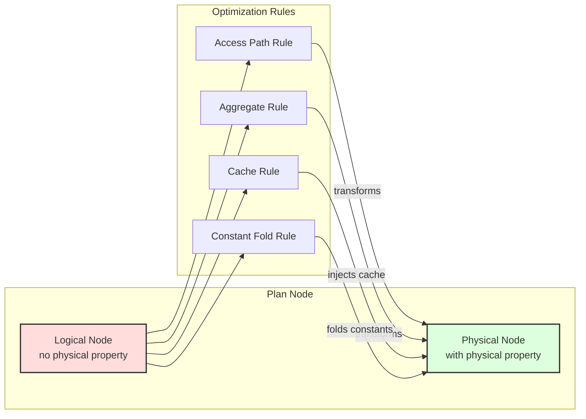

# Quereus Query Optimizer

The optimizer turns the logical plan the builder produced into a physical plan the
emitter can compile, by running rewrite rules over the plan tree in a fixed sequence of
passes. This document is the **hub**: it covers the pass framework, the shared machinery
every rule stands on (physical properties, cost model, attribute identity, visited
tracking), and the discipline a new rule must follow. The rules themselves, and the
subsystems that grew large enough to read on their own, live in the topic documents below.

## Topic documents

| Document | Covers |
| --- | --- |
| [Optimizer Rules](optimizer-rules.md) | The rule catalog, plus the predicate, constant-folding, and cardinality/key families. |
| [Optimizer Joins](optimizer-joins.md) | Join ordering (QuickPick), physical join selection, fan-out lookup joins, join key propagation. |
| [Optimizer Retrieve Push-down](optimizer-retrieve.md) | The `RetrieveNode` module boundary, access-path selection, correlated access, TVF property declarations. |
| [Optimizer Streaming Recognition](optimizer-streaming.md) | Asof scan, and the monotonic LIMIT/OFFSET, range-scan, and window recognitions. |
| [Optimizer Parallel Track](optimizer-parallel.md) | Recognition rules for concurrent execution: async gather, eager prefetch. |
| [Optimizer Assertion Analysis](optimizer-assertions.md) | Row/group/global classification and binding-aware delta planning. |
| [Functional Dependencies](optimizer-fd.md) | FDs, equivalence classes, constant bindings, inclusion dependencies, coverage proving. |
| [Constant Folding System](optimizer-const.md) | The three-phase constant-folding algorithm in full. |
| [Optimizer Conventions](optimizer-conventions.md) | House style for writing a rule. |
| [Progressive Query Optimization](progressive-optimizer.md) | The tiered, feedback-driven optimization strategy. |

## Philosophy

The Quereus optimizer embodies several core principles that guide its design and implementation:

### Virtual Table Centric
The optimizer is built around the premise that all data access happens through virtual tables. This means optimization decisions must respect the capabilities and constraints exposed by each virtual table module through the `BestAccessPlan` API.

### Streaming First
Quereus prioritizes streaming execution over materialization. The optimizer favors transformations that preserve pipeline-able operations and only introduces blocking operations (sorts, materializations) when absolutely necessary for correctness or significant performance gains.

### Attribute-Based Identity
Column identity is tracked through stable attribute IDs rather than names or positions. This enables robust column reference resolution across arbitrary plan transformations without the fragility of name-based or position-based systems.

### Single Hierarchy, Dual Phase
Rather than maintaining separate logical and physical plan hierarchies, Quereus uses a single `PlanNode` tree that transitions from logical to physical through property annotation. This eliminates duplication while maintaining clear phase separation.

### Cost-Based with Heuristic Fallbacks
While the optimizer uses cost estimates to guide decisions, it provides sensible heuristic defaults when statistics are unavailable. This ensures reasonable plan quality even without detailed table statistics.

### Property based rules
Rather than tying rules to specific node types, as much as possible, the optimizer and its rules are tied to properties of the nodes, such as the physical properties, or the node's data type.  This reduces direct dependencies, making the system more robust and flexible.

## Architecture Overview

The Quereus optimizer operates as a transformation engine between the plan builder and runtime emitter:

```
┌─────────────┐     ┌──────────────┐     ┌─────────────┐     ┌──────────────┐
│   Parser    │ --> │   Builder    │ --> │  Optimizer  │ --> │   Emitter    │
│             │     │              │     │             │     │              │
│ SQL → AST   │     │ AST → Logic  │     │Logic → Phys │     │ Phys → Code  │
└─────────────┘     └──────────────┘     └─────────────┘     └──────────────┘
```

The optimizer uses a **multi-pass architecture** where different categories of transformations occur in separate tree traversals. Each pass can use either top-down or bottom-up traversal order depending on its requirements:



### Multi-Pass Optimization System

The optimizer executes transformations through a series of **optimization passes**, each with a specific purpose and traversal order:

#### Pass 0: Constant Folding (Bottom-up)
- **Purpose**: Pre-evaluate constant expressions before other optimizations
- **Traversal**: Bottom-up to evaluate from leaves to root
- **Implementation**: Custom execution using runtime expression evaluator
- **Result**: Simplified plan with literals replacing constant expressions

#### Pass 1: Structural Transformations (Top-down)
- **Purpose**: Restructure the plan tree for optimal execution boundaries
- **Key Rules**: `ruleGrowRetrieve`, `rulePredicatePushdown`, `ruleScalarCSE`
- **Traversal**: Top-down to see parent context for sliding operations
- **Result**: Operations pushed into virtual table boundaries where beneficial; duplicate scalar expressions eliminated

#### Pass 2: Physical Selection (Bottom-up)
- **Purpose**: Convert logical operators to physical implementations
- **Key Rules**: `ruleSelectAccessPath`, `ruleAggregatePhysical`
- **Traversal**: Bottom-up to select implementations based on child properties
- **Result**: Executable physical plan with concrete operators

#### Pass 3: Post-Optimization (Bottom-up)
- **Purpose**: Final cleanup, materialization decisions, and caching
- **Key Rules**: `ruleCteOptimization`, `ruleMutatingSubqueryCache`, `ruleInSubqueryCache`
- **Traversal**: Bottom-up for global analysis and cache injection
- **Result**: Optimized plan with caching and materialization points

#### Pass 3.5: Materialization Advisory (single whole-tree pass, order 35)

> **Invariant:** [OPT-004](invariants.md#opt-004--a-custom-execute-pass-argues-its-own-soundness)

- **Purpose**: Inject caching where reference analysis shows materialization pays off
- **Implementation**: A custom-`execute` pass (no per-node rules) that runs `MaterializationAdvisory.analyzeAndTransform` **once** over the whole plan — one reference-graph build with global parent counts, versus the previous 12 per-anchor-type rule firings that each rebuilt a graph over their own subtree. Runs after Post-Optimization so it observes the `CacheNode`s already injected by `cte-optimization` / `in-subquery-cache` (it skips `nodeType === Cache`, avoiding double-wrapping). See `createMaterializationPass` in `framework/pass.ts` for the coverage and side-effect-soundness rationale.
- **Result**: `CacheNode`s wrapping relational subtrees that benefit from materialization (multi-parent sharing, loop contexts)

#### Pass 4: Validation (Bottom-up)
- **Purpose**: Validate the correctness of the optimized plan
- **Implementation**: Structural and property validation checks
- **Result**: Verified executable plan or error if invalid

### Pass Framework (`src/planner/framework/pass.ts`)

The pass system provides a clean abstraction for multi-pass optimization:

```typescript
interface OptimizationPass {
  id: string;                          // Unique identifier
  name: string;                        // Human-readable name
  traversalOrder: TraversalOrder;      // 'top-down' or 'bottom-up'
  rules: RuleHandle[];                 // Rules belonging to this pass
  execute?: (plan, context) => plan;   // Optional custom execution
  order: number;                       // Execution order (lower first)
}
```

**Key Benefits**:
- **Separation of Concerns**: Each pass focuses on a specific optimization category
- **Proper Sequencing**: Structural transformations happen before physical selection
- **Flexible Traversal**: Each pass can choose its optimal traversal order
- **Clean Debugging**: Clear pass boundaries make optimization easier to understand
- **Depth safety**: Each pass enforces a per-pass depth budget of `max(tuning.maxOptimizationDepth, planInputDepth + tuning.optimizationDepthHeadroom)` so wide input shapes (deep AND chains, deep CASE) plan without tripping the guard, while a separate `tuning.maxRulesFired` budget catches runaway rule rewrites independent of input shape.

### Core Components

**Pass Manager** (`src/planner/framework/pass.ts`)
- Coordinates execution of all optimization passes
- Manages rule registration per pass
- Implements both top-down and bottom-up traversal strategies
- Provides hooks for custom pass execution logic

**Rule Engine** (`src/planner/optimizer.ts`)
- Registers rules to appropriate passes based on their purpose
- Creates optimization context for rule execution
- Integrates with pass manager for multi-pass optimization
- Provides debugging and tracing infrastructure

**Physical Properties** (`src/planner/framework/physical-utils.ts`)
- Captures execution characteristics: ordering, uniqueness, cardinality, monotonic-on-attribute
- `monotonicOn` (per `MonotonicOnInfo` in `nodes/plan-node.ts`) is stronger than `ordering`: it identifies an attribute the relation is totally ordered on (with optional `strict` to assert no duplicates), and is meaningful only for total-order-preserving sources (vtab access plans that advertise it; sort nodes; merge join). Propagation rules live alongside each operator's `computePhysical`.
- `rangeBoundedOn` is a non-relational annotation set by `monotonic-range-access` on physical leaves whose access plan walks a `MonotonicOn(x)` path bounded by a recognized range predicate on `x`. See [Streaming § Monotonic range-scan recognition](optimizer-streaming.md#monotonic-range-scan-recognition).
- Propagates properties through plan transformations
- Enables property-based optimization decisions

**Rule Framework** (`src/planner/framework/`)
- Standard rule signature: `(node, context) → node | null`
- Context provides access to database, statistics, and tuning parameters
- Rules are pure functions that return transformed nodes or null

**Generic Tree Rewriting** (`PlanNode.withChildren()`)
- Every plan node implements generic tree reconstruction
- Preserves attribute IDs during transformations
- Eliminates manual node-specific handling in optimizer core

## Design Decisions

### Immutable Plan Nodes

> **Invariant:** [OPT-008](invariants.md#opt-008--plan-nodes-are-immutable)

Plan nodes are never mutated after construction. All transformations create new nodes, ensuring:
- Clear debugging with before/after comparisons
- Safe concurrent access during optimization
- Predictable transformation behavior

### Attribute ID Preservation

> **Invariant:** [OPT-012](invariants.md#opt-012--withchildren-preserves-attribute-ids)

The optimizer guarantees that attribute IDs remain stable across transformations:
```typescript
// ProjectNode preserves original attribute IDs
const newProjections = this.projections.map((proj, i) => ({
  node: newProjectionNodes[i] as ScalarPlanNode,
  alias: proj.alias,
  attributeId: proj.attributeId // ✅ Preserved from original
}));
```

### Two-Phase Transformation
1. **Logical Phase**: Builder creates plan nodes without physical properties
2. **Physical Phase**: Optimizer transforms and annotates with physical properties

This separation allows the builder to focus on semantic correctness while the optimizer handles execution strategy.

### Rule-Based Transformation
Optimization logic is organized into focused, composable rules:
- Each rule has a single responsibility
- Rules can be enabled/disabled independently  
- New optimizations can be added without modifying core code
- Rules are registered per node type for efficient dispatch

## Engineering Considerations

### Generic Tree Walking
The optimizer uses a generic tree walking mechanism via `withChildren()`:

```typescript
private optimizeChildren(node: PlanNode): PlanNode {
  const originalChildren = node.getChildren();
  const optimizedChildren = originalChildren.map(child => this.optimizeNode(child));
  
  const childrenChanged = optimizedChildren.some((child, i) => child !== originalChildren[i]);
  if (!childrenChanged) {
    return node;
  }
  
  return node.withChildren(optimizedChildren); // Attribute IDs preserved
}
```

This eliminates error-prone manual reconstruction and ensures consistent handling across all node types.

### Cost Model Integration
Cost estimation is centralized in `src/planner/cost/index.ts`:
- Consistent formulas across optimization rules
- Tunable parameters via `OptimizerTuning`
- Clear units (rows, cost units, bytes)

#### Self-cost-only convention

> **Invariant:** [OPT-016](invariants.md#opt-016--estimatedcost-is-self-cost-only), [OPT-018](invariants.md#opt-018--the-total-cost-memo-is-invalidated-on-mutation)

`PlanNode.estimatedCost` stores **only the node's own incremental (self) cost**,
excluding its children. The whole-subtree cost is `PlanNode.getTotalCost()`, which
is the **sole** place child costs are summed — it walks `getChildren()` and adds
each child's total to this node's self-cost.

A node constructor must never fold `child.getTotalCost()` (or a child's
`estimatedCost`) into its own `estimatedCost`. Doing so double-counts the child once
`getTotalCost()` sums the children again, which compounds with nesting depth and
inflates deeply nested plans exponentially — skewing which plan the optimizer picks.
The only genuine leaf self-cost that reads an `estimatedCost` is the vtab access
node's own `xBestIndex` IndexInfo cost (`table-access-nodes.ts`).

`getTotalCost()` is memoized per instance. This is sound because PlanNodes are
immutable (`withChildren` mints a fresh instance with a fresh, empty cache) and no
constructor calls `getTotalCost()`, so the first call always happens after the tree
is fully built. The one in-place mutator — `RecursiveCTENode.setRecursiveCaseQuery()`
— clears the memo via `invalidateTotalCostCache()`.

Two guards keep the two conventions from silently re-mixing (see
`test/planner/cost-additivity.spec.ts`):
- `validateCostAdditivity(plan)` (`planner/validation/plan-validator.ts`) asserts, per
  node, `getTotalCost() === estimatedCost + Σ child.getTotalCost()` and that
  `estimatedCost` is finite and `>= 0`.
- A static source-scan test fails if any node constructor reintroduces
  `getTotalCost(`/child `.estimatedCost` in its self-cost.

### Statistics Abstraction
The `StatsProvider` interface allows pluggable statistics sources:
```typescript
interface StatsProvider {
  tableRows(table: TableSchema): number | undefined;
  selectivity(table: TableSchema, pred: ScalarPlanNode): number | undefined;
  joinSelectivity?(left: TableSchema, right: TableSchema, cond: ScalarPlanNode): number | undefined;
  distinctValues?(table: TableSchema, columnName: string): number | undefined;
  indexSelectivity?(table: TableSchema, indexName: string, pred: ScalarPlanNode): number | undefined;
}
```

The default provider is `CatalogStatsProvider`, which reads real statistics from `TableSchema.statistics` (populated by `ANALYZE` or `VirtualTable.getStatistics()`) and falls back to `NaiveStatsProvider` heuristics when unavailable. When catalog statistics include equi-height histograms, range and equality selectivity estimates use histogram interpolation rather than uniform assumptions.

### Physical Properties System

Physical properties are automatically computed and cached for each plan node using a bottom-up inheritance model:

**Default Properties**
```typescript
const DEFAULT_PHYSICAL: PhysicalProperties = {
  deterministic: true,    // Pure - same inputs produce same outputs
  readonly: true,         // No side effects
  idempotent: true,       // Safe to call multiple times
  constant: false,        // Not a constant value
};
```

**Inheritance Model**
```typescript
// Physical properties are lazily computed and cached
get physical(): PhysicalProperties {
  if (!this._physical) {
    const childrenPhysical = this.getChildren().map(child => child.physical);

    // Get node-specific overrides
    const propsOverride = this.computePhysical?.(childrenPhysical);

    // Derive defaults from children if any, else use DEFAULT_PHYSICAL
    const defaults = childrenPhysical.length
      ? {
        deterministic: childrenPhysical.every(child => child.deterministic),
        idempotent: childrenPhysical.every(child => child.idempotent),
        readonly: childrenPhysical.every(child => child.readonly),
        // constant is not inherited; only leaf nodes explicitly set it
      }
      : DEFAULT_PHYSICAL;

    this._physical = { ...defaults, ...propsOverride };
  }
  return this._physical;
}
```

**Key Principles:**
- Leaf nodes get `DEFAULT_PHYSICAL` properties
- Parent nodes inherit the most restrictive properties from children
- Nodes can override specific properties via `computePhysical()`; `constant` is only set explicitly by nodes that can provide `getValue()`
- Properties are computed once and cached

**Property Computation Example**
```typescript
// SortNode only overrides specific properties
computePhysical(): Partial<PhysicalProperties> {
  return {
    ordering: extractOrderingFromSortKeys(this.sortKeys),
    estimatedRows: this.source.physical.estimatedRows,
    // deterministic and readonly are inherited from source
  };
}
```

### Scalar Expression Properties (per-attribute)

Distinct from `physical` (relational, cached on the node), `ScalarPlanNode` exposes three **per-attribute** property methods on `PlanNode`:

```typescript
isInjectiveIn(inputAttrId: number): InjectivityResult;
monotonicityIn(inputAttrId: number): MonotonicityResult;  // Monotonicity = 'increasing' | 'decreasing' | 'constant' | 'non_monotone' | 'unknown'
rangeRewriteIn(inputAttrId: number, constant: SqlValue): RangeRewrite | undefined;
```

The base class returns conservative defaults (`{ injective: false }` / `{ monotonicity: 'unknown' }` / `undefined`); concrete scalar nodes override only what they can prove. Composite nodes (`UnaryOpNode`, `BinaryOpNode`, `ScalarFunctionCallNode`) recurse into children — they don't switch on `nodeType`. Helper lattices `addMonotonicity` and `negateMonotonicity` (in `nodes/plan-node.ts`) compose the operator rules.

`ScalarFunctionCallNode` consults per-function traits on `FunctionSchema`:
- `injectiveOnArgs?: readonly number[]` — arg indices on which the function is injective when other args are constants.
- `monotoneOnArgs?: { [argIndex]: 'increasing' | 'decreasing' }` — direction-of-monotonicity per arg.
- `rangeRewriteOnArg?: { [argIndex]: { kind: string } }` — names a bucketing kind; the actual boundary computation lives on the operand's `LogicalType.bucketBounds(kind, value)`.

The function-call traits compose with the operand's own `monotonicityIn` / `isInjectiveIn`, so `f(g(x))` is treated correctly when both layers are annotated. `rangeRewriteIn` is intentionally tighter: it only rewrites the `f(x) op c` case, requiring the operand to be a bare `ColumnReferenceNode` for the queried attribute (anything else would conflate value spaces).

Consumers (key propagation through non-trivial projections, sargable predicate rewrites for `date(ts) = D`, etc.) build on this surface — see [Rules § Sargable range rewrites](optimizer-rules.md#sargable-range-rewrites).

### Constant folding

Constant expressions are evaluated at plan time rather than at runtime, via a three-phase
classify / border-detect / replace algorithm that folds even expressions whose column
references resolve to constants further up the tree. See
[Constant Folding System](optimizer-const.md) for the algorithm and
[Rules § Constant Folding Subsystem](optimizer-rules.md#constant-folding-subsystem) for the
`constant` property's requirements and the `ConstantNode` contract.

### Sargable range rewrites

A predicate of the form `f(col) = c` — notably `date(ts) = D` — is rewritten to the
half-open range `col >= lower(c) and col < upper(c)`, restoring a bare `col op literal`
shape the constraint extractor can push into an index seek. See
[Rules § Sargable range rewrites](optimizer-rules.md#sargable-range-rewrites).

### TVF property declarations

Table-valued functions can advertise keys, ordering, monotonicity, and row estimates
through `relationalAdvertisement`, so the optimizer reasons about a TVF exactly as it does
about a virtual table. See
[Retrieve § TVF Property Declarations](optimizer-retrieve.md#tvf-property-declarations).

## Component Reference

### Plan Node Hierarchy

All plan nodes extend the base `PlanNode` class and implement category-specific interfaces:

**Base Classes**
- `PlanNode`: Abstract base with cost, scope, and transformation methods
- `RelationalNode`: Nodes producing row streams (implement `getAttributes()`)
- `ScalarNode`: Nodes producing scalar values
- `VoidNode`: Nodes with side effects (DDL, DML)

**Key Methods**
- `getChildren()`: Returns all child nodes in consistent order
- `withChildren(newChildren)`: Creates new instance with updated children
- `computePhysical()`: Optionally overrides specific physical properties
- `getLogicalProperties()`: Returns logical plan information

### Rule catalog

Rules live in `src/planner/rules/`, one directory per optimization family
(`access`, `aggregate`, `cache`, `distinct`, `join`, `predicate`, `retrieve`, `sort`,
`subquery`, `parallel`), and are registered to passes in `src/planner/optimizer.ts`.
That file is the single source of truth for which rule runs in which pass, at what
priority, under which `sideEffectMode`. The prose catalog — what each rule matches, its
guards, and its soundness argument — is
[Optimizer Rules § Optimization Rules](optimizer-rules.md#optimization-rules).

### Virtual Table Integration

The optimizer integrates with virtual tables through the `BestAccessPlan` API:

```typescript
interface BestAccessPlanRequest {
  columns: readonly ColumnMeta[];
  filters: readonly PredicateConstraint[];
  requiredOrdering?: OrderingSpec;
  limit?: number | null;
  estimatedRows?: number;
}

interface BestAccessPlanResult {
  handledFilters: boolean[];
  cost: number;
  rows: number | undefined;
  providesOrdering?: OrderingSpec;
  uniqueRows?: boolean;

  // Optional monotonic-storage advertisements. Lifted onto the physical leaf's
  // `physical.monotonicOn` / `physical.accessCapabilities`; not propagated by
  // single-input pass-through nodes (Filter, LimitOffset, Alias).
  monotonicOn?: { columnIndex: number; direction: 'asc' | 'desc'; strict: boolean };
  supportsOrdinalSeek?: boolean; // implies monotonicOn
  supportsAsofRight?: boolean;   // implies monotonicOn
}
```

Virtual tables communicate their capabilities, allowing the optimizer to:
- Push predicates to the data source
- Utilize indexes for efficient access
- Preserve beneficial orderings
- Estimate result cardinalities

#### The `handledFilters` contract

> **Invariant:** [OPT-024](invariants.md#opt-024--an-unconsumed-seek-constraint-is-reattached)

`handledFilters[i] = true` is a promise that filter `i` is enforced somewhere other than
the residual `Filter` — and the only channel available is `FilterInfo.constraints`, the
seek bounds `rule-select-access-path` builds. `rule-grow-retrieve` residualizes exactly
the constraints whose flag is `false`, so a claimed filter that never becomes a seek
bound would be applied nowhere.

A module may set `handledFilters[i] = true` only for a filter it will actually apply.
For the seek-family operators (`=`, `IN`, `<`, `<=`, `>`, `>=`, `OR_RANGE`) the planner
consumes at most one filter per column per role — the first `=`, the first lower bound,
the first upper bound, **in `request.filters` order**. Claim positionally: mark the first
match, leave redundant same-column same-role filters unhandled so they survive as a
residual `Filter`. The planner defends itself against an over-claim by reattaching any
seek-family filter it did not consume (`reattachUnconsumedConstraints`), so an
over-claiming module costs a redundant filter, not a wrong answer.

Ops outside the seek family (`IS NULL`, `IS NOT NULL`, `LIKE`, `GLOB`, `MATCH`,
`NOT IN`) are never pushed into `FilterInfo` by this rule, so a module claiming one is
taken at its word — claim only when the predicate is tautological over the rows you
return (the memory module's `IS NOT NULL` on a `NOT NULL` column).

Which seek-family filters the rule *can* consume is further shaped by the seek encodings.
Seek keys are positional, so a standalone range bound is only ever seeked on the
**leading** seek column; a range on a later seek column requires the prefix-range
encoding, which needs every preceding seek column pinned by a single-valued equality. A
multi-value `IN` is not a single-valued prefix key, so `a in (1, 2) and b > 15` over an
index on `(a, b)` declines to a sequential scan with both predicates as residuals rather
than seeking `b`'s bound against `a`.

### Debugging and Tracing

The optimizer provides comprehensive debugging support:

**Debug Namespaces**
- `quereus:optimizer`: General optimizer operations
- `quereus:optimizer:rule:*`: Individual rule execution
- `quereus:optimizer:properties`: Physical property computation

**Trace Hooks**
```typescript
interface TraceHook {
  onRuleStart?(rule: RuleHandle, node: PlanNode): void;
  onRuleEnd?(rule: RuleHandle, before: PlanNode, after: PlanNode | undefined): void;
}
```

**Plan Visualization and Testing**
The PlanViz tool (`packages/tools/planviz`) provides visual plan inspection:
```bash
quereus-planviz query.sql --format tree
quereus-planviz query.sql --format mermaid --phase physical
```

Testing optimizer effects is easy using the `query_plan()` built-in:
```sql
-- Example: ensure FILTER was pushed into Retrieve (0 remaining above)
SELECT COUNT(*) AS filters
FROM query_plan('SELECT id FROM t WHERE id = 1')
WHERE op = 'FILTER';
```

## Extending the Optimizer

### Adding a New Optimization Rule

1. **Create Rule File** in appropriate subdirectory:
```typescript
// src/planner/rules/category/rule-name.ts
export function ruleMyOptimization(
  node: PlanNode,
  context: OptimizerContext
): PlanNode | null {
  // Check applicability
  if (!isApplicable(node)) {
    return null;
  }
  
  // Transform node
  const transformed = performTransformation(node);
  
  // Preserve attribute IDs!
  return transformed;
}
```

2. **Register Rule** in optimizer:
```typescript
// src/planner/optimizer.ts, inside registerRulesToPasses()
this.passManager.addRuleToPass(PassId.Structural, {
  id: 'MyRule',
  nodeType: PlanNodeType.Target,
  phase: 'rewrite',
  fn: ruleMyOptimization,
  sideEffectMode: 'safe', // or 'aware' — see § Audit discipline below
});
```

3. **Add Tests** with golden plans:
```sql
-- test/plan/my-optimization/test.sql
SELECT * FROM users WHERE active = true;
```

### Best Practices

**Rule Development**
- Keep rules focused on a single transformation
- Return `null` for non-applicable cases
- Never mutate input nodes
- Always preserve attribute IDs
- **Use characteristics-based patterns**: Prefer `CapabilityDetectors` over `instanceof` checks for robust, extensible rules
- Include comprehensive tests

**Property Computation**
- Implement `computePhysical()` to override physical properties for new node types
- Use automatic inheritance of properties from children when appropriate
- Document any property assumptions

**Cost Estimation**
- Use centralized cost functions
- Provide reasonable defaults
- Document cost model assumptions

## Audit discipline (`sideEffectMode`)

> **Invariant:** [OPT-001](invariants.md#opt-001--every-rule-declares-sideeffectmode)

Every rule registered via `addRuleToPass` **must** declare its
`sideEffectMode`. `validateSideEffectMode` (`framework/registry.ts`) checks
the field at registration time and rejects any rule that fails to declare.
This is the load-bearing audit gate the side-effect-aware optimizer rests on.

### The signal

`PlanNode.physical.readonly` is the canonical side-effect flag — `false`
means "executing this node has a write side effect" (DML, sequence step,
external sink). It propagates as **AND-of-children**: a node inherits
`readonly` from its children unless its own `computePhysical` overrides
the value. So for any well-formed plan tree, a single DML node anywhere
beneath a SELECT marks every ancestor as side-effect-bearing.

`PlanNodeCharacteristics` exposes two helpers:

```typescript
PlanNodeCharacteristics.hasSideEffects(node)         // local node only
PlanNodeCharacteristics.subtreeHasSideEffects(node)  // iterative subtree walk (defensive)
```

The defensive subtree helper (an explicit worklist, so a deep plan cannot
overflow the native call stack) exists so a rule's intent reads clearly
(*"refuse if any subtree I move / drop / dedup carries a write"*) and so
the audit gate still fires when a custom `computePhysical` override fails
to propagate `readonly=false`.

### The two declarations

> **Invariant:** [OPT-002](invariants.md#opt-002--an-aware-rule-consults-the-side-effect-signal)

- `'safe'` — the rule never moves, duplicates, drops, or merges any
  subtree it does not separately verify pure. Annotation-only transforms,
  in-place field flips (e.g. swap an AsofScan strategy), and logical→
  physical replacements where every child survives in the same position
  qualify. The rule does NOT need to consult `hasSideEffects` because its
  structural shape guarantees side-effect preservation.

- `'aware'` — the rule DOES move, duplicate, drop, or merge subtrees, and
  explicitly consults `PlanNodeCharacteristics.hasSideEffects` (or
  `subtreeHasSideEffects`) to refuse / weaken when any participating
  subtree carries a write. Includes rules that *intentionally* preserve
  side effects through run-once memoization (e.g.
  `rule-mutating-subquery-cache`, which targets impure right sides and
  wraps them in a `CacheNode` so the join's nested-loop driver doesn't
  re-execute the write per outer row).

### Rule categories that consult the signal

| Category | Mode | Why |
|---|---|---|
| `subquery/` (decorrelation, FK-empty / FK-trivial) | aware | Decorrelation changes execution cardinality; FK-empty / -trivial drop subtrees. |
| `predicate/` (pushdown, aggregate-pushdown, fold-empty, contradiction, inference) | aware | Pushdown moves rows under a side-effect subtree; folds drop subtrees. |
| `cache/` (mutating-subquery-cache, in-subquery-cache, materialization-advisory, scalar-cse) | aware | Cache injection is a run-once memoize; CSE dedups scalar expressions. |
| `join/` (greedy-commute, physical-selection, fanout, quickpick, join-elimination, lateral-asof) | mixed | Commute / build-probe swap reorder; elimination drops; FanOut clusters concurrently. |
| `parallel/` (async-gather union-all / zip-by-key, eager-prefetch-probe, fanout-batched) | aware | Concurrent drivers interleave per-branch writes. |
| `retrieve/` (grow-retrieve, projection-pruning) | mixed | Grow slides into read-only Retrieve (safe); pruning drops scalar projections (aware). |
| `access/`, `sort/`, `aggregate/`, `window/`, `distinct/` | mostly safe | Replace logical with physical nodes / annotate in place. |

The full per-rule annotation lives at each `addRuleToPass(...)` call in
`src/planner/optimizer.ts`. Treat that file as the single source of truth
for the audit.

### When DML-in-expression-position lands

The audit gate is mostly inert today because DML appears only at the
root or in FROM position. Once `dml-in-expression-position` lifts the
planning-time gate, side-effect-bearing scalars (`(insert ... returning ...)`)
will appear inside Project / Filter / Sort expressions, and every aware
rule that consults `subtreeHasSideEffects` will start refusing or
weakening on the new shapes. The discipline is the safety net those
landings stand on.

### Parallel-track side-effect refusal

> **Invariant:** [OPT-006](invariants.md#opt-006--parallel-track-rules-refuse-an-impure-branch)

The `parallel/` rules (`async-gather-union-all`, `async-gather-zip-by-key`,
`eager-prefetch-probe`) and the `join/`-residing fan-out rules
(`fanout-lookup-join`, `fanout-batched-outer`) all fork the
`RuntimeContext` and drive sibling subtrees **concurrently** on the same
connection. The module concurrency contract (`'serial'` /
`'reentrant-reads'` / `'fully-reentrant'`) governs *reads*; a DML
subtree on a sibling branch violates the per-connection lock under
everything except `'fully-reentrant'`, and no module currently
advertises that level. The parallel-recognition rules must therefore
refuse to fold / fork / prefetch when any participating branch reports
`hasSideEffects = true`.

`PlanNodeCharacteristics.isConcurrencySafe(node)` is the shared
predicate every parallel-track rule consults. It is implemented as the
negation of `subtreeHasSideEffects` — side-effect freedom is the only
gate today; the module-level concurrency contract is enforced
separately via `node.physical.concurrencySafe`. Once a
`'fully-reentrant'` module ships, `isConcurrencySafe` can be refined to
permit concurrent impure execution on it, without touching every
caller.

The refusal pattern is uniform across the parallel rules:

```typescript
for (const branch of branches) {
  if (branch.physical.concurrencySafe !== true) return null;   // module-level
  if (!PlanNodeCharacteristics.isConcurrencySafe(branch)) return null; // side-effect
}
```

This is a **refusal**, not a fallback to a serial variant — the rules
are optimizations layered on top of an already-correct serial plan.
Refusing leaves the serial plan in place, which is correct (writes
execute exactly once, in textual order, under the connection lock).
Regression coverage lives in
`packages/quereus/test/optimizer/parallel-side-effect-refusal.spec.ts`,
which pins the predicate's contract and the negative-fold cases.

## Common Patterns

### Predicate analysis and pushdown

Filter predicates are normalized, split into constraints, and pushed as far toward the data
as each module will accept — the supported-only placement policy keeps unsupported residuals
above the `Retrieve` boundary. See
[Rules § Predicate Analysis and Pushdown](optimizer-rules.md#predicate-analysis-and-pushdown).

### Property Propagation
```typescript
computePhysical(_children: PhysicalProperties[]): Partial<PhysicalProperties> {
  return {
    estimatedRows: this.source.estimatedRows,
    // Keys propagate as FDs in `fds`. TableReferenceNode emits `{pk} → other-cols`
    // FDs; physical access nodes pass them through unchanged.
    fds: childrenPhysical[0]?.fds,
    ordering: this.providesOrdering,
  };
}
```

### Cache Injection
```typescript
if (shouldCache(node, context)) {
  return new CacheNode(
    node.scope,
    node,
    'memory',
    calculateThreshold(node.physical.estimatedRows)
  );
}
```

## Performance Considerations

### Rule Ordering
- Rules execute in registration order
- Place cheap checks before expensive transformations
- Consider rule dependencies when ordering

### Property Caching
- Physical properties are computed once and cached
- Avoid redundant property calculations
- Use lazy evaluation where appropriate

### Memory Usage
- Plan trees can be large for complex queries
- Avoid keeping references to old plan nodes
- Clean up temporary data structures

## Current limitations

- **OR predicate extraction across different indexes** remains a residual filter. The
  same-column collapses (OR-of-equalities ⇒ `IN`, OR-of-ranges ⇒ `OR_RANGE`) are
  implemented and gated on matching disjunct collation. Tracked by
  `tickets/plan/2-or-to-union-rewriting.md`.
- **Prefix-equality + trailing-range seeks on composite indexes** are not supported.
  Tracked by `tickets/plan/2-composite-index-advanced-seeks.md`.
- **Collation-mismatched index seeks** re-apply the predicate as a residual `Filter`
  (coarser equality index) or decline to a filtered scan (finer index, or any range
  mismatch). See the collation-cover note under `ruleSelectAccessPath` in the
  [rule catalog](optimizer-rules.md#optimization-rules).
- Longer-range optimizer work is listed in [`docs/todo.md`](todo.md) and `tickets/plan/`.

## Streaming and monotonic recognition

Several rules recognize that a plan's input already arrives in the order an operator would
otherwise have to establish, and replace the buffering operator with a one-pass streaming
one. They all read the `physical.monotonicOn` advertisement. Covered in
[Optimizer Streaming Recognition](optimizer-streaming.md):

- **[Streaming asof scan](optimizer-streaming.md#streaming-asof-scan)** — rewrites the
  lateral-top-1 idiom (`left join lateral (… order by q.ts desc limit 1)`) to an
  `AsofScanNode` that runs in `O(L + R)` instead of `O(L · log R)`.
- **[Monotonic LIMIT/OFFSET pushdown](optimizer-streaming.md#monotonic-limitoffset-pushdown)**
  — seeks straight to the kth row when the access path advertises ordinal seek.
- **[Monotonic range-scan recognition](optimizer-streaming.md#monotonic-range-scan-recognition)**
  — annotates a range-bounded monotonic leaf, and defensively drops `monotonicOn` when a
  module declines a range filter it claimed to order on.
- **[Monotonic streaming-window recognition](optimizer-streaming.md#monotonic-streaming-window-recognition)**
  — flips a `WindowNode` to a one-pass emitter, dropping the sort and the buffer.

## Future Directions

The overarching optimization strategy is **progressive, JIT-inspired**: robust heuristic defaults that avoid catastrophic plans without any statistics, with runtime execution feedback driving incremental improvement. See [Progressive Query Optimization](./progressive-optimizer.md) for the full architecture.

See `tickets/plan/` for planned optimizer work.

## Join planning

Join order is chosen by a randomized greedy tour search (QuickPick); a physical algorithm
(nested loop, hash, or merge) is then selected per join by cost. Separately, a chain of
per-outer-row lookups can be clustered into one concurrently-driven fan-out node, and the
keys a join propagates to its output are derived from equi-pair coverage. See
[Optimizer Joins](optimizer-joins.md).

## Visited Tracking Architecture

### Design Philosophy

Quereus uses context-scoped visited tracking to handle optimization of directed acyclic graphs (DAGs) containing shared subtrees. This approach eliminates the architectural problems inherent in global tracking systems while enabling sophisticated multi-pass optimizations.

### Core Architecture

The visited tracking system is built around the optimization context rather than global state:

```typescript
interface OptContext {
  optimizer: Optimizer;
  stats: StatsProvider;
  tuning: OptimizerTuning;
  db: Database;
  
  // Context-scoped tracking
  visitedRules: Map<string, Set<string>>;     // nodeId → ruleIds applied (transformed) in this context
  optimizedNodes: Map<string, PlanNode>;      // nodeId → optimized result cache
}
```

### Shared Subtree Handling

**Problem**: Traditional optimizers assume tree structures, but SQL plans form DAGs due to:
- CTEs referenced multiple times (`WITH t AS (...) SELECT * FROM t UNION SELECT * FROM t`)
- Correlated subqueries with repeated correlation variables
- View expansions that reference the same underlying tables

**Solution**: The pass framework uses a **per-pass traversal cache** to ensure shared subtrees are optimized consistently within a pass, while still allowing later passes to revisit nodes.

```typescript
// PassManager traversal: reuse within a single pass
const cached = context.optimizedNodes.get(node.id);
if (cached) return cached;

// ... optimize children + apply rules ...

context.optimizedNodes.set(node.id, result);
return result;
```

The cache is cleared at the start of each pass (so Physical Selection can still rewrite nodes that Structural cached).

### Rule Application Control

> **Invariant:** [OPT-010](invariants.md#opt-010--visited-rules-are-inherited-across-a-re-mint-declines-are-not)

Rules are prevented from infinite loops through per-context tracking of
*transforming* applications:

```typescript
// Registry checks context-local applied state
hasRuleBeenApplied(nodeId: string, ruleId: string, context: OptContext): boolean {
  const nodeVisited = context.visitedRules.get(nodeId);
  return nodeVisited?.has(ruleId) ?? false;
}

// Marks are context-local, allowing same rule on shared nodes in different paths
markRuleApplied(nodeId: string, ruleId: string, context: OptContext): void {
  if (!context.visitedRules.has(nodeId)) {
    context.visitedRules.set(nodeId, new Set());
  }
  context.visitedRules.get(nodeId)!.add(ruleId);
}
```

When a rule transforms a node the `PassManager` inherits the applied set onto the
freshly-minted node (`inheritVisitedRules`), so an applied rule is not re-tried
on its own output (loop prevention).

**Declines are tracked separately and ephemerally.** Inside a single
`applyPassRules` fixpoint loop, a rule that declines (returns `null` / the same
node) on the current node id is remembered so it is not re-offered on that
*unchanged* node every `while` iteration — the rule is deterministic in its
input node, so the re-run would be pure waste. This decline set is **reset the
moment any rule transforms the node**: the plan piece changed, so every decliner
gets a fresh shot on the new node (a rule that declined on the old shape may well
apply to the new one). Because declines are never inherited across a transform,
this is a strict speedup with **no plan-output change** — only same-node re-runs
are cut, never a legitimate re-offer after the node actually changes.

Individual rules can also be disabled via `OptimizerTuning.disabledRules` (a `ReadonlySet<string>` of rule IDs). Both the pass-based and registry-based rule application paths skip disabled rules. This is primarily intended for testing (e.g., verifying semantic equivalence with/without a specific rewrite).

### Multi-Pass Optimization Support

The architecture supports multi-pass optimization strategies via:

**Single optimization session (current)**:
- One context per optimization session
- `optimizedNodes` is used as a per-pass traversal cache (cleared each pass)
- `visitedRules` persists across passes and is inherited along rewrite chains so local fixpoint iteration terminates

**Multi-Pass (Future)**:
- Fresh context per optimization pass
- Different rule sets or heuristics per pass
- Best plan selection across all passes

### Context Lifecycle

Contexts can be derived and specialized for different optimization scenarios:

```typescript
class OptimizationContext {
  // Create context for different optimization phase
  withPhase(phase: 'rewrite' | 'impl'): OptimizationContext {
    const newContext = new OptimizationContext(/* ... */);
    this.copyTrackingState(newContext); // Preserve learned optimizations
    return newContext;
  }
}
```

Per-traversal depth is tracked by the pass framework itself rather than on the
context — see "Pass Framework" above for the input-scaled budget
(`max(maxOptimizationDepth, planInputDepth + optimizationDepthHeadroom)`) and
the `maxRulesFired` cap.

### Performance Characteristics

**Memory**: O(nodes × rules) per context, garbage collected when context ends
**Time**: O(1) lookup for visited rules and optimized nodes
**Scalability**: Each context is independent, enabling parallel optimization

### Integration with Advanced Optimizations

The context-scoped design enables sophisticated optimization strategies:

**[QuickPick Join Enumeration](optimizer-joins.md#join-optimization-with-quickpick)**:
- The rule builds and costs each candidate join tree in-place, outside the visited set
- Only the winning tree is returned, so exactly one transform is recorded for the node
- Discarded candidates leave no visited-tracking residue to invalidate

**Progressive Optimization** (see [progressive-optimizer.md](./progressive-optimizer.md)):
- Contexts can carry different statistics or cost models
- Tier 2 re-optimization re-runs physical selection with runtime stats overlay
- Runtime cardinality feedback updates stats between executions

## Attribute provenance

> **Invariant:** [OPT-014](invariants.md#opt-014--an-attribute-id-is-originated-exactly-once)

Attribute IDs have two distinct lifecycle operations that `getAttributes()` smears together:

- **Origination** — a node *mints* a fresh ID via `PlanNode.nextAttrId()` (scans, computed projections, aggregate outputs, VALUES rows).
- **Forwarding** — a node *re-publishes* an ID one of its children already produced.

The real invariant of the attribute model is **"each ID is originated exactly once"**, plus "every referenced ID resolves to an in-scope origin". It is emphatically *not* "each ID appears at most once in the tree": several physical node families deliberately forward their children's IDs verbatim so that downstream `ORDER BY` and column references keep resolving against stable IDs — `SetOperationNode` (mirrors the left child), `JoinNode` / `BloomJoinNode` / `MergeJoinNode` (concatenate left+right), `EagerPrefetchNode` (pass-through), `AsyncGatherNode` (mirror children[0] / concatenate), `FanOutLookupJoinNode`, and `ProjectNode` / `ReturningNode` (forward the source ID for *simple column-ref* projections while minting fresh IDs for *computed* projections — so the distinction is per-attribute, not per-node).

Origination is **derivable structurally** without any per-node declaration: an ID is originated at the deepest relational node that outputs it and whose direct relational children do **not**. Any node that outputs an ID already present in one of its direct children is forwarding it. `computeAttributeProvenance(root)` (`planner/analysis/attribute-provenance.ts`) does this in one post-order walk, returning `Map<attrId, { originNode, path }>`. It throws `QuereusError(INTERNAL)` when two distinct nodes originate the same ID (the genuine-bug case) or when one node lists an ID twice; forwarding never throws. The walk dedupes by node identity, so a shared subtree instance (DAG) is not mistaken for a collision.

`validatePhysicalTree` (the `tuning.debug.validatePlan` pass) consumes this surface: it computes provenance once at entry — which both detects duplicate origins and yields the complete `attrId → origin` map — then resolves every `ColumnReference` against `provenance.has(attrId)`. This preserves the prior global-set scoping semantics (sibling-scope visibility is intentionally not tightened here) while no longer false-positiving on attribute-preserving parents.

A companion per-node surface, `PlanNode.getAttributeIndex(): ReadonlyMap<number, number>` (cached, mirrors the `attributesCache` pattern; rebuilds automatically since `withChildren` mints a fresh instance), answers the local "attrId → its index in this node's output" question — replacing the scattered `attrs.findIndex(a => a.id === …)` scans (e.g. `bloom-join-node.ts`, `rule-monotonic-range-access.ts`).

This provenance surface is the **future** mechanism for the [lens](lens.md#overrides-are-merged-per-attribute) sparse-override merge: addressing override coverage by stable attribute ID is what the lens prover (`lens-prover-and-constraint-attachment`) needs when it plans the compiled body to read the FD/key surface. **v1 of the merge does not yet use it** — it composes at the AST level, reading coverage by output-column *name* and recomputing (re-reading the override from source) on every deploy, which delivers the same rename-then-add composability without pulling the planner into the lens compiler. When the prover lands, the merge moves onto the plan tree and addresses attributes by ID.

## Functional Dependency Tracking

Functional dependencies (FDs) are the canonical surface for "what determines what" on a relational node's output. A unique key `K` is encoded as the FD `K → (all_cols \ K)` rather than carried in a separate field, and `∅ → all_cols` encodes the at-most-one-row claim. Equivalence classes, constant bindings, domain constraints, and inclusion dependencies ride the same per-operator propagation. Consumers read uniqueness through `keysOf` / `isUnique` / `isUniqueDeterminant` in `planner/util/fd-utils.ts` and never hand-check the underlying surfaces.

See [Functional Dependency Tracking](optimizer-fd.md) for the type definitions, the per-operator propagation tables, the collation gates, and the producer/consumer catalog.

## Cardinality and key rules

Equality on every column of a unique key caps a relation at one row; foreign keys are
inclusion dependencies that let a semi-join fold to its left side and an anti-join fold to
empty; an unsatisfiable predicate folds to `EmptyRelationNode`, which then cascades. These
rules and the key-propagation rules that feed them are in
[Optimizer Rules](optimizer-rules.md#key-driven-row-count-reduction).

## Parallel-track recognition

Three rules recognize plan shapes that can be driven concurrently: independent `union all`
branches (`AsyncGatherNode`, `unionAll`), a shared-key full-outer join chain
(`AsyncGatherNode`, `zipByKey`), and a hash join whose build side is high-latency
(`EagerPrefetchNode` over the probe). Every one is inert on local-only plans, because the
gate reads `expectedLatencyMs`, which memory-backed leaves leave at 0. See
[Optimizer Parallel Track](optimizer-parallel.md); the runtime contracts are in
[Runtime](runtime.md).

## Assertion delta analysis

A `create assertion` violation query is re-checked at COMMIT. Re-running it whole on every
commit is unaffordable, so each table reference inside the plan is classified `'row'`,
`'group'`, or `'global'`: whether a change to that table can be re-checked by binding a
unique key, a group key, or not at all. The same analysis is reused by `Database.watch` and
the lens layer. See [Optimizer Assertion Analysis](optimizer-assertions.md) for the
classification and binding rules, and [Incremental Maintenance](incremental-maintenance.md)
for the runtime that executes the residuals.

## Retrieve push-down and correlated access

Every `TableReferenceNode` is wrapped in a `RetrieveNode` at build time, marking the exact
boundary between module execution and Quereus execution. Structural rules slide supported
operations across that boundary — never unsupported ones — and the physical pass replaces
every `RetrieveNode` with a concrete access node (`SeqScan`, `IndexScan`, `IndexSeek`) or a
`RemoteQuery`. See [Optimizer Retrieve Push-down](optimizer-retrieve.md).

## Optimization Pipeline Architecture

Quereus uses a **characteristic-based** optimization pipeline that leverages the unique logical properties of different node types to apply rules in optimal sequence. The RetrieveNode's unique logical representation makes it an ideal boundary marker for this approach.

### Why the segment boundary comes first

The builder wraps every `TableReferenceNode` in a `RetrieveNode`, so module execution
boundaries exist before any rule runs. `ruleGrowRetrieve` then slides operators into those
boundaries in the Structural pass — ahead of predicate push-down, ahead of join
enumeration, ahead of physical selection.

That ordering is the point. Growth is purely structural (it asks `supports()`, never the
cost model), so it always terminates at the same segment for a given plan. Once the
segments are fixed, every later rule sees a base relation whose `estimatedRows` already
reflects everything the module will do for itself — which is what makes join enumeration's
cost comparisons meaningful. Enumerating first and pushing afterwards would order joins
against cardinalities that the push-down then invalidates.

The concrete pass list, with what runs in each, is
[Multi-Pass Optimization System](#multi-pass-optimization-system) above. Push-down work
still on the roadmap — projection and aggregation push-down, cost-precise placement of OR
and subquery predicates, correlated push-down — is tracked in
[`docs/todo.md`](todo.md#-push-down--federation-roadmap-active-items).

### Characteristic-Based Rule Design Philosophy

**RetrieveNode Exception**: While Quereus generally avoids hard-coding specific node types in rules, `RetrieveNode` represents a unique logical concept - the module execution boundary. This makes it appropriate to have rules that specifically target `RetrieveNode` characteristics.

**General Principle**: Most other rules should operate on logical characteristics rather than specific node types:
- Filter placement based on selectivity characteristics
- Join reordering based on cardinality characteristics  
- Projection elimination based on attribute usage characteristics

**Benefits of This Approach**:
- Rules remain orthogonal and composable
- Easy to add new node types without breaking existing rules
- Clear separation of concerns between different optimization phases
- Predictable rule application order based on logical properties

## Rejected alternatives

- **Inheriting a rule's *declines* across a transform.** Decline sets are reset the moment
  any rule transforms a node, and are never carried onto the freshly-minted node. Carrying
  them would suppress a rule that becomes applicable only after a *sibling* rule reshapes
  the node — `ruleAsyncGatherZipByKey` is a concrete case — silently changing plans in
  exchange for a small amount of re-run work.
- **A global visited set.** Tracking is context-scoped instead, so the same rule may apply
  to a shared subtree along different paths, and a later pass can revisit what an earlier
  one cached. See [Visited Tracking Architecture](#visited-tracking-architecture).
- **Separate logical and physical plan hierarchies.** One `PlanNode` tree transitions from
  logical to physical by property annotation; see
  [Single Hierarchy, Dual Phase](#single-hierarchy-dual-phase).
